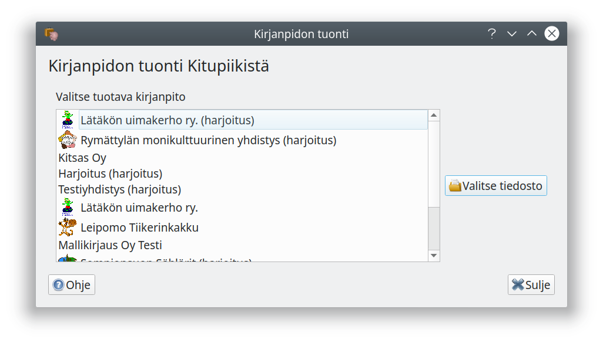
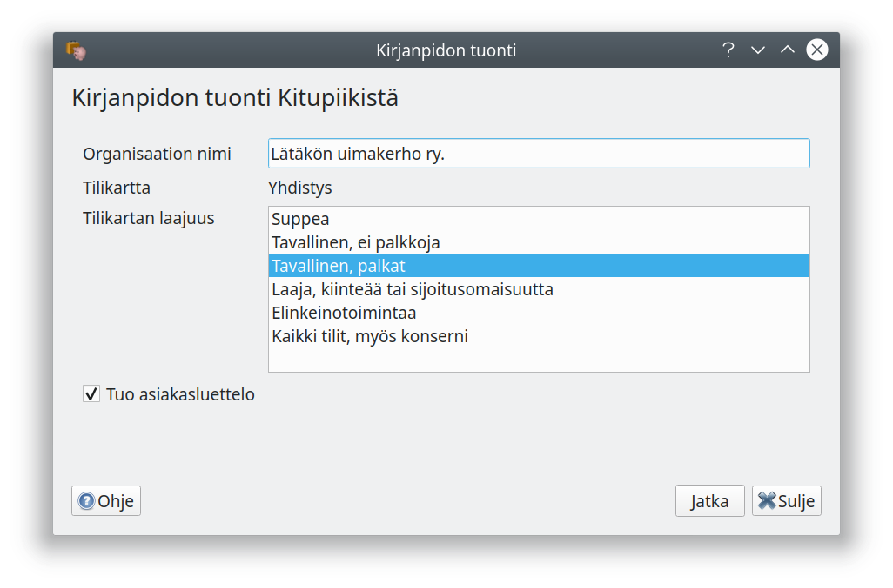
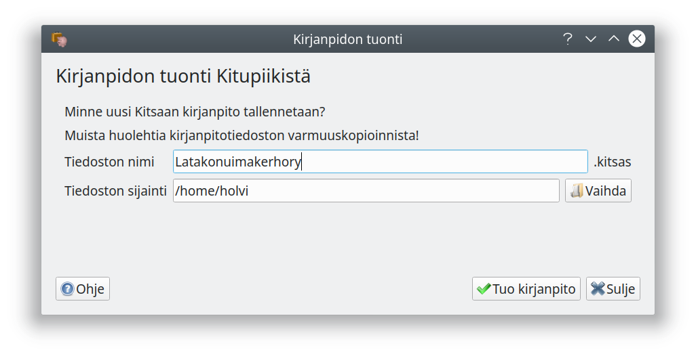

# Kirjanpidon siirtäminen Kitupiikistä

!!! note "Rajoituksia siirtämisessä"
    - Kitsas ei toistaiseksi sisällä asunto-osakeyhtiön tilikarttaa, joten asunto-osakeyhtiöiden kirjanpitoja ei vielä toistaiseksi voi tuoda.
    - Siirtäminen onnistuu ainoastaa uudemmista elinkeinoelämän ja yhdistystoiminnan tilikartoista (versiosta 0.7, maaliskuu 2018 lähtien). Muista tilikartoista siirryttäessä on aloitettava uusi kirjanpito ja tehtävä tilinavaus.
    - Kitsas ei tue enää maksuperusteisia laskuja. Jos siirrettäessä kirjanpidossa on avoimia maksuperusteisia laskuja, muutetaan ne laskuperusteisiksi niin, että päivämääräksi merkitään kirjanpidon siirtopäivämäärä.
    - Jos haluat siirtää Kitupiikin kirjanpidon pilveen, sinun pitää ensin muuntaa kirjanpito Kitsaan tiedostoksi ja vasta sitten siirtää kirjanpito pilveen.
    - Suurin osa tositteista saa Kitsaaseen siirrettäessä tositelajin "Tuonti". Tuotujen tositteiden muokkaus poikkeaa hieman siitä, miten Kitsaalla luotuja uusia tositteita pääsee muokkaamaan.

Kun siirrät kirjanpidon Kitupiikistä, luodaan Kitsasta varten kokonaan uusi tiedosto. Kitupiikin tiedosto jää muuttamattomaksi, eivätkä Kitsaalla tehdyt muutokset tallennu enää vanhaan tiedostoon.

## Siirtäminen

Siirtäminen käynnistyy **Aloita**-sivun **Tuo Kitupiikistä**-painikkeesta (**Tietokone**-välilehdellä).

Ohjelma etsii Kitupiikin kirjanpitoja. Valitse kirjanpito luettelosta tai **Valitse tiedosto** valitaksesi tietokoneella olevan tiedoston.

Toiminto näyttää tuotavan kirjanpidon tiedot. Valitse **tilikartan laajuus** omien tarpeittesi mukaan. Valinnalla piilotetaan näkyvistä sellaisia tilejä, joita et tarvitse. Voit muuttaa valintaa myöhemmin asetuksista tai ottaa käyttöön yksittäisiä tilejä.

**Tuo asiakasluettelo** tuo laskutuksessa käytettyjen asiakkaiden tiedot Kitsaan asiakasrekisteriksi.

Valitse, minne Kitsaan kirjanpito tallennetaan. Ole huolellinen kirjanpidon varmuuskopioinnissa!

## Tarkista asetukset ja kirjanpito

Kitsas pystyy siirtämään lähes kaikki Kitupiikissä olleet asetukset. Tarkista kuitenkin, että kirjanpidot asetukset ovat oikein. Tarkastele myös tilien saldoja ja kirjausten määriä, jotta kaikki kirjaukset ovat siirtyneet oikein.

!!! info "Tilinumeroiden muunto"
    Kitsaan tilikartoissa on joidenkin tilien numerointi muuttunut, ja kirjanpitoa tuotaessa kirjanpito muunnetaan automaattisesti uuteen tilinumerointiin.

## Huomattavia muutoksia Kitupiikin käyttäjille

Kitsaassa tositteiden kirjaaminen on muuttunut kokonaisuudessaan. Vanha kirjausapuri on laitettu eläkkeelle, ja sen tilalla on tositelajien omat kirjausikkunat. Erityisesti tiliotteiden kirjaaminen on yksinkertaistanut.

Myös laskutusnäkymä on rakennettu kokonaan uudelleen. Ohjelmaan on toteutettu asiakkaiden ja toimittajien rekisteri.

Kitupiikistä Kitsaaseen siirtyvien kannattaakin tutustua tähän käyttöohjeeseen!
