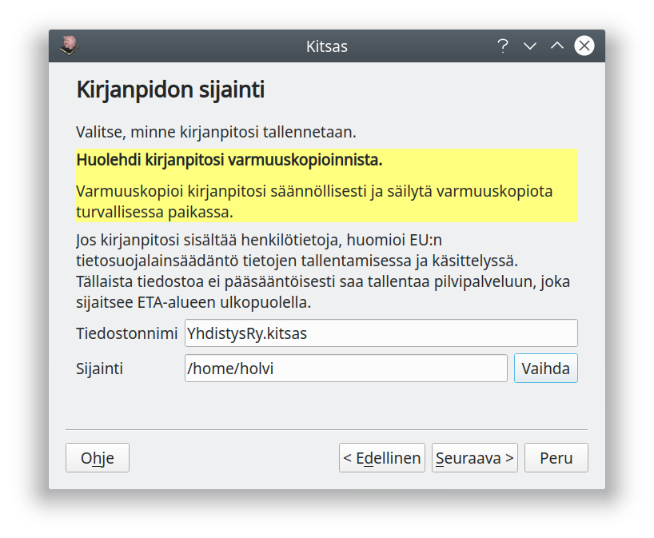

# Kirjanpidon aloittaminen

!!! tip ""
    [ Kirjanpidon luominen (Yhdistys)](https://youtu.be/FQxsg92VjrI)   

## Aloittaminen

Uusi kirjanpito aloitetaan **Aloita**-välilehden **Uusi kirjanpito**-napista.

## Pilveen vai paikallisesti?

Ensimmäisellä näytöllä valitset, tallennetaanko kirjanpito paikallisesti vai pilveen Kitsaan suomalaiselle palvelimelle.

!!! success "Palvelu tulossa"
    Pilvipalvelu tulee saatavalla vuoden 2020 alkupuoliskolla.

## Harjoitus vai todellinen?

Seuraavaksi valitaan, oletko aloittamassa todellista kirjanpito vai harjoittelemassa.

Harjoittelutilassa kaikkiin tulosteisiin tulostuu *HARJOITUS*-teksti, joten ne erottuvat oikeasta kirjanpitoaineistosta. Harjoittelutilassa voit myös tulostaa laskuja haluamillasi päivämäärillä sekä nopeuttaa ajan kulumista jolloin saat näkyviin tilinpäätökseen ja arvonlisäveroon liittyviä ilmoituksia.

!!! tip "Kokeile ensin"
    Ennen varsinaisen kirjanpidon aloittamista kannattaa Kitupiikkiä kokeilla harjoittelutilassa.

## Tilikartta

Seuraavaksi valitaan tilikartta. Tilikartta määrittää käytettävien tilien lisäksi
myös käytössä olevat raportit eli esimerkiksi tuloslaskelman rakenteen sekä
tilinpäätöksen pohjan.

Tilikartta   | Kuvaus
------------------|-------------------------
Elinkeintotoiminta  | Tilikartta yritystoimintaa varten. Yritysmuotoina elinkeinonharjoittaja, avoin yhtiö, kommandiittiyhtiö, osuuskunta, ja osakeyhtiö.
Yhdistys | Tilikartta aatteelliselle yhdistykselle ja säätiölle. Tuloslaskelma on yhdistyskaavan mukainen.

Voit myöhemmin lisätä, muokata ja poistaa käytössä olevia tilejä samoin kuin
raporttien ja tilinpäätöksen malleja.

## Perustiedot

Seuraavassa ruudussa syötetään organisaation nimi, Y-tunnus, osoite ja kotipaikka. Näitä voi muokata
myöhemmin [perusmäärityksissä](/maaritykset/perusvalinnat/).

Lisäksi kannattaa syöttää pankkitilin (ensisijainen käyttötili) tilinumero. Tilinumero tulostuu laskuille ja
sitä käytetään myös maksujen ja tiliotteiden kohdistamiseen. Tilinumeron voi syöttää myöhemmin
tilin tietoihin [tilikartassa](/maaritykset/tilikartta).

Valittava **yritysmuoto** vaikuttaa siihen, mitä tilejä kirjanpidossa on näkyvillä. Samoin **"tilikartan laajuus** vaikuttaa näkyvillä olevien tilien määrään: Elinkeinotoiminnan tilikartassa on 866 tiliä ja yhdistystilikartalla 339 tiliä. Useimmat yritykset ja yhdistykset tarvitsevat näistä tileistä on pientä osaa - laajuusvalinnan mukaan suurin osa tileistä piilotetaan käyttäjältä.

Voit myöhemmin vaihtaa tilikartan laajuutta tai ottaa yksittäisen tilin käyttöön. Tehdessäsi kirjauksia voit myös tilapäisesti siirtyä selaamaan koko tilivalikoimaa.

## Tilikausi

Anna tiedot ensimmäisestä Kitupiikillä pidettävästä tilikaudesta. Koska tilinpäätökseen tulostetaan vertailutiedot myös edellisestä tilikaudesta, anna myös edellisen tilikauden
päivämäärät.

Edellisen tilikauden tiedot syötetään viimeisimmän tilinpäätöksen tilikohtaisesta
tase-erittelystä sekä tuloslaskelman erittelystä. Voit aloittaa kirjanpidon ja myös tehdä
uusia kirjauksia, vaikka tilinavausta ei olisikaan tehty.

Valitse **Toiminta alkaa vasta tästä tilikaudesta** vain, jos yritys perustetaan vasta tällä tilikaudella eikä tilinavausta tehdä lainkaan.

## Tositteiden numerointi

Valitse, haluatko numeroida kaikki tositteet yhteen juoksevaan sarjaan, vai haluatko jakaa tositteet erikseen numeroitaviksi **tositesarjoiksi** joilla on omat kirjaintunnusteensa, esimerkiksi ML myyntilaskuilla ja OL ostolaskuille.

Voit myös muodostaa oman tositesarjan kaikille käteiskuiteille.

!!! tip "Kannattaako käyttää tositesarjoja?"
    Jos paperisia tositteita on paljon, kannattaa ne mapittaa tositetyypeittäin eri mappeihin (esimerkiksi ostolaskut ja myyntilaskut erikseen), ja muodostaa näistä kirjanpito-ohjelmassa omat tositesarjansa.

    Jos tositteita on vain vähän, voivat ne hyvin olla kaikki numeroitu samaan sarjaan. Jos tositteet säilytetään sähköisesti, ei tositenumeroinnin muodolla ole erityistä merkitystä, koska sähköinen arkisto huolehtii tositteiden ja kirjanpidon yhteydestä.

## Tiedostojen sijainti

Tallentaessasi kirjanpidon omalle koneelle valitse tiedostonnimi ja tallennussijainti. Tähän tiedostoon tallennetaan koko kirjanpito kaikkine liitteineen niin, että kirjanpidon voi siirtää tai varmuuskopioida kopioimalla tämän yhden tiedoston.

Kirjanpitotiedoston lisäksi samaan hakemistoon luodaan myöhemmin .arkisto-päätteinen hakemisto, jonne kirjanpidon sähköinen arkisto tallennetaan.

!!! warning "Huolehdi varmuuskopioinnista"
    Huolehdi kirjanpitosi varmuuskopioinnista! Kirjanpidosta tulisi olla aina varmuuskopio toisella tietovälineellä!

!!! note "USB-muisti on hidas"
    Vältä kirjanpidon tallentamista USB-muistitikulle, sillä sen käsittely on hidasta.    

!!! tip "Kirjanpito pilvessä"
    Voit tallettaa kirjanpidon sellaiseen hakemistoon, joka synkronoidaan automaattisesti pilvipalveluun. Muista kuitenkin, että mikäli esimerkiksi asiakasrekisterissä on GDPR:n mukaisia henkilötietoja,  
    niin niiden sijoittaminen EU:n ulkopuolella sijaitsevalla palvelimella voi olla ongelmallista.

    Kitsas Oy tarjoaa mahdollisuuden tallentaa kirjanpito Kitsaan omalla pilvipalvelulla Suomessa sijaitsevalle palvelulle, jossa tietoturvasta on huolehdittu GDPR:n mukaisesti. Kitsaan pilvipalvelu mahdollistaa myös useamman samanaikaisen käyttäjän.

## Valmista tuli!

Kaikki valinnat on tehty ja Kitsas on valmis luomaan uuden kirjanpidon.

## Viimeistele vielä määritykset

!!! tip ""
    [ Kirjanpidon asetukset ja tilikartan muokkaaminen (Yhdistys)](https://youtu.be/R7vJiC3HjRQ)   

    [ Tilinavaus (Yhdistys)](https://youtu.be/7PJTKbHzWbA)   

Ennen kuin aloitat kirjausten tekemisen, kannattaa vielä tarkistaa joukko
määrityksiä. Ne kaikki on selostettu Asetukset-luvussa.

1. Lisää **perusmäärityksiin** logo, puhelinnumero yms. tietoja
2. Yleensä kaikki tarpeelliset tilit löytyvät **tilikartasta**, mutta tarvittaessa voit muokata tilikarttaa.
3. Jos haluat käyttää **kohdennuksia** (kustannuspaikat ja projektit), lisää ne asetuksista
4. Syötä **tilinavaus** edellisen tilinpäätöksen perusteella

!!! note "Tutustu ohjelmaan"
    Ohjelmasta löytyy melkoinen määrä erilaisia asetuksia ja toimintoja. Jo ennen varsinaisen kirjanpidon aloittamista kannattaa ohjelman ohjeisiin tutustua ajan kanssa.

## Harjoittelutila

Jos käytät **harjoittelutilaa**, on ikkunan ylälaidassa vihreä **Harjoittelutila käytössä**-palkki,
ja vaihtamalla oikeassa yläkulmassa olevaa päivämäärää voit "matkustaa ajassa" eli määrätä, mikä päivä
on menossa, ja siten kokeilla vaikkapa tilinpäätöksen tekemistä, alv-tilitystä tai uuden tilikauden aloittamista.
