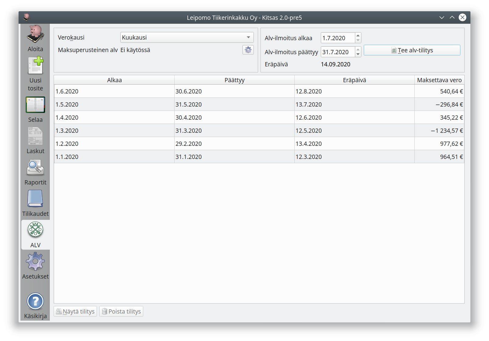
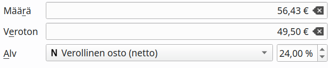
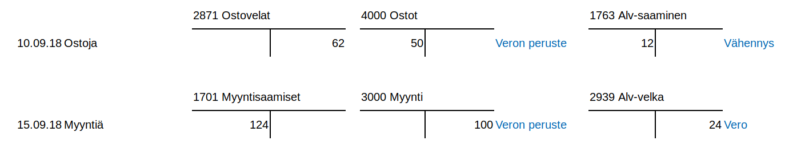
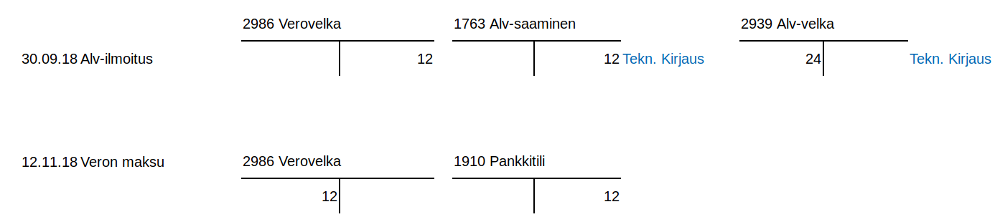

# Arvonlisävero

!!! tip ""
   [ Video arvonlisäverollisista kirjauksista ja alv-ilmoituksen laatimisesta](https://youtu.be/AZBj1D_jBbg)   

!!! warning "Koodit kohdalleen"
    Arvonlisäveron käsittely perustuu kirjauksiin liittyviin ohjaustietoihin (eli alv-laji, alv-prosentti ja kirjauksen tyyppikoodi). Väärät alv-koodit johtavat virheelliseen alv-ilmoitukseen. Suosittelemme tulo- ja menokirjausten tekemistä Tulo- ja menotositteina, ei käsin tiliruudukolle kirjaamalla.

Kitsaan tapa käyttää ohjaustietoja vaatii usein vähän totuttelua, sillä monilla muilla ohjelmilla kirjaukset tehdään yksinomaan eri tilejä käyttäen. Kitsaan menettelystä on kuitenkin omat etunsa

- Kitsas pystyy laatimaan arvonlisäveroilmoituksen ja useimmissa tapauksissa laskemaan myös mahdollisen alarajahuojennuksen
- Jos alv-prosentit muuttuvat, ei tilikarttaan tarvitse luoda uusia tilejä, ja myös muutosvaihessa kirjauksien tekeminen onnistuu
- Alv-kirjauksia ei ole mitenkään piilotettu käyttäjältä, joten monimutkaisemmissakin tapauksissa (esim. vähennyskelvottomat yhteisöhankinnat) kirjauksen oikeellisuus on havaittavissa.

## Arvolisäverovelvollisuus

Kirjanpitovelvollinen määritellään arvonlisäverovelvolliseksi [Perusvalinnoista](/maaritykset/perusvalinnat). Jos yritys ei ole alv-velvollinen, ei arvonlisäveroon liittyviä valintoja näytetä kirjauksissa eikä määrityksissä.

!!! note "Arvonlisäverovelvollisuus"
    Arvonlisäverovelvolliseksi on hakeuduttava, jos tilikauden liikevaihto voi ylittää 10 000 euroa. Alarajahuojennuksen takia hakeutuminen kannattaa yleensä pienemmälläkin liikevaihdolla. Yleishyödyllinen toiminta on arvonlisäverotonta, eli useimpien yhdistysten tarvitsee maksaa arvonlisäveroa vain, jos ne harjoittavat huomattavaa liiketoimintaa. Katso [Verohallinnon ohje arvonlisäverotuksesta](https://www.vero.fi/yritykset-ja-yhteisot/tietoa-yritysverotuksesta/arvonlisaverotus/).

## ALV-välilehti

**Verokausi** on pääasiallisesti kuukausi. [Verohallinnon ohje](https://www.vero.fi/yritykset-ja-yhteisot/ilmoittaminen-ja-maksaminen/omaaloitteiset-verot/hakeutuminen_valinnaiseen_verokautee/) selvittää, milloin ja miten yritys voi hakeutus neljännesvuoden tai vuoden verokauteen.

Tällä sivulla voit myös tehdä uuden alv-tilityksen (**Tee alv-tilitys**) tai tarkastella jo tehtyjä tilityksiä (**Näytä tilitys**). Voit poistaa tilityksen, jos sinun tarvitsee korjata sitä.

## Arvonlisäverolajit

Kitsas käsittelee arvonlisäveroa ohjaustietojen avulla, eli samalle kirjanpitotilille voi kirjata erilaisen alv-kohtelun kirjauksia. Arvonlisäveron laji ja veroprosentti tallennetaan erikseen jokaiselle viennille.

Kitsaassa on seuraavat alv-kirjaustyypit

| Tunnus              | Nimi                                              | Selitys                                                                                                                                                                                                                                                                                                                                                                                                                                                                                      |
| ------------------- | ------------------------------------------------- | -------------------------------------------------------------------------------------------------------------------------------------------------------------------------------------------------------------------------------------------------------------------------------------------------------------------------------------------------------------------------------------------------------------------------------------------------------------------------------------------- |
|                     | Veroton                                           | Myynnistä ei makseta veroa / menosta ei tehdä alv-vähennystä. Tämä merkitään myös kaikille niille menotileille, jotka eivät ole alv-vähennyskelpoisia.                                                                                                                                                                                                                                                                                                                                       |
|       | Verollinen myynti/osto (netto)                    | Verollinen kotimaan myynti/osto. Heti kirjauksen yhteydessä myynti- tai ostotilille kirjataan veroton määrä, ja alv-veron tai vähennyksen osuus kirjataan alv-velkojen tai -saatavien tilille.                                                                                                                                                                                                                                                                                               |
|     | Verollinen myynti/osto (brutto)                   | Verollinen bruttosumma kirjataan tilille, ja vero erotetaan tililtä alv-velkatilille vasta arvonlisäveroilmoitusta laadittaessa.                                                                                                                                                                                                                                                                                                                                                             |
|        | Verollinen myynti/osto (maksuperusteinen alv)     | Arvonlisävero tilitetään vasta, kun maksu on suoritettu.                                                                                                                                                                                                                                                                                                                                                                                                                                     |
|       | Nollaverokannan alainen myynti                    | <a href="https://www.edilex.fi/verohallinnon_ohjeet/2014_0627.html#4.2 Nollaverokannan alaiset myynnit ja yritysj%C3%A4rjestelyt" target="_blank">Erikseen määritellyt tilanteet</a> joissa myynnistä ei suorita veroa, mutta hankinnoista saa vähentää arvonlisäveron.                                                                                                                                                                                                                      |
|          | Tavaroiden ja palveluiden yhteisömyynti tai -osto | <a href="https://www.vero.fi/yritykset-ja-yhteisot/tietoa-yritysverotuksesta/arvonlisaverotus/ulkomaankaupan_arvonlisaverotus/" target="_blank">Verohallinnon ohje</a>.                                                                                                                                                                                                                                                                                                                      |
|       | Tavaroiden maahantuonti EU:n ulkopuolelta         | <a href="https://www.vero.fi/yritykset-ja-yhteisot/tietoa-yritysverotuksesta/arvonlisaverotus/ulkomaankaupan_arvonlisaverotus/maahantuonnin-arvonlisavero/" target="_blank">Maahantuonnin arvonlisävero</a> ilmoitetaan kausiveroilmoituksessa. Myyntilaskun yhteydessä kirjaus tehdään valinnalla **Tavaroiden maahantuonti EU:n ulkopuolelta**. Jos myyntilasku on jo kirjattu verottomana, voidaan tullauspäätös kirjata myöhemmin valinnalla **Tavaroiden maahantuonti, veron kirjaus**. |
|      | Rakennuspalveluiden myynti tai osto               | <a href="https://www.vero.fi/yritykset-ja-yhteisot/tietoa-yritysverotuksesta/arvonlisaverotus/rakennusalan_kaannetty_arvonlisaverovelvollisuus/" target="_blank">Rakennuspalveluiden arvonlisäveron suorittaa ostaja</a> käänteisen verovelvollisuuden mukaisesti. (Myyntilaskussa ostajan tiedoissa oltava Y-tunnus tai VAT-tunnus).                                                                                                                                                        |
|  | Voittomarginaalijärjestelmä                       | <a href="https://www.vero.fi/syventavat-vero-ohjeet/ohje-hakusivu/48682/k%C3%A4ytettyjen-tavaroiden-sek%C3%A4-taide--ker%C3%A4ily--ja-antiikkiesineiden-marginaaliverotusmenettely/" target="_blank">Marginaaliverotusmenettelyssä</a> vero maksetaan ainoastaan voittomarginaalista. Kitsas tukee Verohallinnon ohjeessa kuvattua yksinkertaistettua menettelyä. <!--_-->                                                                                                                   |

## Arvonlisävero kirjanpidossa

Alla esimerkki kotimaan arvonlisäveron käsittelystä nettoperiaatetta noudattaen. Kitsaassa kaikkiin arvonlisäverollisiin kirjauksiin liittyy alv-koodi, jonka tyyppitieto on esitetty alla olevassa esimerkissä sinisellä:

10.9. on tehty osto, josta saadaan tehdä alv-vähennys. Veroton osuus kirjataan ostotilille ja veron osuus alv-saamiseksi.

15.9. on saatu verollista myyntituloa. Veroton osuus kirjataan myyntitilille ja veron osuus alv-velaksi.

30.9. näkyy kirjanpidossa verokauden viimeiselle päivälle kirjattava alv-ilmoitus. Siinä alv-velat ja saamiset yhdistetään Verovelka-tilille.

12.11. verot maksetaan verottajan pankkitilille.
