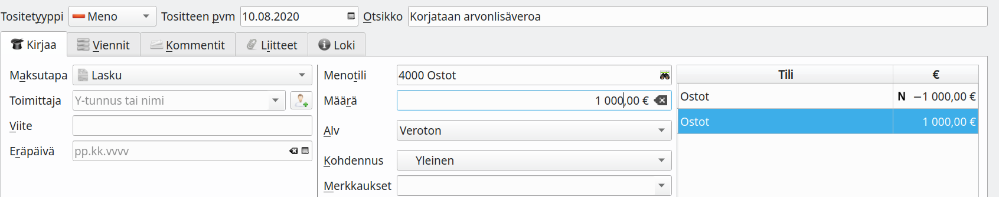
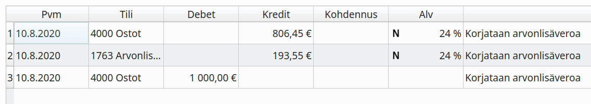
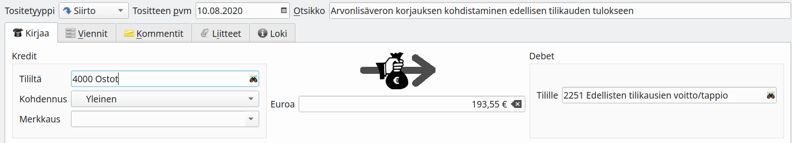
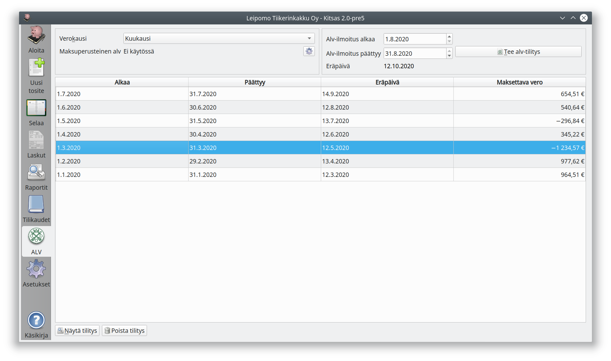

# Arvolisäveroilmoituksen korjaaminen

!!! tip "Verottajan ohje"
    [Verohallinnon ohje virheen korjaamisesta](https://www.vero.fi/yritykset-ja-yhteisot/ilmoittaminen-ja-maksaminen/omaaloitteiset-verot/miten_omaaloitteisten_verojen_ilmoituks/)

## Vähäisen virheen korjaaminen

Jos verokauden arvonlisäilmoituksen virhe (liikaa ilmoitettu tai ilmoittamatta jäänyt vero) on enintään 500 euroa, voidaan se korjata muuttamalla seuraavalta verokaudelta ilmoitettavan veron määrää.

Esimerkissä on aiemmalla verokaudella merkitty 1000 euron vähennyskelvotos oston vähenettäväksi 24 % verokannan mukaan. Korjaustositteelle verollinen osto merkitään miinusmerkkisenä ja veroton plusmerkkisenä. Korjaustositteeen viennit:

Jos virhe olisi tapahtunut jo edellisellä tilikaudella, pitää virheen tulosvaikutus oikaista kirjanpidossa kohdistumaan omaan pääomaan.

## Korvaavan arvonlisäveroilmoituksen antaminen

Jos virheellinen kausi on vielä avoimena (tilinpäätöstä ei ole tehty), voit poistaa virheellisen arvonlisäveroilmoituksen **Poista tilitys** -painikkeella, tehdä tarvittavat korjaukset ja laatia uuden Alv-ilmoituksen. Kun annat OmaVerossa korvaavan arvonlisäveroilmoituksen, ilmoita aina myös korjauksen syy.

Jos virhe on tapahtunut aiemmalla jo lukitulla tilikaudella, joudut laskemaan korjausilmoituksen tiedot itse sekä kirjaamaan korjauksen tulosvaikutuksen omaan pääomaan.
