# Arvonlisäveron mallikirjaukset

Kaikki arvonlisäverolliset kirjaukset kannattaa aina tehdä Meno- ja Tulo-tositetyypin tositteine. Huomaa, että verokäsittelyn kannalta ei ole olennaista, mille tilille kirjaus tehdään, vaan että kirjaukselle määritellään oikein arvonlisäveron valinnat!

Kitsas muodostaa tulokirjaukset myös ohjelmalla laadituista laskuista kaikille laskutuksessa valittavissa oleville arvonlisäverolajeille.

## Kotimaan ostot

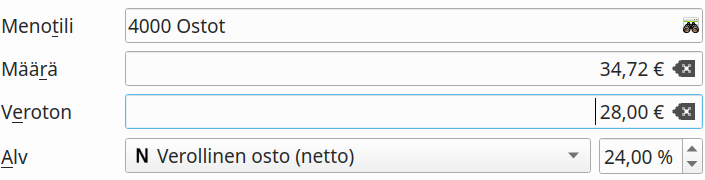

Voit syöttää kohtaan **Määrä** verollisen kokonaismäärän tai kohtaan **Veroton** verottoman nettomäärän.

Nettokirjausmenettelyssä arvonlisäveron osuus kirjataan erikseen alv-saamisiksi. Bruttokirjausmenettelyssä ostotilille kirjataan verollinen määrä, ja vasta arvonlisäveroilmoitusta laadittaessa veron osuus siirretään alv-saamiksiksi.

!!! note "Laskutusvaatimukset"
    Voit vähentää arvonlisäveron hankinnoistasi vain, jos lasku on Arvonlisäverolain määritysten mukainen. Erityisesti laskulla on oltava merkinnät verokannasta ja veron osuudesta.

**Viennit**-välilehdeltä näet kirjauksesta syntyvät viennit:

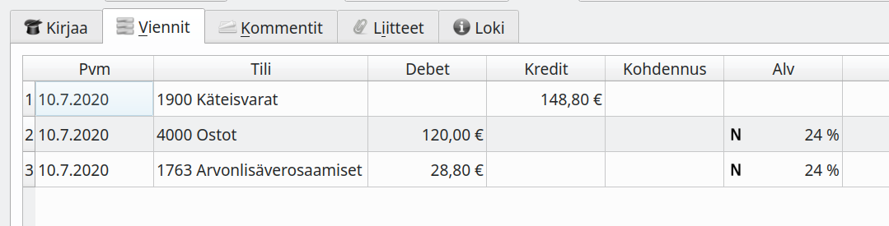

## Kotimaan myynti

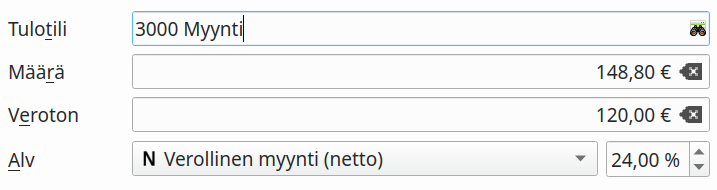

Voit syöttää kohtaan **Määrä** verollisen kokonaismäärän tai kohtaan **Veroton** verottoman nettomäärän.

Nettokirjausmenettelyssä arvonlisäveron osuus kirjataan arvonlisäverovelkaan. Bruttokirjausmenettelyssä myyntitilille kirjataan verollinen määrä, ja vasta arvonlisäveroilmoitusta laadittaessa veron osuus siirretään alv-velaksi.

## Veroton myynti

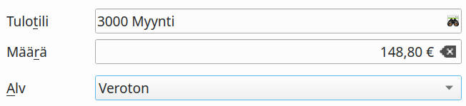

Alv-lajia **Veroton** käytetään verottomaan myyntiin (esim. terveydenhuoltopalvelut) tai kun myyjä ei ole alv-velvollinen. **Nollaverokannan alainen myynti** koskee [erikseen määriteltyjä tilanteita](https://www.edilex.fi/verohallinnon_ohjeet/2014_0627.html#4.2 Nollaverokannan alaiset myynnit ja yritysj%C3%A4rjestelyt), joissa myynnistä ei suorita veroa, mutta hankinnoista saa vähentää arvonlisäveron.

## Verottomat ostot

Alv-lajia **Veroton** käytetään kaikkiin ostoihin, joista ei voi tehdä alv-vähennystä.

## Marginaaliverotusmenettely

[Marginaaliverotusmenettelyssä](https://www.vero.fi/syventavat-vero-ohjeet/ohje-hakusivu/48682/k%C3%A4ytettyjen-tavaroiden-sek%C3%A4-taide--ker%C3%A4ily--ja-antiikkiesineiden-marginaaliverotusmenettely/) vero maksetaan ainoastaan voittomarginaalista. Kitsas tukee Verohallinnon ohjeessa kuvattua yksinkertaistettua menettelyä.

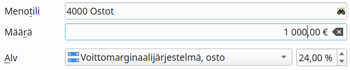
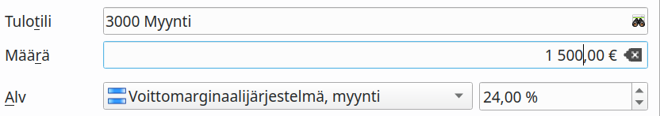

Kitupiikki laskee alv-ilmoitusta tehtäessä verokauden voittomarginaalin. Voittomarginaalilaskelma löytyy alv-erittelyn loppupuolelta.

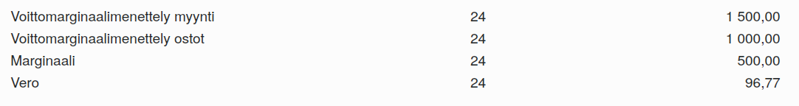

Tavarakohtaisessa menettelyssä tulee tavaraa myytäessä kirjata tavaran ostohinta verottomaksi ja voittomarginaalin osuus verolliseksi (netto- tai bruttokirjaukseksi).

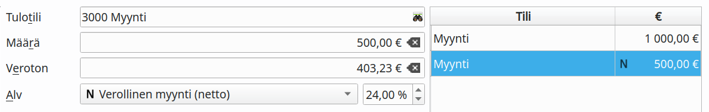

## Rakennusalan käännetty arvonlisäverovelvollisuus

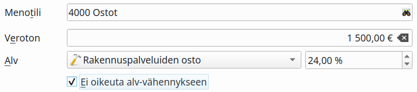

Valintaa **Ei oikeuta alv-vähennykseen** käytetään silloin, jos ostaja ei ole oikeutettu tekemään alv-vähennystä (esimerkiksi henkilöstön virkistysmökin kunnostaminen).

## Yhteisöhankinnat

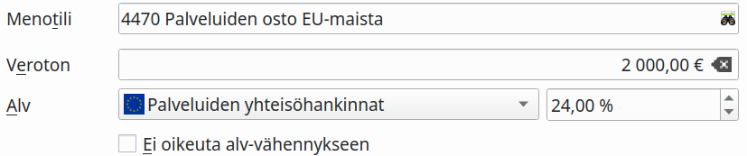

Maksettu määrä kirjataan kohtaan **veroton**, ja **alv-prosentti** on suomalaisen arvonlisäveron prosentti.

## Yhteisömyynti

Yhteisömyynnissä ostaja maksaa arvonlisäveron. Myyjän tulee antaa myös [kuukausittainen yhteenvetoilmoitus](https://www.vero.fi/syventavat-vero-ohjeet/ohje-hakusivu/48617/arvonlisaveron_yhteenvetoilmoituksen_an/).

## Maahantuonti

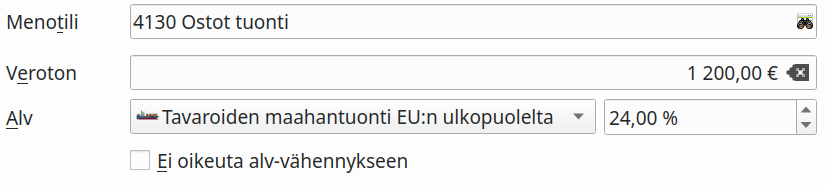

<a href="https://www.vero.fi/yritykset-ja-yhteisot/tietoa-yritysverotuksesta/arvonlisaverotus/ulkomaankaupan_arvonlisaverotus/maahantuonnin-arvonlisavero/" target="_blank">Maahantuonnin arvonlisävero</a> ilmoitetaan kausiveroilmoituksessa. Ostolaskun yhteydessä kirjaus tehdään valinnalla **Tavaroiden maahantuonti EU:n ulkopuolelta**. Jos ostolasku on jo kirjattu verottomana, voidaan tullauspäätös kirjata myöhemmin valinnalla **Tavaroiden maahantuonti, veron kirjaus**
<!-- __ -->

## Käsin kirjaaminen

Tositetyypillä Muu kirjattaessa verolaji ja -prosentti on valittava erikseen. Ole huolellinen!

* **Veronalainen määrä** tarkoittaa arvonlisäveron perustetta. Bruttokirjauksessa summa kirjataan alv-tiedolla *Verollinen myynti(brutto)* ja *veronalainen määrä*. Nettokirjauksessa tähän kirjataan veroton (netto)summa.
* **Veron määrä** tarkoittaa maksettavaa arvonlisäveroa: nettokirjauksessa tähän kirjataan maksettava vero eli brutto- ja nettosummien erotus.
* **Vähennettävä määrä** tarkoittaa ostojen kirjauksessa arvonlisäverosta vähennettävää määrää.
* **Kohdentamaton maksuperusteinen alv** tarkoittaa maksua odottavaa veroa
