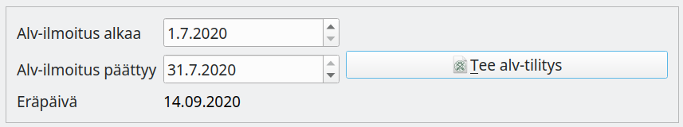
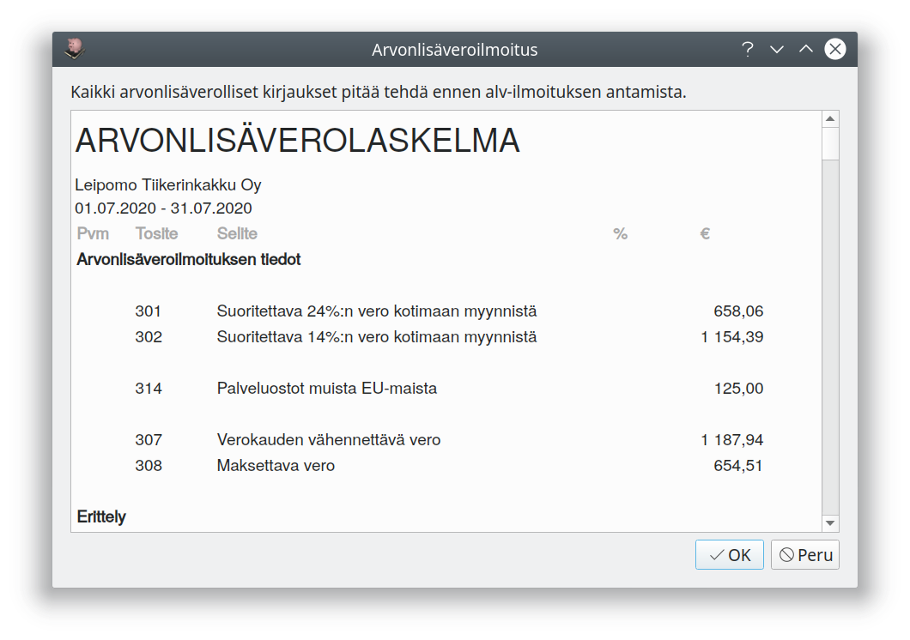
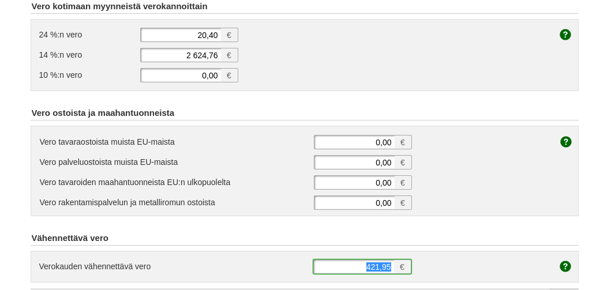
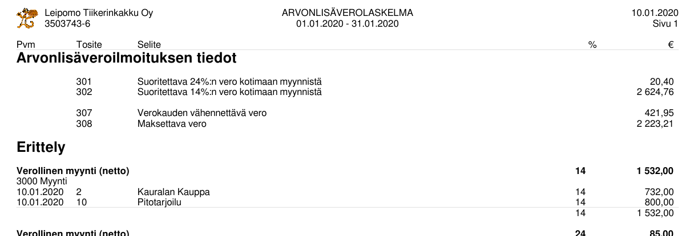
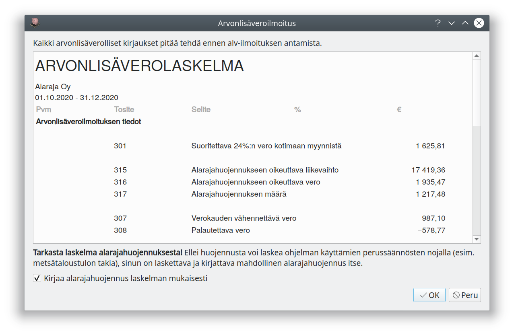

# Arvonlisäveroilmoitus

Ohjelma muistuttaa aloitusikkunassa, kun arvonlisäveroilmoituksen eräpäivä lähestyy

Kun kaikki tälle ilmoituskaudelle tehdyt verolliset kirjaukset on tehty, paina *ALV*-sivulla **Tee alv-tilitys**-nappia.

Kitsas esittää Alv-laskelman, jossa on kausiveroilmoituksessa arvolisäveron osalta tarvittavat tiedot. Vahvista laskelma painamalla **OK**.

Laskelman pohjalta tehdään kirjaus, jossa alv-velka ja alv-saatava yhdistetään ja kirjataan **Verovelat**-tilille. Samalle tilille kirjataan myös muut oma-aloitteisesti maksettavat verot, kuten ennakonpidätys ja työnantajamaksut.

!!! note "Verovelat-tili"
    Verovelat-tilille kirjataan kaikki oma-aloitteiset verot, jotka on ilmoitettu verottajalle mutta ei vielä maksettu. Tilikauden aikana myös palautukset kirjataan miinusmerkkisinä Verovelkoihin, mutta tilinpäätöstoiminto kirjaa ne kuitenkin tilinpäätökseen Verosaamisina.

Tilitykseen liittyy erittely, jossa kirjauksia voi seurata aina tositteisiin saakka. Tilitys avautuu alv-sivun **Näytä tilitys**-napista. Se tallentuu myös liitteeksi alv-tilitysvientiin ja siten myös sähköiseen arkistoon.

## Arvonlisäveron maksaminen

Kitupiikissä ei ole koneellista tietojen siirtoa. Tarkista Kitupiikin laatima verolaskelma ja tee ilmoitus [OmaVero](https://omavero.fi/)-palvelussa.

Maksa verot OmaVero-palvelussa tai verottajan antamalla viitenumerolla. Veron maksu kirjataan siirtokirjauksena Verovelat-tilille. Sähköisen tiliotteen tuontitoiminto tekee kirjauksen automaattisesti.

## Arvonlisäveron erittely

!!! tip "Arvonlisäverolaskelma kesken kauden"
    Raportit-välilehdeltä voit tulostaa Arvonlisäveron erittelyn haluamaltasi aikaväliltä (riippumatta siitä, onko kyseiselle aikavälille tehty vielä alv-tilitystä).

## Arvonlisäveron alarajahuojennus

Arvonlisäverosta saa [alarajahuojennusta](https://www.vero.fi/yritykset-ja-yhteisot/tietoa-yritysverotuksesta/arvonlisaverotus/arvonlisaveron_alarajahuojennu/), jos vuoden liikevaihto ilman alv:tä on alle 30 000 euroa. Kitupiikki tekee tilikauden tai vuoden viimeiseen arvonlisäveroilmoituksen myös laskelman alarajahuojennuksesta.

Alarajahuojennus on tuloverotuksessa veronalaista tuloa.

!!! note "Alarajahuojennuksen erityistapaukset"
    Alarajahuojennukseen liittyy erityssääntöjä esimerkiksi metsätalouteen ja vapaaehtoiseen kiinteistön vuokrauksesta arvonlisäverovelvolliseksi hakeutumiseen. Tutustu Verohallinnon ohjeisiin ja laske tarvittaessa itse alarajahuojennuksen määrä.
