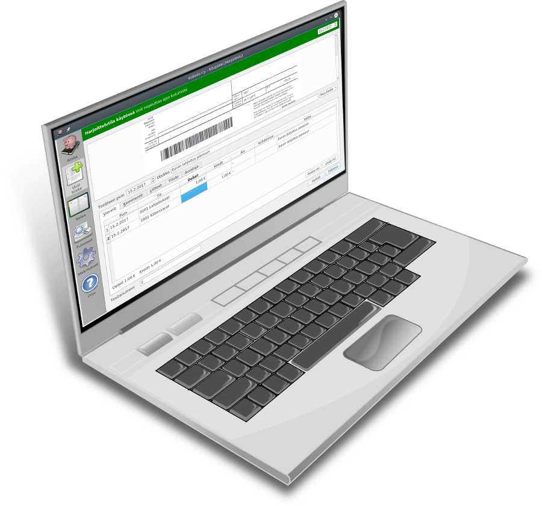

# Kitsas <small>Ystävällinen kirjanpitäjä</small>

**Kitsas** tekee kahdenkertaisesta kirjanpidosta entistä yksinkertaisempaa.

**Kitsas** on avointa lähdekoodia. Ohjelmaa saa käyttää täysin ilman maksua. Kitsas Oy myy ohjelman käyttäjille myös maksullisia tukipalveluita sekä mahdollisuutta tallentaa kirjanpito pilveen turvalliselle suomalaiselle palvelimelle.

**Kitsas** sopii yhdistyksille, yrittäjille ja yrityksille.
