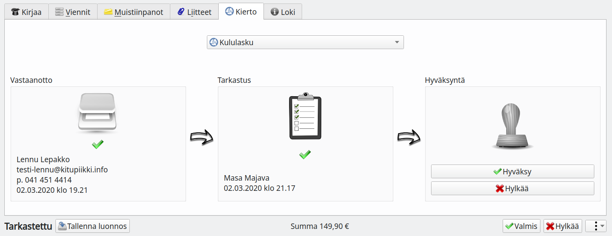
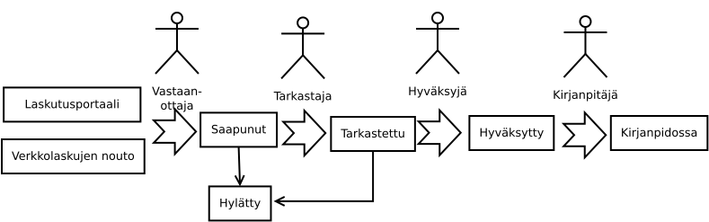

# Laskujen kierto

!!! note "Vain pilvessä"
    Laskujen kierto on käytettävissä vain Kitsaan pilveen sijoitetuissa kirjanpidoissa.

Kierto antaa mahdollisuuden määritellä polun, jossa saapunut lasku tarkastetaan ja hyväksytään ennen kuin se tulee osaksi kirjanpitoa. Kiertoa käytetään myös, kun kirjanpitoon lisätään laskuja laskutusportaalista tai verkkolaskujen automaattisella noudolla.

Kitsaassa on mahdollista määritellä, että kierron siirtyessä seuraavaan vaiheeseen lähetetään kierrossa seuraavana olevalle henkilölle sähköposti-ilmoitus.

## Roolit

Toiminto ei edellytä kaikkia kaaviossa olevia rooleja eikä jokaisen vaiheen suorittamista erikseen.

Rooli   |   Tehtävä | Tarvittava oikeus
--------|-----------|------
Vastaanottaja | Tallentaa laskun järjestelmään ja valitsee noudatettavan kierron. Laskutusportaalista ja verkkolaskutuksesta saapuvat laskut vastaanotetaan automaattisesti **Saapunut** -tilaan | Laskun lisääminen kiertoon
Tarkastaja | Tarkastaa laskun (esim. jaoston vastaava tai hankinnan tehnyt) | Laskun tarkastaminen
Hyväksyjä  | Hyväksyy laskun (esim. puheenjohtaja) | Laskun hyväksyminen
Kirjanpitäjä | Tarkastaa, että lasku on oikein kirjattu ja siirtää sen kirjanpitoon. Tässä vaiheessa huolehtii yleensä myös laskun maksamisesta. | Tositteen tallentaminen ja muokkaaminen
