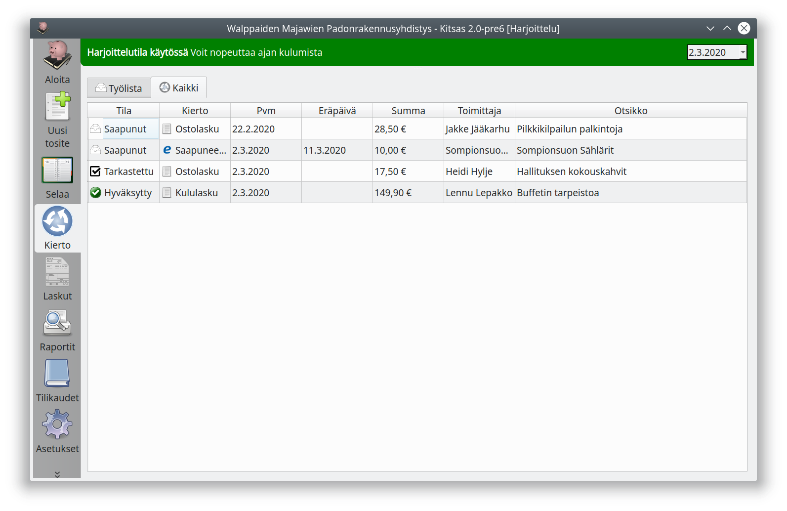
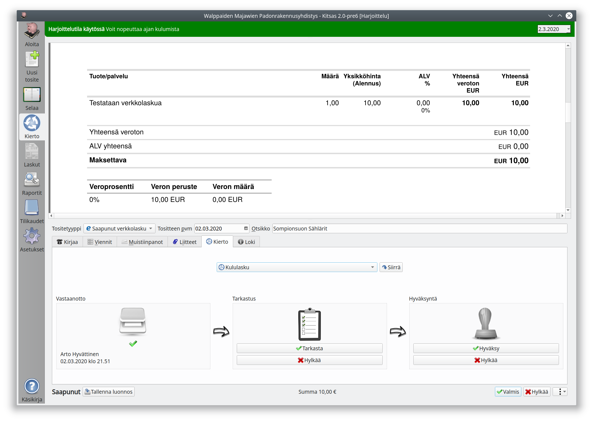
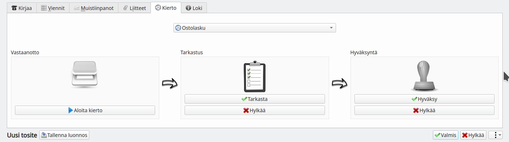

# Laskujen käsittely

**Kierto**-sivulla näet kierrossa olevat laskut. **Työlistalla** näytetään sinun käsiteltävänäsi olevat laskut. Jos sinulle on oikeus kaikkien kierrossa olevien laskujen selaamiseen, näet ne **Kaikki**-välilehdellä.

Valitse käsiteltävä lasku ja pääset tositenäkymään.

**Kierto**-välilehdellä ovat kiertoon liittyvät valinnat, jotka riippuvat oikeuksistasi. Tämä käyttäjä voisi

- Siirtää laskun toiseen kiertoon vaihtamalla kiertoa ja painamalla **Siirrä**-nappia
- **Tarkastaa** tai **Hyväksyä** laskun
- **Hylätä** laskun (ei ole merkitystä, kumman vaiheen hylkäyspainiketta painaa)
- Tallentaa laskun kirjanpitoon **Valmis**-napilla

Viimeistään laskun tallentajan (kirjanpitäjän rooli) pitäisi myös tarkistaa muilta välilehdiltä, että laskun tiedot ovat oikein.

## Uuden laskun lisääminen kiertoon

Jos sinulla on oikeus lisätä lasku kiertoon, voit laskun tallentamisen sijaan siirtyä **Kierto**-välilehdelle, valita kierron ja painaa **Aloita kierto**.

