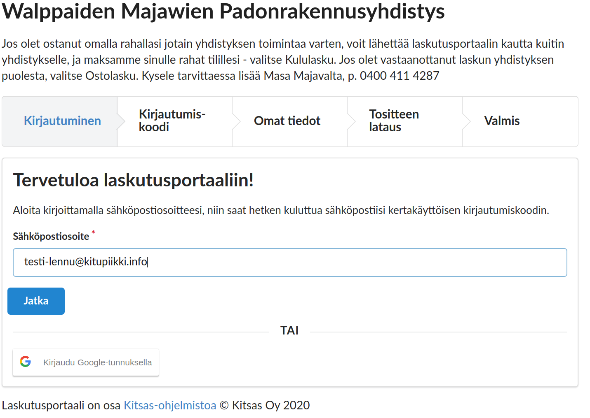
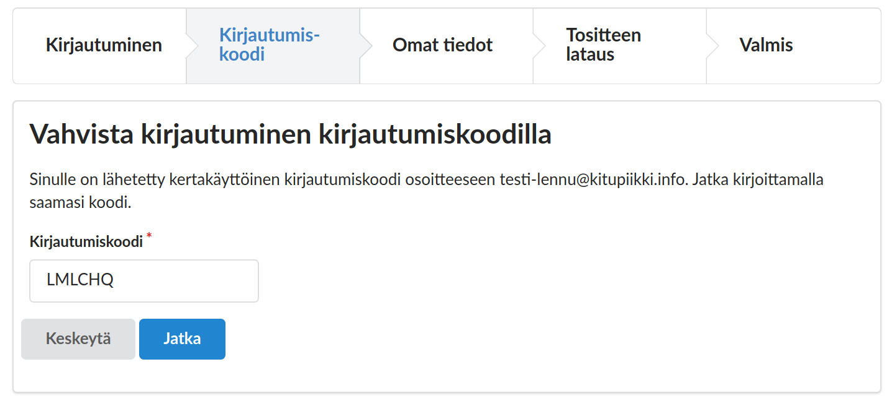
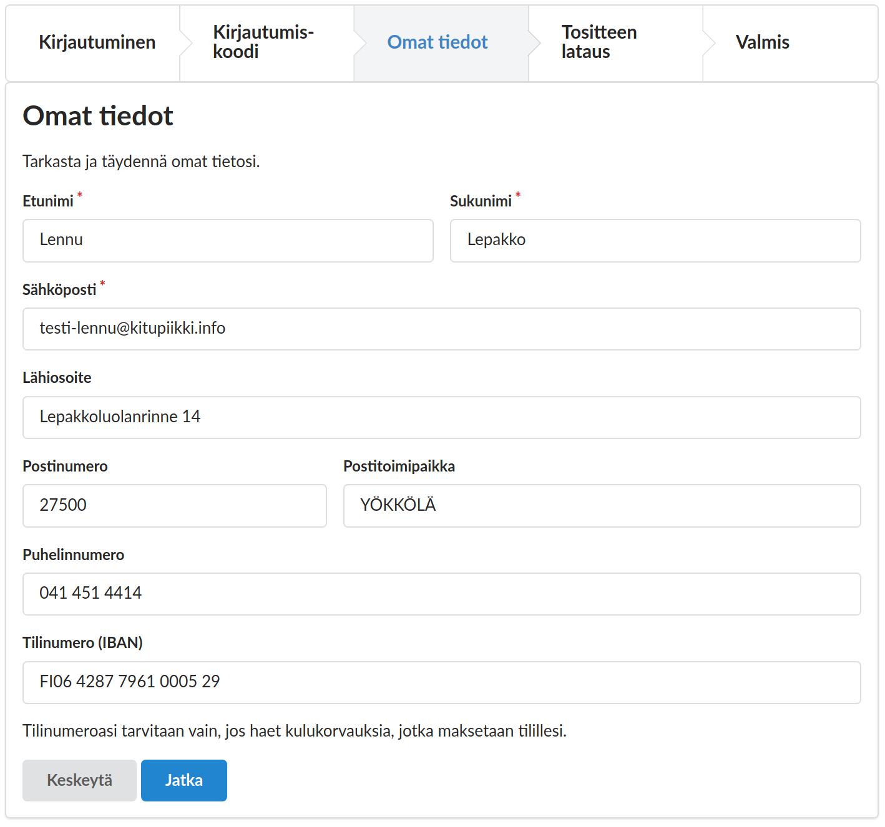
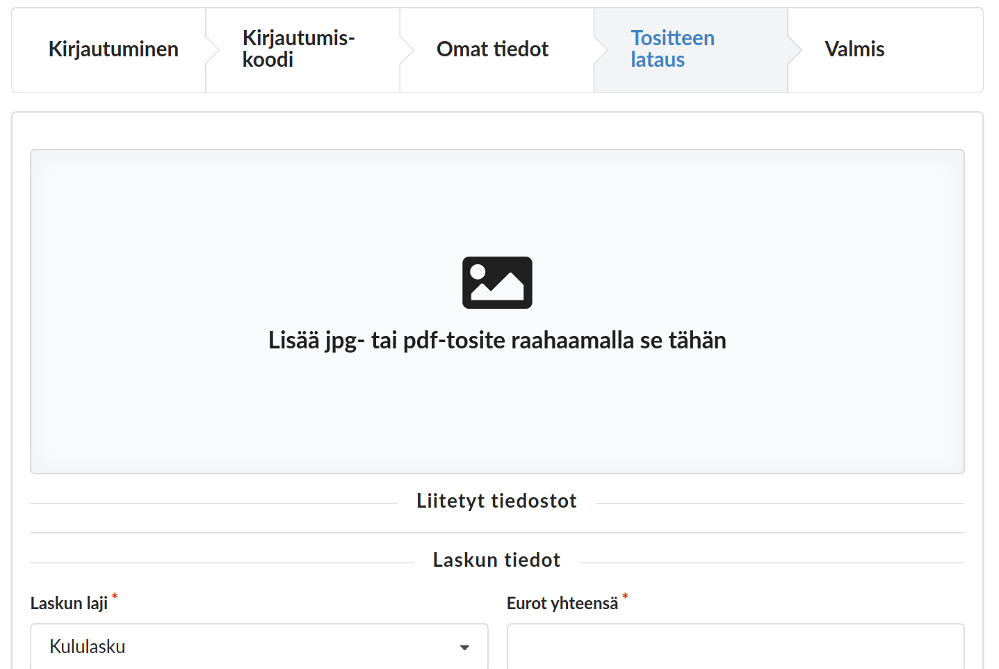
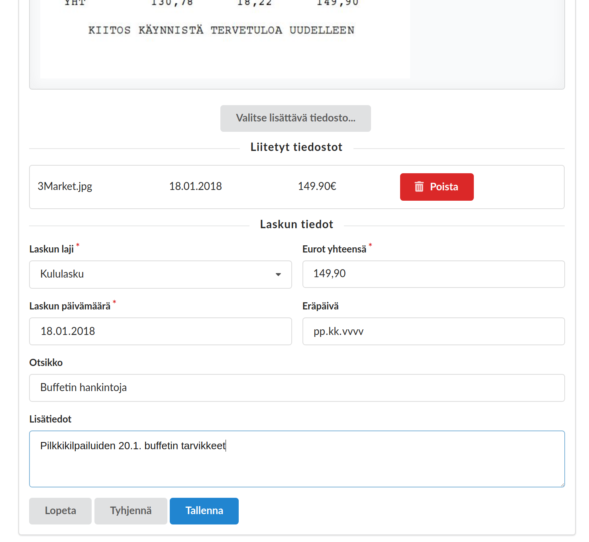
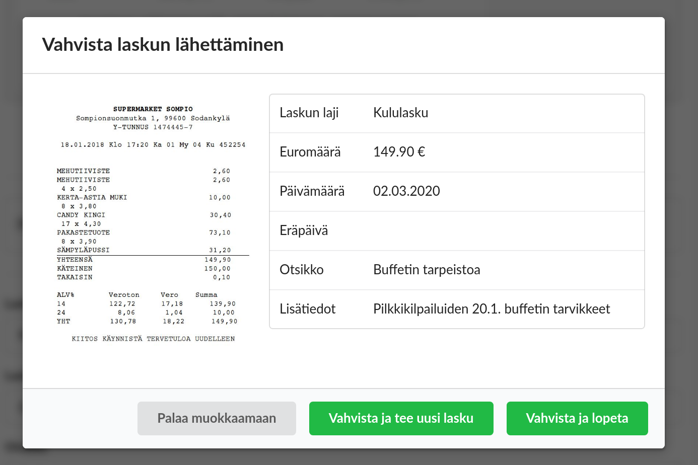

# Laskutusportaali

Kitsaan kaikkiin pilvitilauksiin sisältyy laskutusportaali. Kun laskutusportaali on otettu käyttöön kirjanpidon asetuksista, pääsee kuka tahansa portaalin osoitteen tietävä toimittamaan laskutusportaalin kautta laskuja, jotka siirtyvät automaattisesti Kitsaan hyväksymiskiertoon.

!!! tip "Kululaskut yhdistyksissä"
    Kun yhdistyksen vastuuhenkilöt tekevät hankintoja yhdistykselle, voivat he kätevästi toimittaa kuitit suoraan kirjanpitoon tallennettaviksi, eikä kuitteja pääse hukkumaan tai hautautumaan paperipinoihin.

Laskutusportaalin osoite löytyy Laskujen kierron määrityksistä.

## Laskun toimittaminen laskutusportaalissa

### 1. Kirjautuminen

Laskutusportaali varmistaa käyttäjänsä sähköpostiosoitteen. Portaaliin voi joka kirjautua Googlen tunnuksilla, tai sitten portaalille ilmoitetaan sähköpostiosoite, johon lähetetään kirjautumiskoodi.

### 2. Kirjautumiskoodi

Googlen tunnuksilla kirjauduttaessa et tarvitse kirjautumiskoodia

### 3. Omat henkilötiedot

Henkilötietoja tarvitaan, jos teet yhdistykselle kululaskun. Järjestelmä tallentaa syöttämäsi tiedot tulevia laskuja varten.

### 4. Tositteen lataaminen

Raahaa jpg- tai pdf-muodossa oleva tosite lisäyskuvakkeen päälle. Järjestelmä tutkii lisäämääsi kuvatiedostoa, ja pyrkii poimimaan siitä päivämäärän sekä eurosumman valmiiksi.

Jos lisäät samalle laskulle useamman tositteen, paina **Valitse lisättävä tiedosto** -nappia

### 5. Täydennä tositteen tiedot

Täydennä laskun tiedot. Kirjanpidossa voi olla käytössä useampia **laskun lajeja**, joille on määritelty omat kiertosääntönsä (esimerkiksi jokaisella jaostolle oma valintansa).

### 6. Tallenna

Tarkista vielä laskun tiedot ja vahvista laskun lähettäminen.
