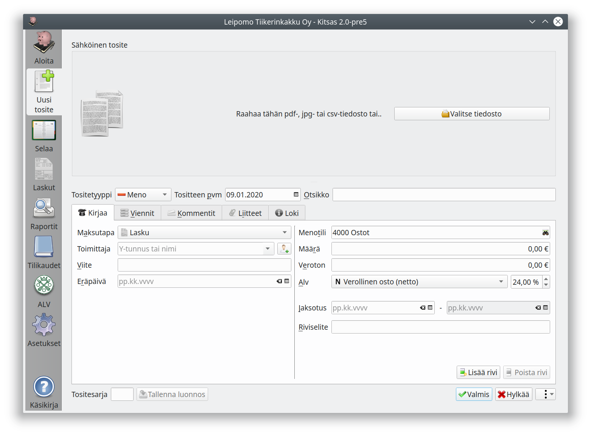
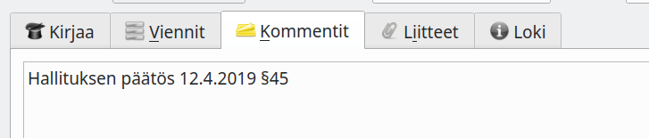
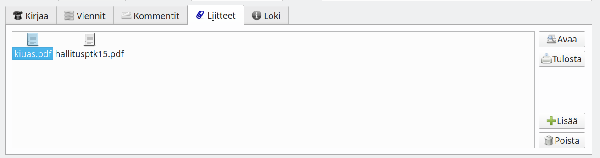
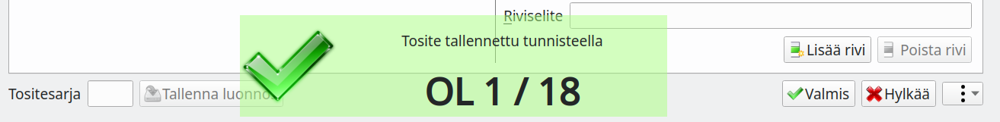

# Kirjaaminen

1. Jos tosite on tietokoneella (pdf- tai jpg-tiedostona) tuo se joko raahaamalla se **Sähköinen tosite**-kohtaan tai **Valitse tiedosto**-napilla (tai <kbd>CTRL</kbd>+<kbd>O</kbd>).
    Kitsas pyrkii poimimaan osan tositteen tiedoista.
2. Valitse **tositetyyppi**    
3. Täytä tositteen **päivämäärä** <kbd>Enter</kbd> ja **otsikko** <kbd>Enter</kbd>.
4. Kirjaa tositteen muut tiedot (näkymä vaihtelee eri tositetyypeittäin)
5. Lisää tarvittaessa vielä **Kommentit**-välilehdelle tarkemmat selvitykset.
6. Tallenna kirjaus painamalla **Tallenna** tai <kbd>F12</kbd>. Valinnalla **Tallenna luonnos** tosite tallennetaan luonnoksena, joka ei ole vielä osa kirjanpitoa.

## Tositetyypit

Tyyppi    | Käyttötarkoitus
----------|-----------------------
Meno      | Ostolaskut ja muut menotositteet
Tulo      | Myyntilaskut ja muut menotositteet
Kululasku | Työntekijän (tms.) omalla rahallaan ostaman yritykselle kuuluvan menon kulut korvataan hänelle jälkikäteen
Siirto    | Rahoitustapahtuma, kuten tilillepano, tililtäotto, laskun maksu tms. jossa raha siirtyy kahden kirjanpitotilin välillä. Pankkitilin tapahtumia tiliotteelta kirjattaessa käytä kuitenkin Tiliote-tositetyyppiä.
Tiliote   | Pankkitilin tapahtumien kirjaaminen tiliotteelta. Tiliotteelta voidaan kirjata laskujen maksamisen lisäksi arvonlisäverottomia tuloja ja menoja.
Palkka    | Yksinkertainen palkkatosite
Muistio   | Itse laadittu tosite esimerkiksi kirjanpidon jaksotuksia varten
Liitetieto | Liitetietoja varmentava tosite, tositteella ei voi olla kirjauksia
Muu       | Tosite, jossa kirjaukset tehdään tileittäin tiliruudukolle. Tarvitaan joskus monimutkaisemmissa kirjauksissa.

## Tositteen kommentit

Kommentit-välilehdelle kirjoitetaan tarkemmat tiedot tositteesta. Hankinnasta voidaan esimerkiksi kertoa, mitä varten se on tehty ja mihin päätökseen se perustuu (esim. yhdistyksessä viittaus hallituksen pöytäkirjaan).

Muistiotositteessa selitys voidaan kirjoittaa Kommentti-välilehdelle.

## Liitteet

Tositteeseen voi liittää pdf- tai jpg-tiedostoja.

Ensimmäisen liitteen (sähköinen tosite) voit liittää suoraan **Sähköinen tosite**-kohdassa raahaamalla tiedoston tai **Valitse tiedosto**-napista.

Voit lisätä enemmän tiedostoja **Liitteet**-välilehdeltä **Lisää**-napista. Voit myös poistaa liitteitä, muuttaa liitteen nimeä (kaksoisnapsauttamalla nimeä), avata liitteen ulkoisella ohjelmalla tai tulostaa liitteen.

Lisäliite voi olla esimerkiksi hankintapäätös, tarjouspyyntö, lähetyslista tai muu tarpeellinen asiakirja.

Voit myös tehdä tositteen, jossa on liite ja mahdollisesti kommentteja ilman yhtään vientiä, jos jokin asiakirja on tarpeen liittää sähköiseen arkistoon. Tällainen voi olla tarpeen esimerkiksi todennettaessa tilinpäätöksen liitetietoja liitetietotositteella.

## Tositesarja

Jos olet valinnut numeroinnin useampaan tositesarjaan, voit valita tositesarjan tunnuksen.

!!! note "Tositenumerointi"
    Tositteet numeroidaan vasta, kun ne tallennetaan valmiina kirjanpitoon. Tallennuksen jälkeen Kitsas näyttää tallennetun tositteet tunnuksen. Jos säilytät tositteet paperisina, merkitse ohjelman ilmoittama tunnus tositteeseen.
    

## Lisää toimintoja

Kirjausikkunan oikean alakulman valikosta löytyvät

* **Tulosta tosite** <kbd>Ctrl</kbd>+<kbd>P</kbd>
* **Poista tosite**
