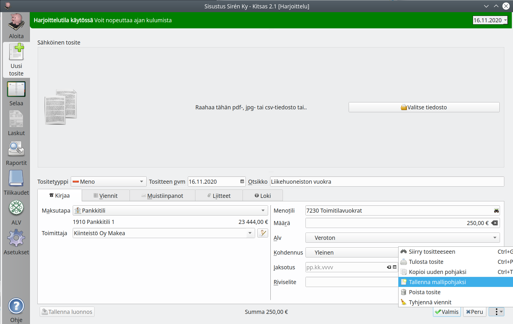
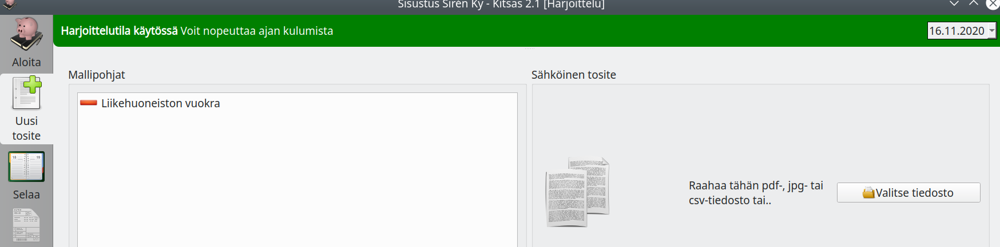

# Mallipohjat

Voit tallentaa usein toistuvia tositteita mallipohjiksi, joiden pohjalta on nopea luoda uusia tositteita.

## Mallipohjan luominen

Aloita uuden tositteen tekeminen ja täytä tositteet tietoja tavalliseen tapaan.

Kun olet valmis, valitse oikean alakulman valikosta **Tallenna mallipohjaksi**.

!!! note "Kaikkien käytössä"
    Jos tallennat kirjanpidon pilveen, ovat mallipohjat kaikkien käyttäjien nähtävillä ja käytttävissä.

## Mallipohjan käyttäminen

Jos kirjanpitoon on tallennettu mallipohjia, näkyvät ne **Uusi tosite**-näkymässä. Aloita tositteen tekeminen mallin pohjalta valisemalla luettelosta haluamasi mallipohja.

