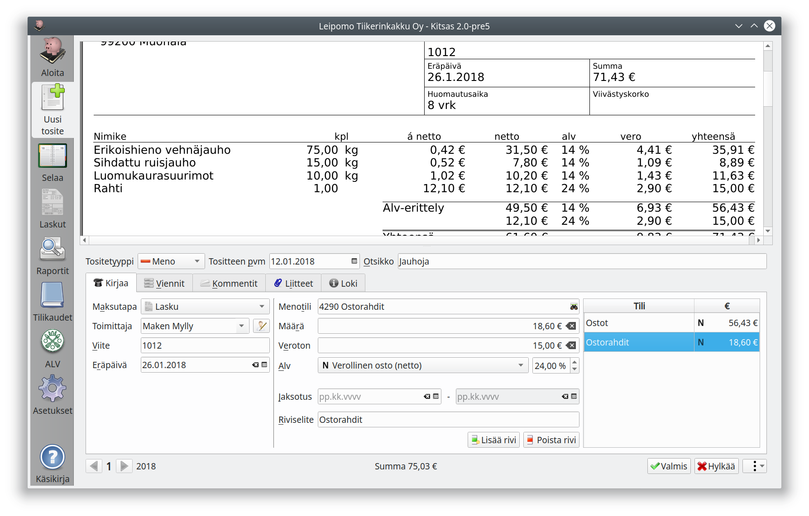
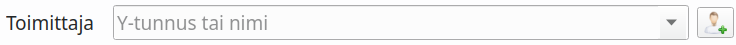
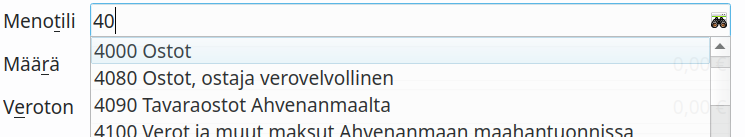
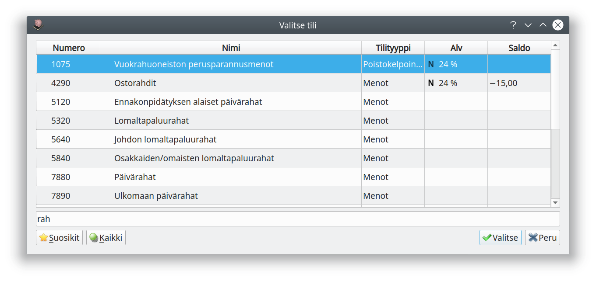
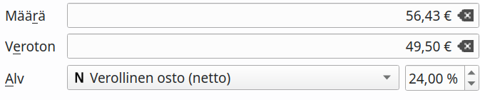
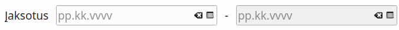
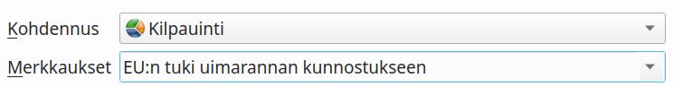
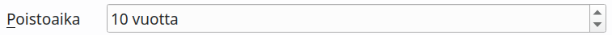

# Menot ja tulot

!!! tip ""
    [ Ohjevideo meno- ja tulotositteiden kirjaamisesta (Yhdistykset)](https://youtu.be/sxCpdRc16r4)

Aloita kirjaaminen aina lisäämällä mahdollinen sähköinen tosite.

## Menokirjausten maksutavat

Maksutapa  | Käyttötarkoitus     | Päivämäärä
-----------|---------------------|-------
Lasku      | Ostolasku kirjataan **lasku- tai suoriteperusteisesti** ostovelkoihin. Laskun maksaminen kirjataan myöhemmin erikseen. | Laskun päivämäärä tai toimituspäivä
Käteinen   | Lasku kirjataan **maksuperusteisesti** käteistililtä. | Maksupäivä
Pankkitili | Lasku kirjataan **maksuperusteisesti** pankkitililtä. | Maksupäivä
Luottokortti | Lasku kirjataan luottokorttivelkojen tilille. | Laskun päivämäärä tai toimituspäivä
Hyvityslasku | Aiemmasta laskusta kirjattava hyvitys (valitse hyvitettävä lasku näkyviin tulevasta listasta). Kirjaa hyvitys miinusmerkkisenä. | Hyvityslaskun päivämäärä
Siirtovelka | Käytetään, kun meno jää tilinpäätöksessä siirtovelkoihin. | Toimituspäivä
Kaikki vastatilit | Valitse vastatili ja tarvittaessa erä kaikkien tilien luettelosta. |

!!! info "Laskun lisätiedot"
    Toimittajan tiedot, viitteen ja eräpäivän voit jättää tyhjäksi, ellet halua seurata laskujen maksamista ohjelmaan integroidussa reskontrassa. Tietoja käytetään myös maksujen automaattisessa kohdentamisessa laskuille.

## Tulokirjauksen maksutavat

Maksutapa   | Käyttötarkoitus | Päivämäärä
------------|-----------------|------
Lasku       | Myyntilasku kirjataan **lasku- tai suoriteperusteisesti** myyntisaamisiin. Laskun maksu kirjataan myöhemmin erikseen. | Laskun päivämäärä tai toimituspäivä
Käteinen    | Lasku kirjataan **maksuperusteisesti** käteistililtä. | Maksupäivä
Pankkitili  | Lasku kirjantaan **maksuperusteisesti** pankkitililtä. | Maksupäivä
Siirtosaaminen  | Käytetään, kun tulo jää tilinpäätöksessä siirtovelkoihin. | Toimituspäivä
Kaikki vastatilit | Valitse vastatili ja tarvittaessa erä kaikkien tilien luettelosta. |

!!! note "Maksutapojen muokkaaminen"
    Käytössä olevia maksutapoja voit muokata ohjelman asetuksista, jos käytössä on esimerkiksi usemapi maksuliikennetili.

## Asiakas / Toimittaja

Jos asiakas/toimittaja on jo Kitsaan rekisterissä, voit valita sen alasvetovalikosta. Voit myös kirjoittaa nimen tai Y-tunnuksen. Nimikentän vieressä olevasta kuvakkeesta pääset muokkaamaan tietoja.

!!! info "Asiakas- ja toimittajarekisteri"
    Kitsas käyttää yhdistettyä asiakas- ja toimittajarekisteriä, jossa on sekä asiakkaiden että toimittajien tiedot. Tämän takia myös toimittajien tiedoissa on paikka laskutustavalle ja -kielelle. Osakeyhtiöille Kitsas hakee perustiedot Yritys- ja yhteisötietojärjestelmästä Y-tunnuksen perusteella.

## Kirjanpitotilin valitseminen

Voit valita tilin kirjoittamalla tilin numeron (tai osan siitä). Vaihtoehtoisesti voit kirjoittaa osan tilin nimestä, jolloin pääset valitsemaan tilin luetteloikkunasta. Ikkunaan pääset myös painamalla kiikarikuvaketta.

**Suosikit**-painikkeella näet vain suosikiksi merkitsemäsi tilit, ja **Kaikki**-painikkeella myös ne tilit, jotka eivät tavallisesti ole käytettävissä valitsemallasi tilikartan laajuudella.

## Arvonlisävero

Käytössä olevat alv-lajit on esitelty kappaleessa ...tähän linkki...
Verollisessa kirjauksessa voit syöttää kokonaismäärän (brutto) tai verottoman määrän (netto).

## Jaksotus

Jaksotuksella voit tehdä kirjauksia, jotka kuuluu jaksottaa tilinpäätöksen yhteydessä tilikaudelta toiselle. Jaksotuskirjaukset tehdään vasta tilinpäätöksen yhteydessä, joten niitä ei ole huomioitu kesken tilikauden tulostettavassa tuloslaskelmassa tai taseessa.

!!! note "Esimerkkitilanteita, kun tilikausi on kalenterivuosi"
    - Jäsen maksaa vuoden 2020 jäsenmaksun 10.11.2019.
    - Yhdistykselle on myönnetty avustusta 1.11.2019 järjestettyyn tapahtumaan. Avustus maksetaan 7.1.2020.
    - Ohjelmistoyritys laskuttaa 15.9.2019 ohjelmiston ylläpitomaksun kaudelle 1.7.2019 - 30.6.2020.

    Kirjausesimerkkejä jaksotuksesta [Tilinpäätös-osan jaksotusohjeessa](../../tilinpaatos/jaksotukset)

## Kohdennukset

Jos kirjanpidossa on käytössä kohdennukset tai merkkaukset, pääset valitsemaan ne valintalistoilta.

## Poistot

Jos kirjaat tasaeräpoistoina käsiteltävän hankinnan, pääset valitsemaan hankinnan poistoajan. Kitsas laskee vuotuiset poistot tilinpäätöstä laadittaessa.

## Kirjauksen jakaminen useampaan vientiin

Tositteen kirjaukset on mahdollista jakaa useammalle tilille, kohdennukselle, verolajille tai veroprosentille. Aloita tekemällä ensimmäinen vienti ja paina **Lisää rivi**. Nyt näkymän oikeassa reunassa on riveistä luettelo, josta voit valita muokattavan rivin.

**Riviselite** tarkoittaa yksittäistä riviä koskevaa selitettä. Ellei riviselitettä ole merkitty, käytetään tositteen otsikkoa myös vientien selitteenä.

## Viennit

Voit tarkastella tositteelta muodostettavia kirjanpitokirjausia **Viennit**-välilehdeltä. Et voi kuitenkaan suoraan muokata vientejä. Jos sinun tarvitsee muodostaa monimutkaisempia kirjauksia (esimerkiksi useampi vastatili), pitää kirjaus tehdä käsin tositetyypillä **Muu**.
