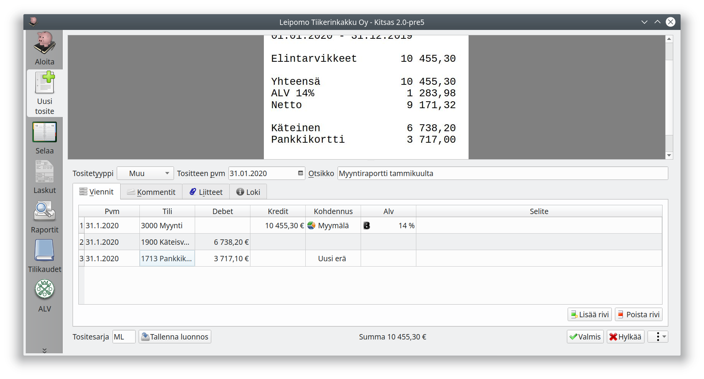
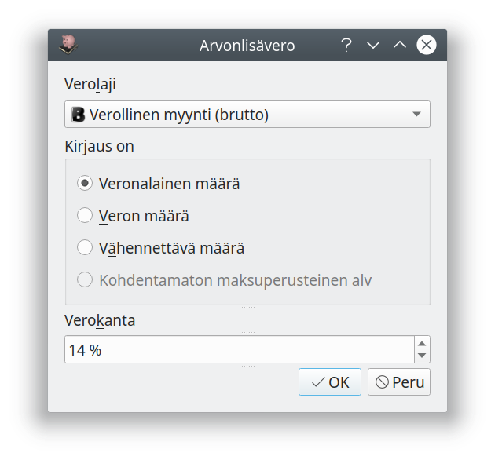

# Muut tositteet

Käytä tositetyyppiä **Muu** kirjataksesi tositteen käsin käyttäen tiliruudukkoa.

Sarakkeessa **Tili** voit syöttää tilinumeron tai kirjoittaa tilin alkua.
Jos käytät kohdennuksia, pääset **Kohdennus**-sarakkeessa valitsemaan kohdennukset menoille tai tuloille. **Merkkaukset** valitaan painamalla Kohdennus-sarakkeen päällä hiiren vasenta nappia. Eriteltävissä tasetileissä valitaan kohdennus-sarakkeessa tase-erä.

!!! note "Tositesarjat"
    Jos käytät eri tositesarjoja, voit valita tositesarja vapaasti.

## Arvonlisäveron kirjaaminen

Arvonlisäveron tietoja pääset muokkaamaan napsauttamalla Alv-saraketta, josta avautuu valintaikkuna. Tehtäessä arvonlisäverollisia kirjauksia pitää vientiin määritellä aina oikeat arvonlisäveron ohjaustiedot.

Katso tarkemmin luvusta [Arvonlisävero](/alv) eri arvonlisäveron kirjaustyypit.

Kotimaan arvonlisäverot kirjataan myyntien osalta seuraavasti

Verolaji |  Kirjaamisohje
--------------|---------------------
Verollinen myynti (netto)  | Myynti-tilille kirjataan veroton määrä alv-tiedolla *Veronalainen määrä* ja *Verokanta*. Alv-velkatilille kirjataan veron osuus alv-tiedolla *Veron määrä* ja *Verokanta*
Verollinen myynti (brutto) | Koko bruttohinta kirjataan myynti-tilille alv-tiedolla *Veronalainen määrä* ja *Verokanta*. Vero erotellaan tästä kirjauksesta alv-ilmoituksen yhteydessä.
Verollinen myynti (maksuperusteinen alv) | Myynti-tilille kirjataan veroton määrä alv-tiedoilla *Veronalainen määrä* ja *Verokanta*. Maksuperusteisen alv-velan tilille kirjataan alv:n määrä tiedoilla *Kohdentamaton maksuperusteinen alv* ja *Verokanta*.

Muut arvonlisäverot kirjataan aina nettoperusteisesti niin, että alv-tiedolla *Veronalainen määrä* merkitään veron peruste ja alv-tiedolla *Veron määrä* maksettava vero ja vastaavasti *Vähennettävä määrä* alv-vähennykset määrä.

!!! tip "Suosi Meno- ja tulotositetta"
    Meno- ja tulotositteen omiin tositetyypeihin sisältyy paljon sellaista automaatiota, jota ei ole käytettävissä kirjattaessa käsin tositetyypille Muu.

## Muistiotositteet

Muistiotosite on tarkoitettu itse laadituille tositteille esimerkiksi tulojen jaksotusta, taseessa olevan omaisuuden arvostamista tai aiemman kirjauksen korjausta varten. Kirjaukseen liittyvä laskelma ja selvitys voidaan antaa joko itse allekirjoitettuna liitteenä tai Kommentit-kohdassa, jolloin laatijan nimi (tai nimikirjaimet) on syytä merkitä näkyviin.

Muistiotosite kirjataan samoin kuin Muu tosite.

## Liitetietotositteet

Liitetietotositteilla varmennetaan liitetietoina olevia tietoja. Tositteelle voi tallentaa liitteitä, mutta tositteella ei voi olla vientejä.

## Järjestelmätositteet

Selausnäkymästä voit avata myös ohjelman luomia tositteita, kuten arvonlisäverolaskelmia, jaksotuksia ja poistotositteita. Tositteita voi tarvittaessa myös muokata.

!!! danger "Tiedä, mitä teet!"
    Muokkaa järjestelmän luomia tositteita vain, jos todella tiedät miten kirjaukset vaikuttavat kirjanpitoon ja tilinpäätökseen!
