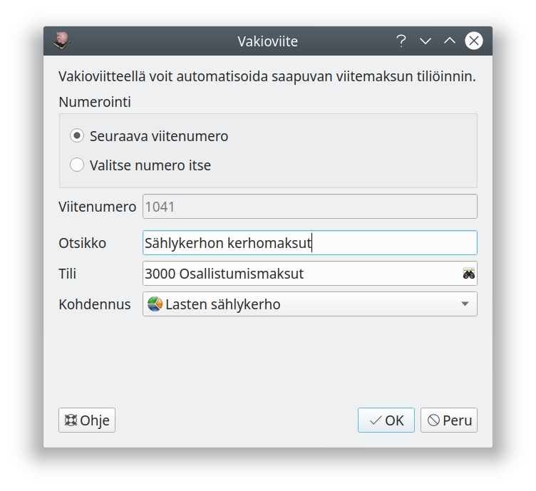

# Muut tositteet

Käytä tositetyyppiä **Muu** kirjataksesi tosite käsin tiliruudukkoa käyttäen.

Tositetyyppiä tarvitset kun teet monimutkaisempia kirjauksia, joissa on useita vientejä, esimerkiksi
- kassan myyntiraportit eri maksutavoista
- monimutkaisemmat palkkatositteet
- osingon maksuun liittyvät kirjaukset
- useimmat yhtiön perustamiseen liittyvät kirjaukset

Periaatteessa voisit tehdä kaikki kirjaukset tositetyypillä **Muu**, mutta todennäköisesti haluat kirjata useimmat tositteet tositteen tyypin mukaisella kirjausnäkymällä.

!!! note "Tositesarjat"
    Jos käytät eri tositesarjoja, voit valita muulle toistteelle tositesarjan vapaasti.

## Kirjaaminen suoraan ruudukkoon

Sarakkeessa **Tili** voit syöttää tilinumeron tai kirjoittaa tilin alkua.
Jos käytät kohdennuksia, pääset **Kohdennus**-sarakkeessa valitsemaan kohdennukset menoille tai tuloille. **Merkkaukset** valitaan painamalla Kohdennus-sarakkeen päällä hiiren vasenta nappia. Eriteltävissä tasetileissä valitaan kohdennus-sarakkeessa tase-erä.

Harmaat rivit ovat arvonlisäveron nettokirjauksiin liittyivä automaattisia vero- ja vähennyskirjauksia, joita ei voi muokata itse.

!!! note "Kaikki viennin valinnat"
    Tiliruudukolla et voi tehdä aivan kaikkia vientiin liittyviä valintoja, kuten menon jaksotus tai investoinnin poistoaika. Näitä valintoja pääset muokkaamaan **Muokkaa vientiä** -painikkeella.

### Tase-erät
Moneen tasetiliin liittyvä **tase-erä** tarkoittaa tase-erittelyssä olevaa seurattavaa erää.

- **Uusi tase-erä** tarkoittaa, että tosite aloittaa uuden seurattavan erän (esimerkiksi uusi lasku tai erittelyyn lisättävä omaisuus)
- **Ei tase-erää** tarkoittaa, ettei tämä vienti muodosta seurattavaa erää, vaan seuranta tehdään vain tilin saldon osalta
- Valitsemalla tase-erän liität viennin olemassa olevaan tase-erään. Esimerkiksi laskun maksu tai hyvityslasku liitetään laskun luomiseen, velan lyhennys velkaan jne.

## Kirjaaminen vientiä muokkaamalla

**Uusi vienti** -painikeella luot viennin käyttämällä valintataulua, jossa voit määritellä kaikki viennin tiedot. Vastaavasti pääset muokkaamaan kaikkia tietoja **Muokkaa vientiä**-painikkeella.

Valintataulussa näytettävät valinnat riippuvat valitsemasi tilin tyypistä. **Kumppani** tarkoittaa tässä liiketoimen toista osapuolta (asiakasta, toimittajaa, maksun saajaa tai maksajaa).

### Arvonlisävero

Tavallisesti kirjakset tehdään valinnalla **Veron peruste** jolloin voit valinnoilla **Kirjaa myös vero** ja/tai **Kirjaa myös vähennys** valita, lisääkö ohjelma automaattisesti myös nettokirjauksiin liittyvät vero- ja vähennysviennit. Valinnalla **Sis. alv** voit syöttää kohtaan **Määrä** verollisen määrän.

Katso tarkemmin luvusta [Arvonlisävero](/alv) eri arvonlisäveron kirjaustyypit.

Joissain hyvin harvinaisissa tapauksissa saattaa olla tarpeellista tehdä arvonlisäveron kirjaus täysin käsin (esimerkiksi jos yritykseltä laskutetaan pakettiauton kolarikorjauksesta omavastuun lisäksi korjaushinnan täysi arvonlisävero). Ole näissä tapauksissa erityisen huolellinen!

- **Veron peruste** on veroton määrä, jonka perusteella arvonlisävero määräytyy
- **Veron määrä** on arvonlisäverovelkaan tiliöitävä arvonlisäveron osuus
- **Vähennyksen määrä** on arvonlisäverosaataviin tiliöitävä vähennettävän arvonlisäveron osuus
- **Kohdentamaton maksuperusteinen alv** on maksuperusteista arvonlisäveroa tai ennakkolaskua käytettäessä tehtävä veron määrää ja vähennyksen määrää vastaava valinta. Kun lasku aikanaan maksetaan, siirretään kyseinen määrä veroksi tai vähennykseksi.

## Muistiotositteet

Muistiotosite on tarkoitettu itse laadituille tositteille esimerkiksi tulojen jaksotusta, taseessa olevan omaisuuden arvostamista tai aiemman kirjauksen korjausta varten. Kirjaukseen liittyvä laskelma ja selvitys voidaan antaa joko itse allekirjoitettuna liitteenä tai Kommentit-kohdassa, jolloin laatijan nimi (tai nimikirjaimet) on syytä merkitä näkyviin.

Muistiotosite kirjataan samoin kuin Muu tosite.

## Liitetietotositteet

Liitetietotositteilla varmennetaan liitetietoina olevia tietoja. Tositteelle voi tallentaa liitteitä, mutta tositteella ei voi olla vientejä.

## Järjestelmätositteet

Selausnäkymästä voit avata myös ohjelman luomia tositteita, kuten arvonlisäverolaskelmia, jaksotuksia ja poistotositteita. Tositteita voi tarvittaessa myös muokata.

!!! danger "Tiedä, mitä teet!"
    Muokkaa järjestelmän luomia tositteita vain, jos todella tiedät miten kirjaukset vaikuttavat kirjanpitoon ja tilinpäätökseen!
