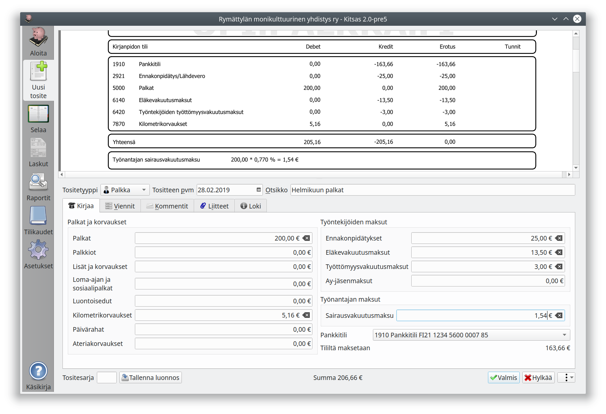

# Palkkatosite

Palkka-tositetyypillä voit kirjata yksinkertaisia palkkatositteita. Toiminto on suunniteltu erityisesti palkka.fi-palvelun kanssa käytettäväksi, jolloin tarvittavat tiedot saat tulostamalla Kirjanpidon tositteen.

Monimutkaisemmat palkkakirjaukset, joissa on esim. eriteltynä johdon palkkoja tai palkkoja kohdennettuina kustannuspaikoille, joudut tekemään kirjaukset käsin Muu-tositetyypillä.

Palkkojen kirjaustilejä pääsee valitsemaan Asetusten kohdasta [Palkkakirjaustilit](/maaritykset/palkkatilit/)

## Palkkakirjaukset palkka.fi-palvelun aineistolla

### Palkka

Laadi Palkka-tyypin tosite käyttämällä tositteena palkka.fi -kirjanpitotositetta. Ohjelma kirjaa sekä ennakonpidätyksen että sv-maksuvelan Verovelka-tilille, koska molemmat tilitetään osana oma-aloitteisia veroja. Tosite päivätään palkanmaksupäivälle.

Maksa palkka työntekijälle palkka.fi -maksuluettelon mukaisesti.

### Ennakonpidätys ja sv-maksu

Ennakonpidätys ja sv-maksu maksetaan viimeistään seuraavan kuun 12. päivänä. Maksutiedot ovat palkka.fi -maksuluettelossa.

Voit tehdä kirjauksen Siirto-tositteella Verovelka-tilille tositteena OmaVerosta tulostettava tosite tai kirjata siirron suoraan tiliotteelta. Tuotaessa tiliote sähköisesti Kitsas osaa kohdentaa automaattisesti oma-aloitteisten verojen maksut.

### Eläkevakuutusmaksu

Tee Meno-tositteella kirjaus tilille Eläkevakuutusmaksut. Ellet saa erillistä laskua eläkevakuutusyhtiöltä, voit käyttää tositteena palkka.fi -maksuluetteloa.

### Työttömyysvakuutusmaksu

Kun saat Työttömyysvakuutusrahaston laskun, kirjaa se Meno-tositteena tilille Työttömyysvakuutusmaksu.
