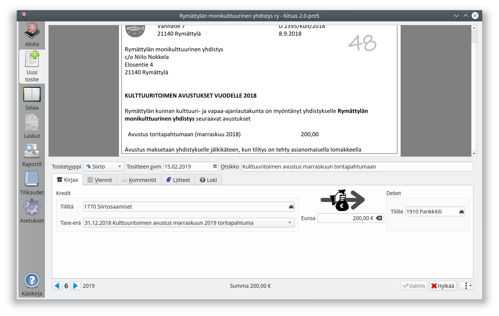

# Siirtotosite

Siirtotositteella kirjataan rahoitustapahtumia, kuten

- laskun maksaminen
- rahan nostaminen tililtä tai tilillepano
- lainan nostaminen tai lainan maksaminen

Jos rahoitustapahtuma kohdistuu pankkitilille, kirjataan se yleensä kuitenkin tiliotteelta.

Valitse **kredit** ja **debet** -kirjanpitotilit.

Jos tilillä on käytössä tase-erittely, valitse käytettävät **tase-erät**. Tase-erien avulla maksu kohdistetaan oikealle laskulle, siirtosaamisten erään jne.
