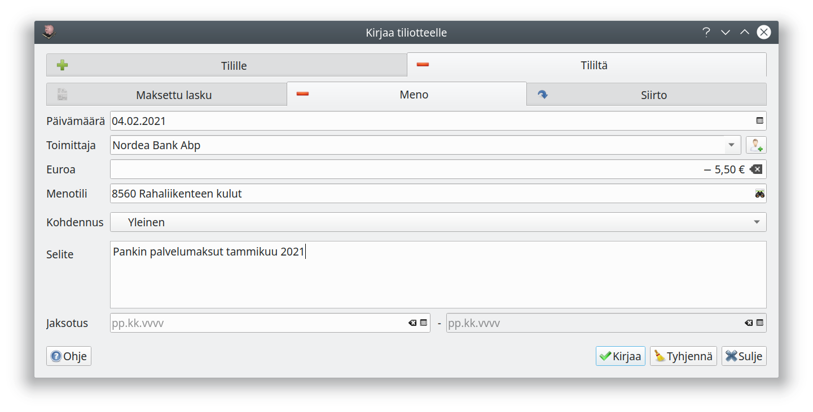

# Tiliote

!!! tip ""
    [ Ohjevideo tiliotteen kirjaamisesta (Yhdistykset)](https://youtu.be/WKIynu2hdjg)

## Kirjaaminen

Valitse ensin tili ja tiliotteen aikaväli

Ohjelma hakee kaikki aiemmat kirjaukset kyseiselle tilille. Ne näkyvät luettelossa harmaalla, koska näitä rivejä ei tule enää kirjata tiliotteelta uudelleen.

Kirjaa puuttuvat tilitapahtumat **Kirjaa tilitapahtumia**-painikkeella avautuvalla ikkunalla:

Ylempi välilehti | Alempi välilehti | Käyttötarkoitus
-----------------|------------------|-----------------
Tilille          | Saapuva maksu    | Lasku- tai suoriteperusteisen myyntilaskun kirjaaminen maksetuksi
Tilille          | Tulo             | Tulo (esimerkiksi pankkitilin korko)
Tilille          | Siirto           | Rahoitustapahtuma (esim. lainan nosto tai siirtosaamisen kirjaaminen saaduksi)
Tililtä          | Maksettu lasku   | Lasku- tai suoriteperusteisen ostolaskun kirjaaminen maksetuksi
Tililtä          | Meno             | Meno (esimerkiksi pankin palvelumaksu tai lainan korko)
Tililtä          | Siirto           | Rahoitustapahtuma (esim. lainan maksu tai siirtovelan kirjaaminen maksetuksi)

Huomaa, että **päivämääräksi** merkitään aina yksittäisen tapahtuman kirjauspäivä. Voit jaksottaa tuloja ja menoja samalla tavalla, kun meno- ja tulotositteissa.

Laskujen välilehdellä on luettelo avoimista maksuista. Valitse maksettu lasku ja päivämäärä, jolloin lasku maksettiin. **Kirjaa**-painike kirjaa tapahtuman taustalle jääneeseen tilioteikkunaan, joten voit jatkaa seuraavan tilitapahtuman kirjaamista.

## Täsmäyttäminen

Kun kaikki rivit on kirjattu, pitäisi tapahtumanäkymän rivien vastata tiliotetta. Tarkista erityisesti, että tiliotteen yhteenvetotiedot ja saldot täsmäävät tiliotteen yhteenvetotietoihin. Muista tallentaa kirjaamasi tiliote **Valmis**-painikkeella!

## Tiliotteen tuominen

Voit tuoda tiliotteen lisäämällä pdf- tai csv-muotoisen tiliotteen sähköiseksi tositteeksi. Kitsas pyrkii tunnistamaan tiliotteelta saajat sekä maksajat sekä kohdentamaan maksut viitenumeroiden mukaisesti. Toiminto edellyttää, että osto- ja myyntilaskujen viitenumerot sekä pankkitilin IBAN-numerot on syötetty ohjelmaan.

CSV-muotoisessa tiliotteessa saat erillisen valintataulun, josta valitaan tili. Tarvittaessa voit myös valita, miten tiedostossa olevat sarakkeet tuodaan.
