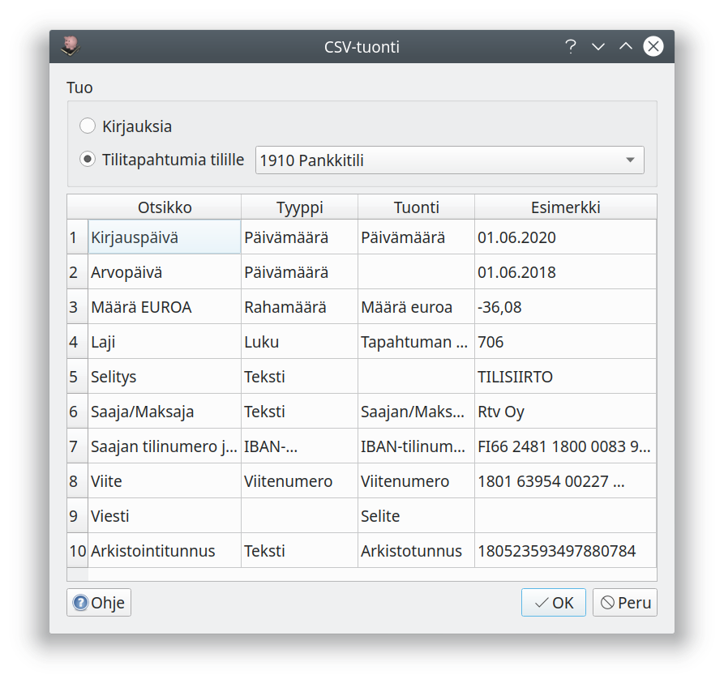
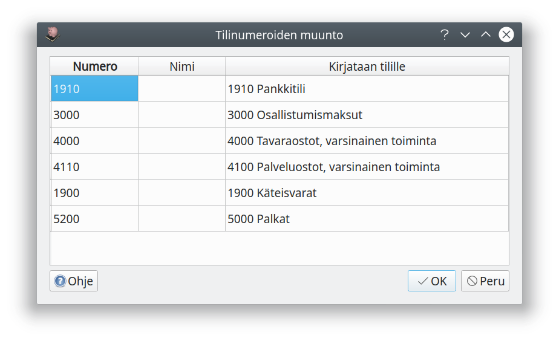
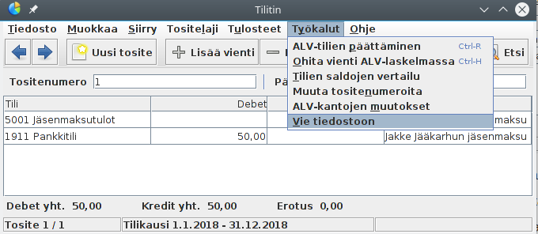

# Tuonti

## Pdf-tiedostojen ja kuvatiedostojen tuonti

Kun kirjausikkunassa lisätään pdf-muotoinen tosite, pyrkii Kitsas poimimaan siitä tietoja kirjauksien pohjaksi.

Kitsaan tilaajat voivat ottaa Asetusten **Liitteiden käsittely** -sivulta käyttöön **Tekstintunnistuksen kuvatiedostoista**. Tällöin kuvatiedostoille tehdään Kitsaan palvelimella tekstintunnistus, josta pyritään poimimaan tietoja. Yhden tositteen kuvantunnitus kestää tavallisesti 5-15 sekuntia, ja edellyttää että kuva on riittävän hyvälaatuinen.


## CSV-tiedostojen tuonti

CSV-tiedosto on tekstitiedosto, jossa eri tietokentät on eroteltu toisistaan pilkulla. Voit tuoda Kitsaan tällä toiminnolla esimerkiksi [Tilitin-kirjanpito-ohjelman](http://helineva.net/tilitin) kirjauksia tai verkkopankin tilitapahtumia. Kitsaan tai Kitupiikin kirjauksia voit tuoda csv-muotoisesta Päiväkirja-raportista](/tulosteet#paivakirja).

Voit tuoda kirjanpitoon csv-tiedoston lisäämällä **.csv**-päätteisen tiedoston kirjaukseen (raahaamalla **Sähköinen tosite**-laatikkoon tai **Lisää tiedosto**-painikkeella). Saat ikkunan, jossa valitaan, mitä tietoja csv-tiedoston eri sarakkeista tuodaan.



Jos tuot **tilitietoja**, valitse lisäksi tili, jolle tiedot kirjataan. Tilitiedot käsitellään ja kohdennetaan samalla tavalla kuin pdf-tiliotteelta.

**Kirjauksia** tuotaessa saat **Muunna tilinumerot**-valinnalla vielä erillisen valintaikkunan, jossa määrittelet tilinumeroiden muuttamisen tuotaessa käytössäsi olevan tilikartan tileiksi. Vasemmanpuoleisessa sarakkeessa ovat csv-tiedoston tilinumerot ja oikeanpuolimmaisesta voit valita, mille Kitsaan tilille kirjaus tuodaan.



Kaikki csv-tiedoston kirjaukset tulevat samalle tuontitositteelle ja alkuperäinen tositetunniste tulee selitteen alkuun.

### Kirjausten tuonti Tilittimestä

1. Vie Tilittimen kirjanpito csv-tiedostoksi **Työkalut | Vie tiedostoon** -valinnalla
   
2. Avaa tai luo Kitupiikillä kirjanpito, johon haluat tuoda Tilittimen kirjaukset
3. Varmista, että Kitsaassa on kaikki ne tilikaudet, joille kirjauksia tuodaan.
4. Muokkaa tarvittaessa Kitsaan tilikarttaa.
5. Tuo Tilittimen CSV-tiedosto yllä olevien ohjeiden mukaisesti. Käytä tilinumeron muuntoa ja varmista jokaisen tuotavan tilin kohdalta, että kirjaukset kohdistuvat oikealle tilille.

!!! note "Alv-ohjaustietoja ei tuoda"
    Tilitin käsittelee arvonlisäveroa tilikohtaisesti ja Kitupiikki kirjauksen ohjaustietojen mukaan. Tuoduissa kirjauksissa ei ole arvonlisäveron ohjaustietoja, joten jokaista verollista kirjausta täytyy muokata käsin, jos niiden perusteella on tarpeen luoda Kitsaan alv-ilmoitus.

### CSV-tiedoston muoto

CSV-tiedostossa erottimena saa olla pilkku, puolipiste tai tabulaattori. Päivämäärät voivat olla suomalaisessa (31.12.2018) tai ISO-muodossa (2018-12-31). Tiedostossa pitää olla otsikkorivi, mutta otsikoiden nimet voivat olla mitä tahansa - sarakkeiden sisältö valitaan aina tuotaessa.

Esimerkki tuotavista tilitapahtumista
```
Kirjauspäivä;Arvopäivä;Määrä EUROA;Laji;Selitys;Saaja/Maksaja;Saajan tilinumero ja pankin BIC;Viite;Viesti;Arkistointitunnus
04.03.2018;04.03.2018;-50,00;160;TILISIIRTO;;Korkeasaaren ystävät ry;FI1415723000369314 NDEAFIHH;00000000000000001025;70306392900369580
05.03.2018;05.03.2018;+25,00;130;TILISIIRTO;Muonalan Market ky;;1009;;170307392900363378

```

Esimerkki tuotavista kirjauksista
```
Tosite,Päivämäärä,Nro,Tili,Debet,Kredit,Selite
1,18.11.2016,1911,Pankkitili,"50,00",,Jullen jäsenmaksu
1,18.11.2016,5001,Jäsenmaksutulot,,"50,00",Jullen jäsenmaksu
2,18.11.2016,4201,Toiminnan kulut,"15,00",,Ostettu suklaata
2,18.11.2016,1911,Pankkitili,,"15,00",Ostettu suklaata
3,18.11.2016,1911,Pankkitili,,"10,00",Käteisnosto
3,18.11.2016,1901,Käteisvarat,"10,00",,Käteisnosto
```

Vaihtoehtoisesti kahdenkertaisen kirjanpidon debet- ja kredit-kirjaukset voidaan tuoda samalta riviltä
```
Päivämäärä;Euroa;Debet-tili;Kredit-tili;Selite
15.01.2020;85.20;4741;1910;Masa Majavan km-korvaus kisareissulta
22.01.2020;44.20;4000;1910;Heikki Hylkeen kululasku kokoustarjoiluista
```
