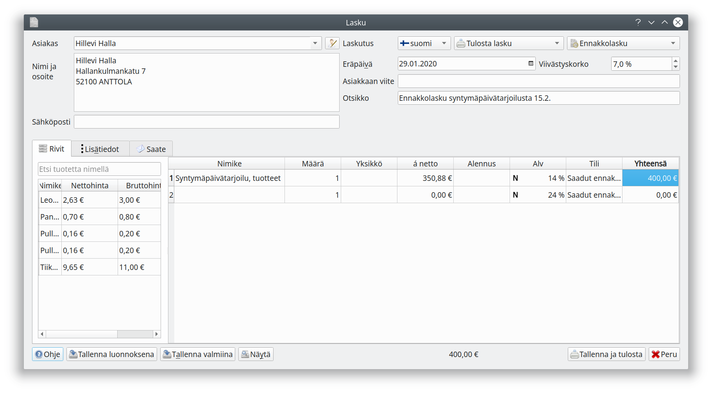
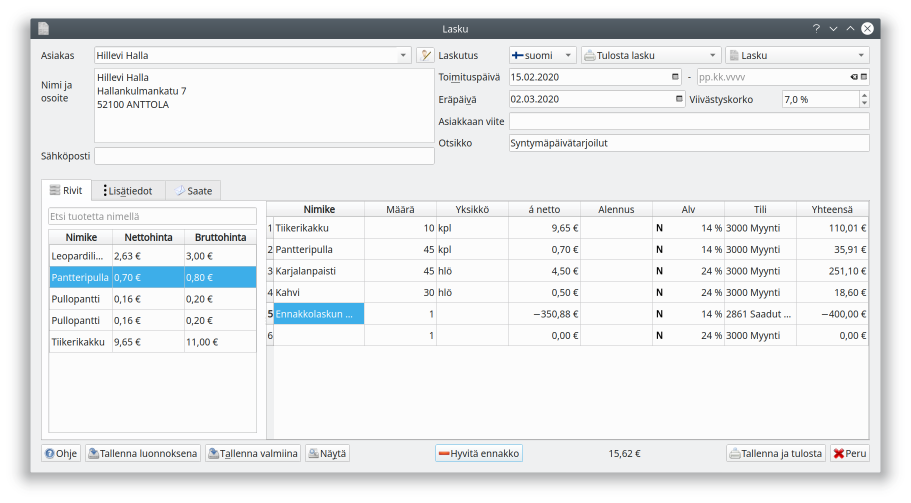

# Ennakkolasku

Valitsemalla uudelle laskulle laskuperusteeksi **Ennakkolasku** pääset laatimaan ennakkolaskua. Ennakkolasku kirjataan saatujen ennakkojen tilille, ja ennakkolaskun arvonlisävero kirjataan laskua maksettaessa (ohjelma tekee kirjauksen, kun lasku maksetaan tiliotteelta tai siirtokirjauksena).

Tuotteen toimittamisen yhteydessä laaditaan asiakkaalle varsinainen lasku tuotteineen. Kun asiakkaalle on laskutettuja ennakkoja, on ikkunan alalaidassa **Hyvitä ennakko**-painike. Painikkeesta pääset valitsemaan ennakkolaskun, jota tällä laskulla hyvitetään.

