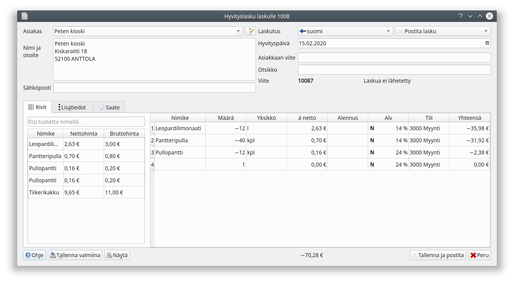
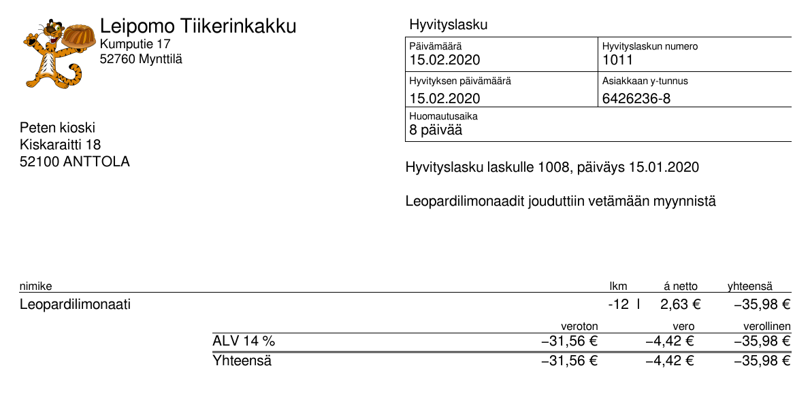

# Hyvityslasku

Jos lähetettyä laskua tulee tarve korjata, laaditaan laskusta hyvityslasku. Valitse lasku laskuluettelosta ja paina **Hyvityslasku**.

Ohje näyttää oletuksena koko alkuperäisen laskun miinusmerkkisenä. Jos hyvität vain osan laskua, tee laskulle tarpeelliset muutokset.

## Hyvityslaskun malli

