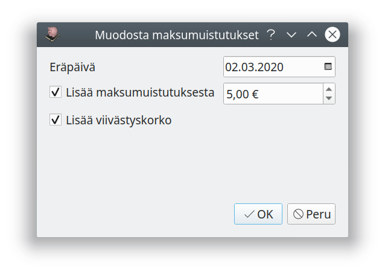

#Maksumuistukset  

Erääntyneelle laskulle voit laatia maksumuistutuksen valitsemalla yhden tai useamman myöhässä olevan laskun laskuluettelosta ja painamalla **Maksumuistus**.

Valitse maksumuistutuksen eräpäivä sekä lisätäänkö laskulle maksumuistuksesta maksua ja laskutetaanko viivästyskorkoa eräpäivästä maksumuistuksen päiväykseen.

!!! note "Maksumuistukset kuluttajalle"
    Kuluttajalle saa lähettää maksullisen maksumuistutuksen, kun eräpäivästä on kulunut kaksi viikkoa. Maksumuistutus saa maksaa enintään viisi euroa.

Muodostetut maksumuistukset löytyvät **Lähetettävät**-välilehdeltä. Voit vielä muokata yksittäisiä maksumuistutuksia, jos esimerkiksi haluat lisätä muistukselle viestin. Toimita lopuksi maksumuistukset asiakkaille.

Voit muodostaa toisen maksumuistuksen valitsemalla maksamatta jääneen maksumuistuksen listalta ja painamalla jälleen **Maksumuistutus**

## Maksumuistuksen malli

