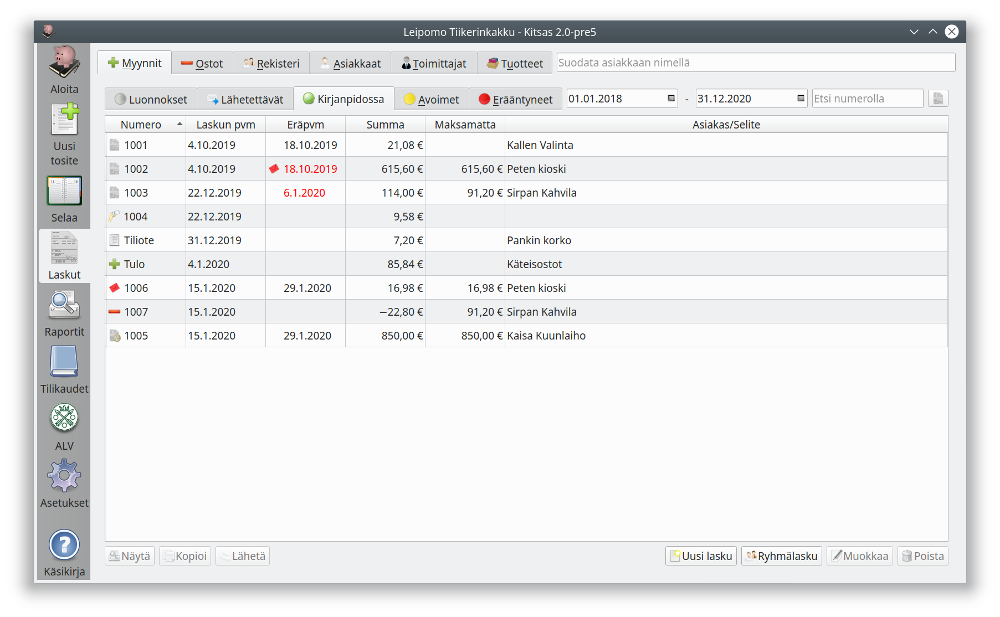
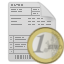
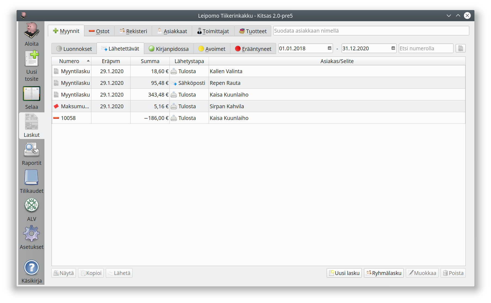
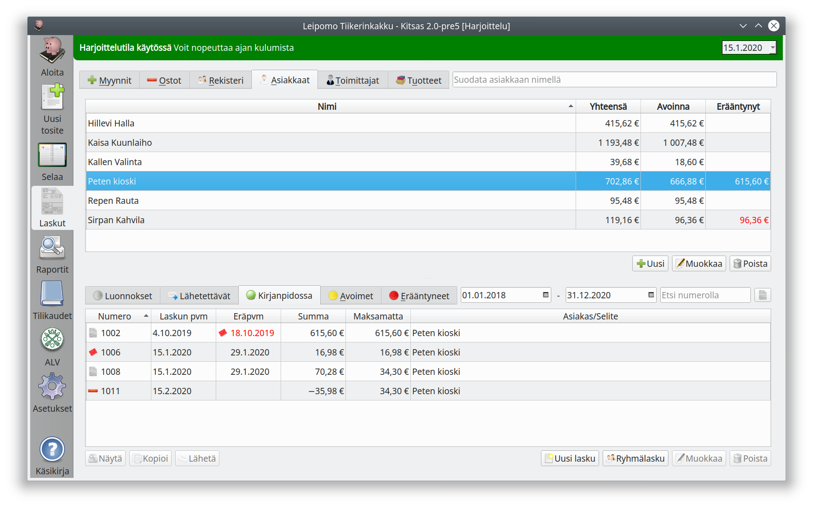

# Myynnit

**Laskut**-sivun **Myynnit**-välilehti sisältää ohjelmaan integroidun myyntireskontran, jolla voit tehdä laskuja sekä seurata saapuneita maksuja.

Näkymään on integroitu kaikki saapuneet maksut (myös tulotositteilta ja tiliotteilta). Jos haluat katsella vain laskutuksella laadittuja laskuja, valitse _Etsi numerolla_-kentän oikealla puolella oleva laskukuvake.

Voit rajata laskuja päivämäärän mukaan, asiakkaan nimellä tai laskun numerolla. Alempien välilehtien avulla voit valita

- **Luonnokset**: Laskut, joiden laatiminen on kesken
- **Lähetettävät**: Valmiiksi laaditut laskut, joita ei ole vielä lähetetty
- **Kirjanpidossa**: Kaikki laskut, jotka ovat kirjanpidossa (myyntilaskuista kaikki lähetetyt)
- **Avoimet**: Laskut, jotka ovat maksamatta (tai joilla on ylisuorituksia)
- **Erääntyneet**: Avoimet laskut, joiden eräpäivä on jo mennyt

Laskun numeron vieressä oleva kuvake esittää laskun tyypin

| tunnus                 | Nimi                     | Selitys                                                                                 |
| ---------------------- | ------------------------ | --------------------------------------------------------------------------------------- |
|          | Laskuperusteinen lasku   | Kirjataan maksun päivämäärälle                                                          |
|        | Suoriteperusteinen lasku | Kirjataan toimituspäivälle                                                              |
|   | Ennakkolasku             | Myyntiä laskutetaan etukäteen.                                                          |
|       | Käteislasku              | Maksu on suoritettu käteisellä                                                          |
|         | Hyvityslasku             | Hyvitetään jo annettua laskua                                                           |
|  | Maksumuistutus           | Punainen kuori eräpäivän vieressä tarkoittaa, että laskusta on laadittu maksumuistutus. |

Lisäksi luettelossa näkyy tulotositteina ja tiliotteelta kirjattuja tuloja.

!!! note "Myyntilaskut kirjanpidossa"
    Myyntilaskut saavat lasku- ja viitenumeron sekä tulevat osaksi kirjanpito vasta, kun ne toimitetaan asiakkaalle. **Luonnokset** ja **Lähetettävät** -välilehden laskuilla ei ole vielä laskunumeroa (paitsi sellaisilla _Lähetettävät_-välilehden laskuilla, joiden toimittaminen on epäonnistunut).

## Myyntien näkymän toiminnot

- **Näytä**-painike avaa nähtäväksi valitsemasi laskun
- **Kopioi** tekee uuden laskun vanhan laskun pohjalta. Toimintoa voit käyttää esimerkiksi sopimuksen kausilaskutuksessa.
- **Lähetä** toimittaa laskun asiakkaalle laskulle valitun toimitustavan mukaisesti

- **Hyvityslasku** laatii laskulle hyvityslaskun.
- **Maksumuistutus** (näkyvissä vain, jos lasku erääntynyt) laatii maksumuistuksen

- **Uusi lasku**-painikkeesta pääset tekemään [uuden laskun](uusi). Jos olet valinnut asiakkaan, laaditaan lasku tälle asiakkaalle.
- **Ryhmälasku**-painikkeella lähetät samansisältöisen [ryhmälaskun](ryhma) usealle asiakkaalle.
- **Muokkaa**-painikkella pääset muokkaamaan jo tehtyä laskua. Jo asiakkaalle toimitettua laskua ei pääsääntöisesti kuitenkaan pitäisi enää muokata, vaan lähettää hyvityslasku.
- **Poista** poistaa laskun.

## Laskujen lähettäminen

Ellet ole valinnut uutta laskua lähetettäväksi välittömästä, sijoitetaan se **Lähetettävät**-välilehdelle odottamaan lähettämistä. Valitse luettelosta lähetettävät laskut ja paina **Lähetä**-painiketta.

Jos laskun lähettäminen epäonnistuu, jää lasku edelleen **Lähetettävät**-välilehdelle.

!!! note "Muista lähettää!"
    Maksumuistutukset sekä ryhmälaskut tallennetaan aina ensin lähetettävät kansioon, ja ne pitää lähettää sieltä erikseen.

### Laskujen lähetystavat

| Lähetystapa             | Selite                                                                                                                                                                            |
| ----------------------- | --------------------------------------------------------------------------------------------------------------------------------------------------------------------------------- |
| Tulosta                 | Lasku tulostetaan paperille                                                                                                                                                       |
| Postita                 | Jos asetuksissa on valittuna **Paperilaskujen postitus Maventan kautta**, toimitetaan lasku Maventan tulostuspalveluun. Muutoin lasku tulostetaan paperille.                      |
| Sähköposti              | Lasku lähetetään sähköpostilla                                                                                                                                                    |
| Tallenna pdf-tiedostoon | Lasku tallennetaan pdf-tiedostoon, josta se välitetään saajalle                                                                                                                   |
| Ei tulosteta            | Lasku merkitään lähetetyksi, vaikka sitä ei tulosteta. Voidaan käyttää, jos lasku saatetaan muulla tavalla tiedoksi (tai esimerkiksi kirjattaessa luottotappiota hyvityslaskulla) |
| Verkkolasku             | Lasku lähetetään verkkolaskuna. Kitsas tukee yritysten Finvoice-verkkolaskuja. Ominaisuus on käytettävissä maksullisissa tilauksissa ja kaikissa pilvikirjanpidoissa.             |

## Laskun maksaminen

Laskut kirjataan maksetuiksi joko kirjaamalla tiliote tai tekemällä siirtotosite.

## Asiakkaat

**Asiakkaat**-välilehdellä näet myyntilaskut asiakkaiden mukaan järjestettynä.
