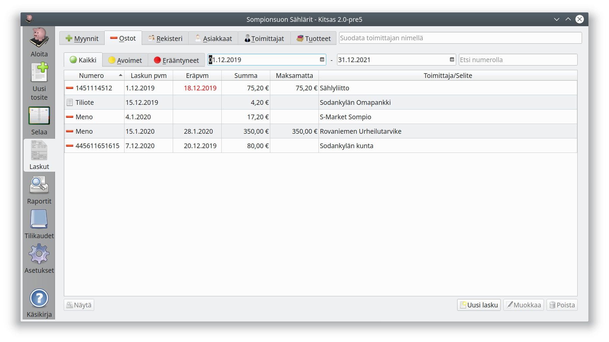
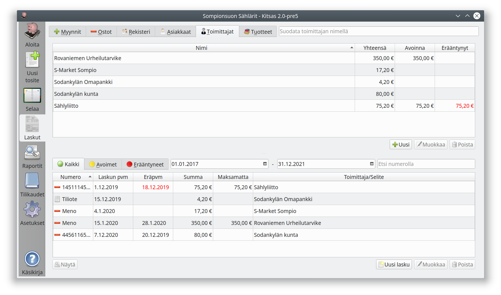

# Ostot

**Ostot**-välilehdellä näet saapuneet ostolaskut sekä muut maksut.

- **Kaikki** selaa kaikkia kirjanpidossa olevia ostoja
- **Avoimet** selaa maksamattomia laskuja
- **Erääntyneet** selaa maksamattomia laskuja, joiden eräpäivä on mennyt

Voit etsiä laskuja toimittajan nimellä tai numerolla sekä valita päivämäärävälin, jolta ostolaskut näytetään.

## Toimittajat

Toimittajat-välilehdellä näet laskut toimittajien mukaan järjestettynä sekä yhteenvetotiedot eri toimittajien laskuista.
