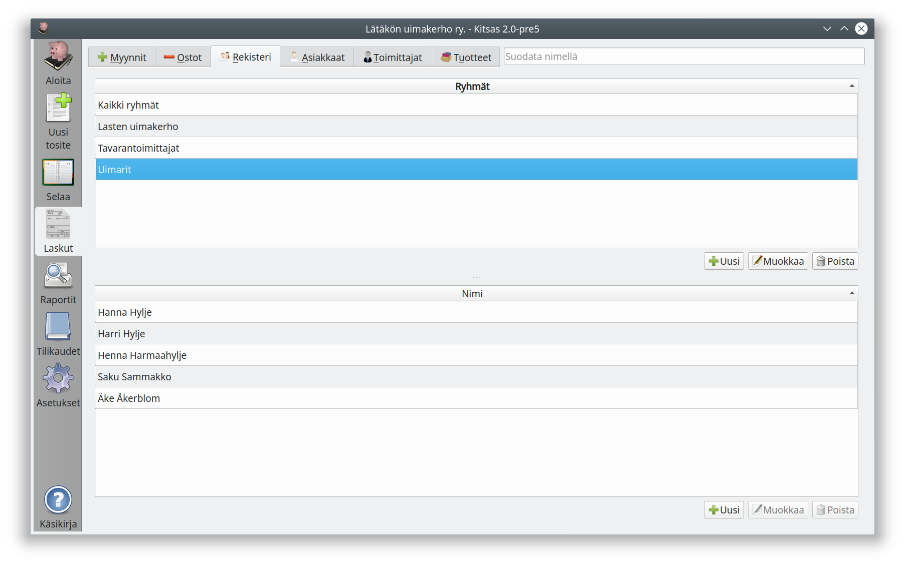
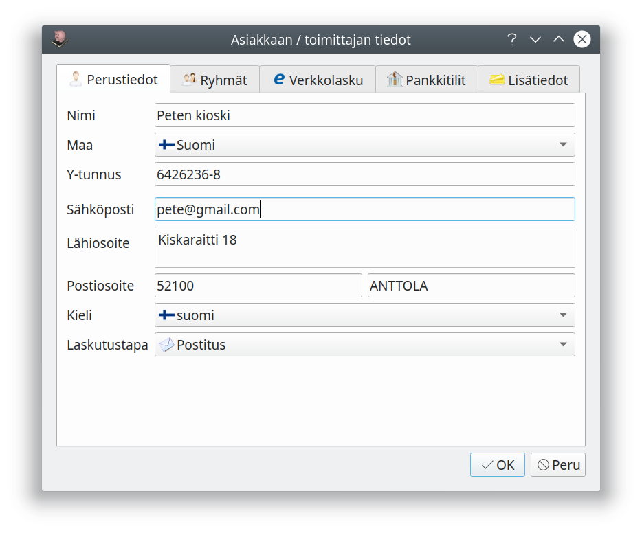
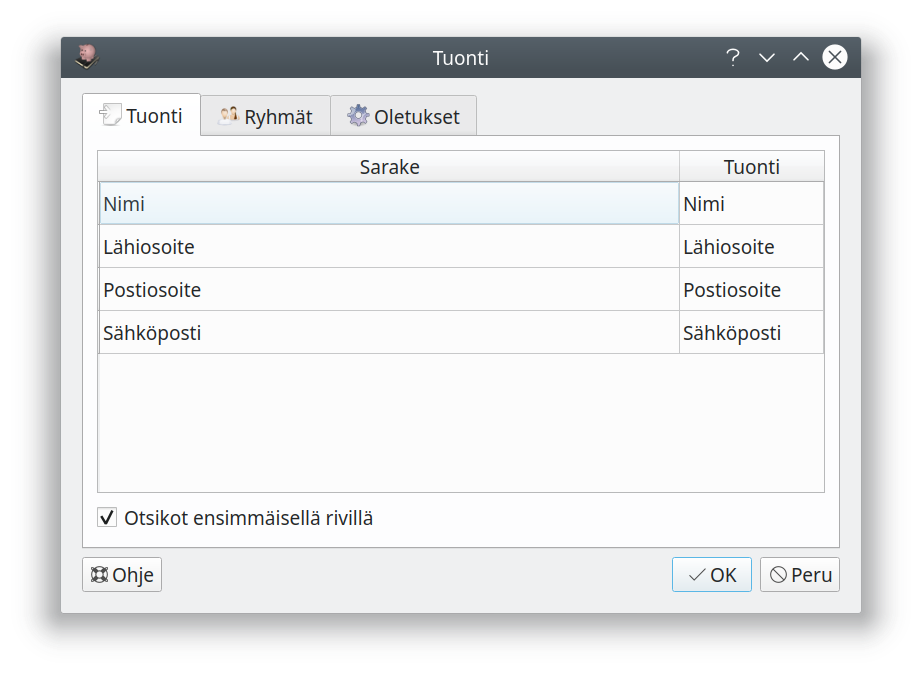

# Rekisteri

Kitsaan yhdistettyyn asiakas- ja toimittajarekisteriin tallennetaan asiakkaiden ja toimittajien tiedot. Rekisterin avulla voit tarkastella myyntejä asiakkaiden sekä ostoja toimittajien mukaan, voit hakea tiedot laskuille ja laskuttaa kokonaisia ryhmiä. Rekisteriä käytetään myös laskujen kohdistamiseen tiliotteita tuotaessa.

!!! tip "Rekisterin käyttö on vapaaehtoista"
    Voit tehdä kirjaukset myös valitsematta asiakasta/toimittajaa, mutta rekisterin käyttäminen tekee tietojen hakemisesta helpompaa.



!!! note "Yhdistetty rekisteri"
    *Asiakkaat*-välilehdellä näytetään vain ne asiakkaat, jotka on jo yhdistetty myynteihin; ja *toimittajat*-välilehdelle vain ne toimittajat, jotka on yhdistetty ostoihin. Jos lisäät uuden asiakkaat, tulevat asiakkaan tiedot aluksi näkyviin vain *Rekisteri*-välilehdelle.

## Ryhmät

Muodostamalla ryhmiä voit hakea tietoja nopeammin, sekä voit muodostaa nopeasti ryhmälaskuja. Esimerkiksi yhdistys voi muodostaa tietystä laskutettavasta toimintaryhmästä ryhmän.

## Asiakkan/Toimittajan valitseminen


Asiakas/toimittajaa valittaessa voit

- valita olemassa olevan asiakkaan/toimittajan valintalistasta
- aloittaa kirjoittamaan nimeä
- luoda uuden asiakkaan/toimittajan kentän vieressä olevalla **+**-painikkeella
- luoda uuden asiakkaan kirjoittamalla nimen
- kirjoittaa asiakkaan/toimittajan Y-tunnuksen

Nimikentän vieressä olevalla painikkeella pääset muokkaamaan asiakkaan/toimittajan tietoja.

## Asiakkaan/Toimittajan tiedot



**Kieli** ja **laskutustapa** ovat oletusvalintoina uusille laskuille.  
**Pankkitilien** numeroita käytetään myyntilaskujen kohdentamiseen.

!!! tip "Tietojen hakeminen"
    Painamalla nimikentän vieressä olevaa kiikarin kuvaa, haetaan yrityksen tietoja Yritys- ja yhteisötietojärjestelmästä. Jos käytössäsi on Maventan
    verkkolaskutus, haetaan tietoja myös verkkolaskuosoitteistosta.
    
!!! note ""
    Verkkolasku-välilehti on käytettävissä vasta, kun yritykselle on ensin syötetty y-tunnus.

## Tietojen tuominen

**Tuo**-painikkeella voit tuoda rekisteriin tietoja csv-tiedostosta. Valittuasi tiedoston saat ikkunan, jossa määrittelet, mitä kenttiä tiedostosi sarakkeet vastaavat. **Ryhmät**-välilehdellä voit määrittää, mihin ryhmiin lisättävät henkilöt/yritykset lisätään ja **Oletukset**-välilehdellä oletuksen maalle, laskutuskielelle ja laskutustavalle.



### Esimerkki csv-tiedostosta
```csv
Nimi,Lähiosoite,Postiosoite,Sähköposti
Olli Orava,Käpykuja 8,00330 Helsinki,testi-olli@kitupiikki.info
Otso Karhu,Kontiokuja 6,54110 Karhula,testi.otso@kitupiikki.info
Aapo Apina,Banaanipolku 9,88790 Viidakko,testi.aapo@kitupiikki.info
```

## Tietojen vieminen

**Vie**-painikkeella saat tallennettua listalla näkyvien asiakkaiden tiedot CSV-muodossa, jossa voit avata ne taulukkolaskentaohjelmassa.

**Tulosta**-painikkeella saat tulostettua (tai tallennettua) listalla olevat tiedot.

## Rekisteriselosteen malli

**Rekisterin pitäjä:** Yritys Oy / Yhdistys ry, virallinen osoite, Y-tunnus

**Yhteyshenkilö rekisteriä koskevissa asioissa** Nimi, sähköposti, puhelin

**Rekisterin nimi**: Yritys Oy / Yhdistys ry :n asiakas- ja toimittajarekisteri

**Henkilötietojen käsittelyn tarkoitus**: Henkilötietojen käsittelyn tarkoituksena on asiakas- ja toimittajatietojen hoitaminen. Rekisteri on osa kirjanpidon tietojärjestelmää, jossa tietoja käytetään myös lakisääteisen kirjanpidon hoitamiseen sekä maksujen seuraamiseen ja rekisteröintiin.

**Rekisterin tietosisältö**: Rekisteri sisältää nimitiedon, tiedon yhteisön Y- tai ALV-tunnuksesta, yhteystiedot sekä laskutustiedot. (Yhdistys tallentaa laskutusta varten tiedon ryhmän jäsenyydestä / seuraavia tarkemmin yksilöityjä muita tietoja...)

**Säännönmukaiset tietolähteet**: Rekisterin tiedot saadaan asiakkailta/toimittajilta itseltään ja heidän toimittamista asiakirjoista (esim. laskuista). Yritysten tietoja täydennetään Yritys- ja yhteisötietojärjestelmän sähköisen rajapinnan kautta.

**Tietojan säännönmukaiset luovutukset**: Tietoja ei luovuteta kolmansille osapuolille / Asiakkaiden ja toimittajien perustietoja voidaan luovuttaa tavarantoimittajille / rahdin kuljettajille / ... mikäli se on toimitusketjun kannalta tarkoituksenmukaista. Varsinaisen kirjanpitoaineiston osalta toimitaan kirjanpitolainsäädännön mukaisesti.

**Tietojen siirto EU tai ETA-alueen ulkopuolelle**: Tietoja ei säännönmukaisesti luovuteta EU tai ETA-alueen ulkopuolelle / Tietoja voidaan luovuttaa myös EU- tai ETA-alueen ulkopuolelle sikäli kun se on toimitusketjun kannalta tarpeellista.

**Rekisterin suojauksen periaatteet**. Rekisteri on toteutettu Kitsas-kirjanpito-ohjelmistolla, jota käytetään Kitsas Oy:n pilvipalveluna suomalaiselta palvelimelta / yrityksen tietokoneelle asennettuna. Rekisteriin pääsy on rajattu ja käyttöoikeus edellyttää henkilökohtaista käyttäjätunnusta ja salasanaa.

**Tarkastusoikeus**. Rekisteröity voi tarkastaa häntä koskevat tiedot pyytämällä niitä ylempänä mainitulta yhteyshenkilöltä.

**Oikeus vaatia tietojen korjaamista**. Rekisteröidyllä on oikeus vaatia tietojensa korjaamista. Pyynnön virheellisen tai vanhentuneen tiedon korjaamisesta voi välittää ylempänä mainitulle yhteyshenkilölle.

**Muut henkilötietojen käsittelyyn liittyvät oikeudet**. Kirjanpitoaineiston säilyttämisessä noudatetaan Kirjanpitolakia. Erityisesti saapuneet ja lähetetyt laskut säilytetään osana kirjanpitoa lain vaatimusten mukaisesti. Rekisteröidyllä on oikeus vaatia henkilöiden yhteystietojen poistamista rekisteristä EU:n tietosuoja-asetuksen mukaisesti ja tiedot poistetaan pyynnön jälkeen. Mahdollisista rekisteröidyn tietoihin kohdistuneista tietoturvaloukkauksista ilmoitetaan rekisteröidylle ja viranomaiselle säännösten mukaisesti.
