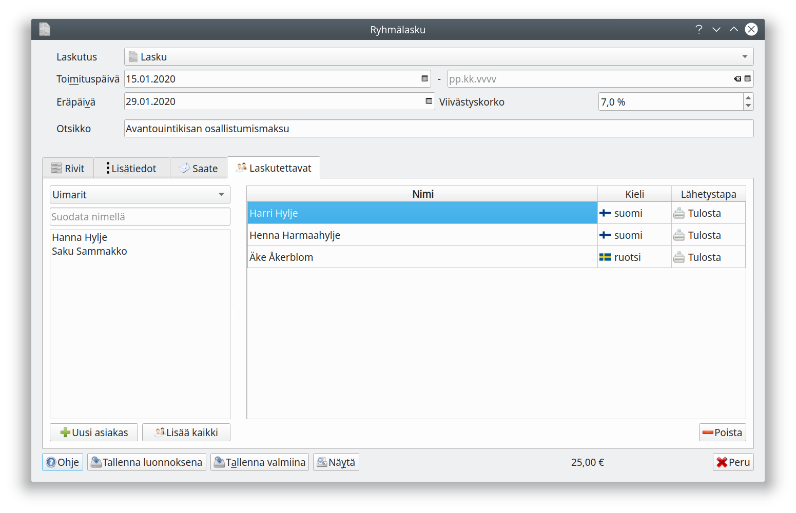

#Ryhmälasku  

Ryhmälasku-toiminnolla voit lähettää saman sisältöisen laskulle kerralla useammalle asiakkaalle. Laskun laatiminen aloitetaan laskulistauksessa **Ryhmälasku**-painikkeella.

Täytä **Rivit**-välilehdelle laskutettavien tuotteiden tiedot ja **Lisätiedot**-välilehdelle laskulle tulostuvat lisätiedot.

Valitse laskun saajat **Laskutettavat**-välilehdeltä. Voit lisätä rekisterissä olevan asiakkaan napsauttamalla listalta nimeä. Voit myös lisätä uuden asiakkaan. Valitsemalla rekisterissä olevan ryhmän ja **Lisää kaikki** saat luotua laskun kerralla koko  ryhmälle.

Näytöllä olevasta luettelosta voit vaihtaa yksittäisen laskun saajan kielen ja laskun lähetystavan.

Kun painat **Tallenna luonnoksena** tai **Tallenna valmiina**, luo ohjelma jokaiselle laskun saajalle erillisen laskun. Valitsemalla laskun *Luonnokset* tai *Lähetettävät*-välilehdeltä voit vielä muokata yksittäisiä laskuja ennen niiden lähettämistä.

!!! note "Muista lähettää laskut"
    Ryhmälaskut on lähetettävä erikseen laskuluettelon **Lähetä**-napilla.
