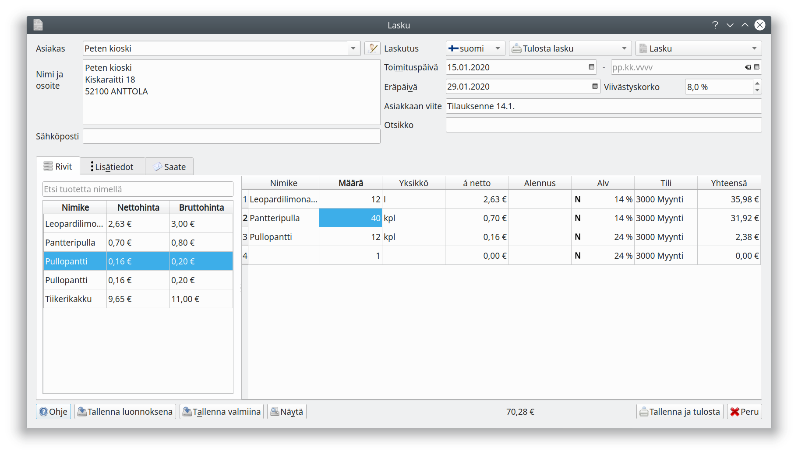
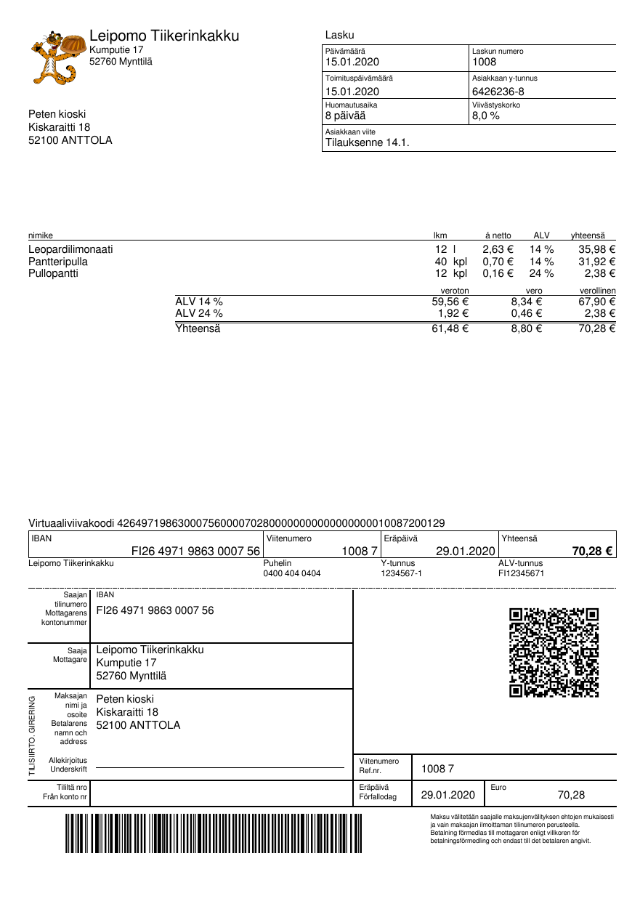

## Uusi lasku

Muokataksesi asiakkaasta tallennettuja yhteystietoja valitse asiakkaan nimen oikealla puolella oleva kuvake. Jos haluat kirjoittaa yksittäisen laskun lisäämättä asiakasta asiakasrekisteriin, tai jos haluat lähettää yksittäisen laskun toiseen osoitteeseen, muokkaa suoraan kohtia **Nimi ja osoite** tai **Sähköposti**

**Laskutus** kentän vierestä valitaan **kieli**, **laskun toimitustapa** sekä **kirjausperuste**.

Laskulle tehdään kirjanpidossa jaksotus toimituspäivämäärän tai toimitusaikavälin mukaan. Jos valitset **Suoriteperusteisen laskun**, kirjataan lasku toimituspäivälle. **Otsikko** tulostuu laskulle sekä toimii kirjanpidossa tositteen otsikkona.

Voit lisätä tuoterekisterin tuotteita napsauttamalla tuoteluettelon riviä. Voit myös syöttää laskun rivitiedot suoraan ruudukkoon. Jos syötät luvun **yhteensä**-sarakkeeseen, laskee ohjelma nettoyksikköhinnan.

**Lisätiedot**-välilehdelle syötetty teksti tulostuu laskulle. **Saate**-välilehden teksti on saatteena sähköpostilla lähetettävälle laskulle.

* **Tallenna luonnoksena** tallentaa laskun keskeneräisenä. Voit palata muokkaamaan sitä myyntiluettelon *Luonnokset*-välilehdeltä
* **Tallenna valmiina** tallentaa laskun *Lähtevät*-välilehdelle. Laskua ei vielä lähetetä eikä viedä kirjanpitoon.
* **Näytä** avaa laskun esikatseluun. Huomaa, ettei uudella laskulla ole vielä viite- eikä laskunumeroita.
* **Tallenna ja tulosta** tulostaa laskun ja tallentaa sen kirjanpitoon. Toimitustavasta riippuen tässä voi olla myös *Tallenna ja lähetä* tms.

!!! note "Laskujen numerointi"
    Lasku saa laskunumeron vasta toimitusvaiheessa. Näin varmistetaan, että laskujen numerot muodostavat yhtenäisen juoksevan sarjan ilman päällekkäisyyksiä, vaikka useampi lasku olisi muokattavana samaan aikaan.

## Mallilasku

