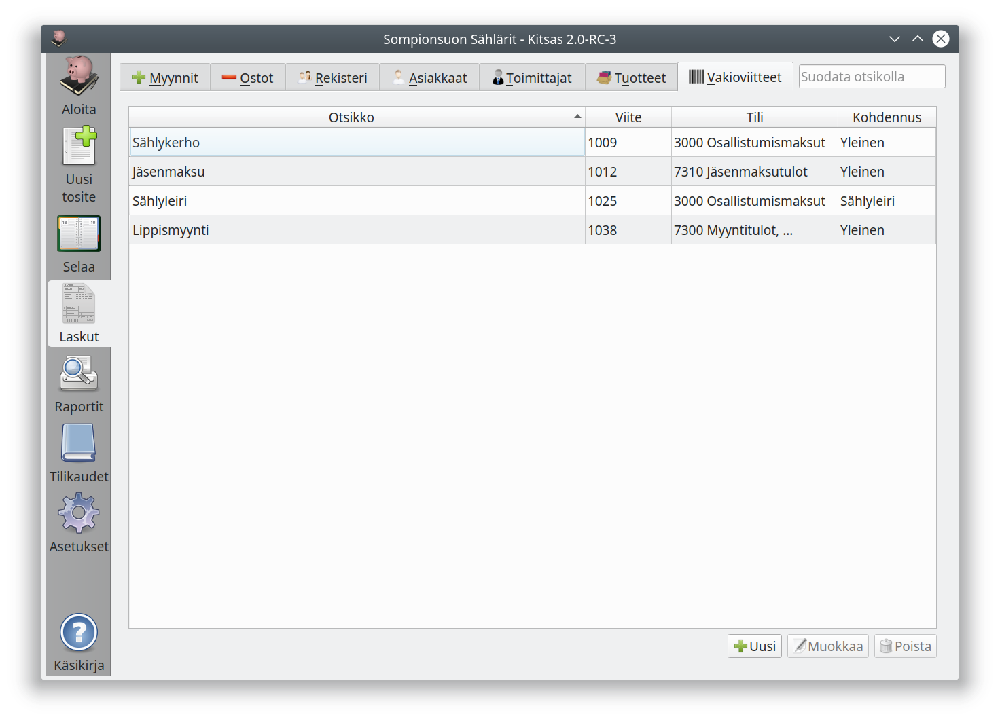
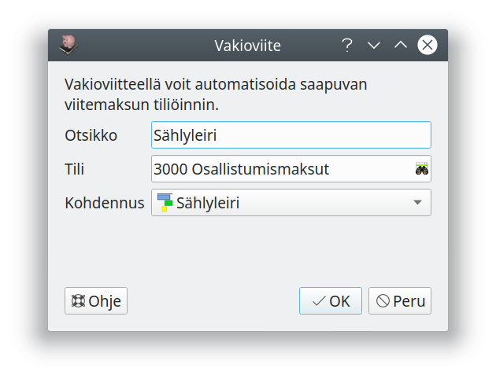

# Vakioviitteet

Voit määritellä vakioviitteitä, joilla saapuvat maksut tiliöidään automaattisesti, kun ohjelmaan tuodaan tiliote csv- tai pdf-tiedostona.

Koska näistä maksuista ei laadita varsinaista laskua, soveltuu toiminto lähinnä yhdistyksille arvonlisäverottomien maksujen vastaan ottamiseen.

Yllä olevassa esimerkissä sählyleirille osallistuvia voidaan kehoittaa maksamaan leirimaksunsa viittellä **1025**. Maksujen valvonta hoidetaan maksajan nimen perusteella.

Jos yhdistyksellä on rahankeräyslupa, voidaan lahjoittajille ilmoittaa vakioviite ja toimintoa käyttää lahjoitustulojen tiliöintiin.

## Vakioviitteen luominen

**Uusi**-painikkeesta voit luoda uuden vakioviitteen

Voit valita saapuvan maksun **tilin**, **kohdennukset** sekä selitteen (**otsikko**), joka lisätään tiliotetositteelle maksuja kirjattaessa.

Kun viite on luotu, näet uuden viitenumeron luettelonäkymästä. Voit myös **muokata** tiliöintitietoja sekä lopulta **poistaa** tarpeettoman vakioviitteen.
