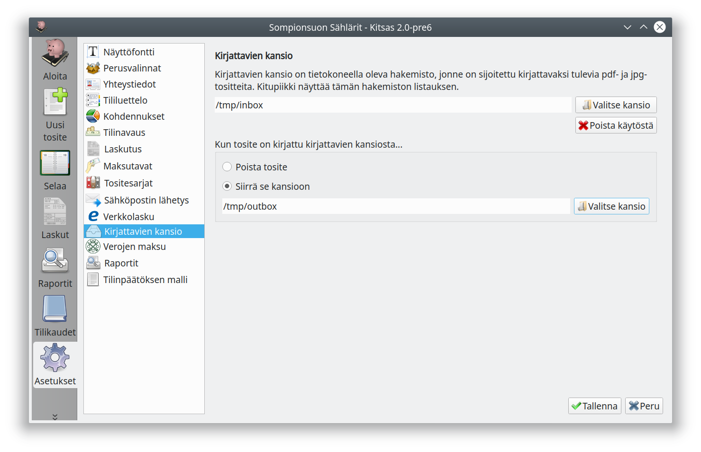
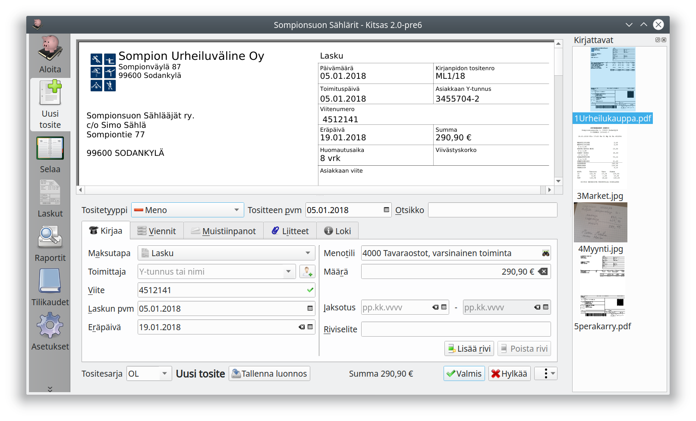

#Kirjattavien kansio

Toiminnalla määritellään tietokoneella oleva hakemisto, jonka sisältämät laskut (pdf- ja kuvatiedostot) näytetään ohjelman ikkunan oikeassa laidassa. Kun kirjattavien kansiossa oleva tiedosto on liitetty laskuun ja lasku tallennetaan, niin valintasi mukaan tiedosto

 - **poistetaan** tietokoneelta, tai
 - **siirretään** valitsemaasi hakemistoon

Kirjattavien ikkunasta lasku on helppo siirtää raahaamalla kirjattavaksi.

Voit kirjata listan ensimmäisen tositteen myös <kbd>F8</kbd>-näppäimellä.

Määrittelemällä sama hakemisto skannausohjelmaan skannattavien tiedostojen tallennushakemistoksi ja Kitsaan kirjattavien kansioksi saat käsiteltyä nopeammin paperilla saamasi tositteet.
