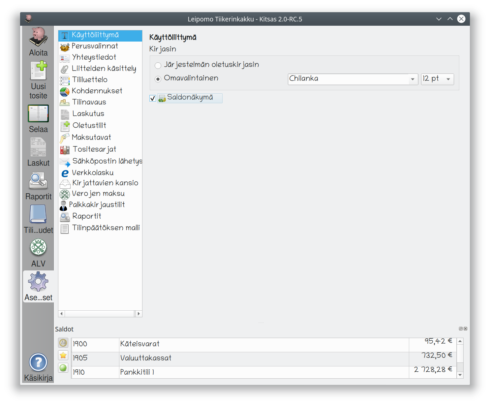

Käyttöliittymä-sivulla voit vaihtaa ohjelman **näyttökirjasinta** (fonttia). Ohjelman oletuskirjaisin saattaa olla turhan pieni joillain suuren näyttötarkkuuden kannettavilla tietokoneilla.

**Saldonäkymä**-valinnalla saat näytön alalaitaan saldonäkymän, joka päivittyy aina kun tosite tallennetaan kirjanpitoon. Voit valita saldonäkymän vasemman laidan kuvakkeilla näytettäviksi **maksutilit**, **suosikkitilit** tai **kaikki käytössä olevat tilit**.
