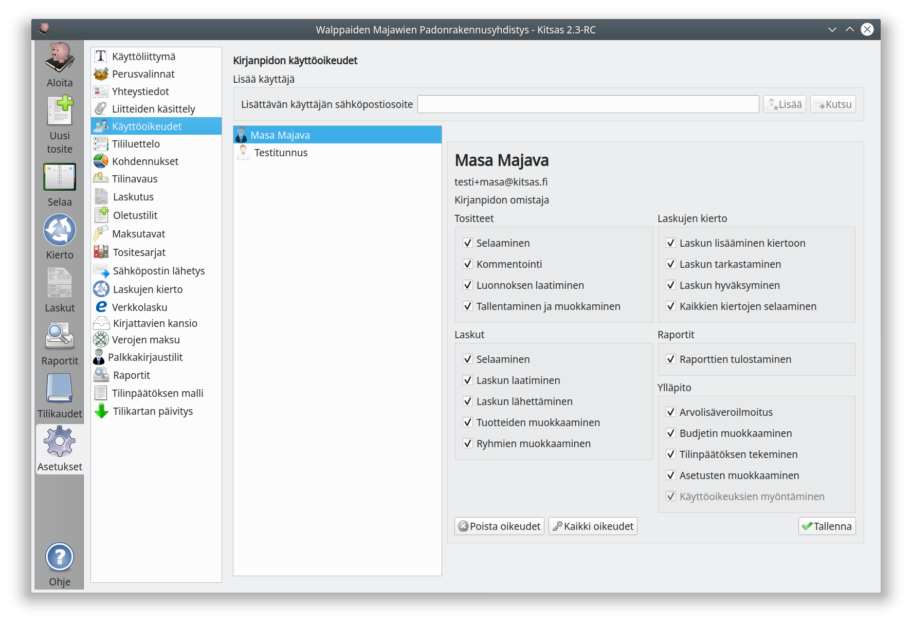

# Käyttöoikeudet

!!! note "Vain pilvessä"
    Käyttöoikeusvalinnat näkyvät vain pilveen tallennetuilla kirjanpidoilla ja vain silloin, kun käyttäjä on kirjanpidon omistaja tai hänelle on annettu oikeus käyttöoikeuksien muokkaamiseen.

  

Käyttöoikeudet-sivulla voit antaa kirjanpitoosi käyttöoikeuksia muille käyttäjille.

## Uuden käyttäjän lisääminen

Syötä **sähköpostiosoite**-kenttään lisättävän käyttäjän sähköpostisoite.

Paina **Lisää** nappia, jos lisättävä käyttäjä on jo rekisteröitynyt Kitsaan käyttäjäksi. **Kutsu**-napilla lähetät sähköpostiin kutsun henkilölle, joka ei vielä ole Kitsaan käyttäjä.

Näet nyt alempana käyttäjän nimen ja sähköpostiosoitteen. Valitse käyttäjälle annettavat oikeudet ja paina **Tallenna**.

Käyttäjä näkee tämän kirjanpidon **Pilvi**-välilehdellään, kun hän seuraavan kerran kirjautuu ohjelmalla Kitsaan pilveen.

!!! note "Käyttöoikeuksien päivittyminen"
    Käyttöoikeudet päivittyvät vasta käyttäjän kirjautuessa seuraavan kerran.

## Käyttöoikeuksien muuttaminen

Valitsemalla käyttäjän nimen listalta pääset muuttamaan hänelle annettuja käyttöoikeuksia. Paina lopuksi **Tallenna**.

Jos poistat käyttäjältä kaikki oikeudet, ei käyttäjää enää näytetä luettelossa eikä käyttäjä voi valita tätä kirjanpitoa.

## Käyttöoikeudet

### Tositteet

Käyttöoikeus    |  Merkitys
----------------|-----------------------------------------
Selaaminen      | Tositelistauksien selaaminen ja tositteen katsominen
Luonnoksen laatiminen | Tositteen tallentaminen Luonnos-tilaan, luonnoksen poistaminen
Tallentaminen ja muokkaaminen | Tositteen tallentaminen Kirjanpidossa tilaan, tositteen muokkaaminen ja poistaminen

### Laskut
Käyttöoikeus    |  Merkitys
----------------|-----------------------------------------
Selaaminen      | Laskujen luettelon selaaminen, laskun näyttäminen
Laskun laatiminen | Uuden laskun luominen, tallentaminen luonnokseksi ja lähetettäväksi
Laskun lähettäminen | Laskun lähettäminen ja tallentaminen suoraan valmiiksi
Tuotteiden muokkaaminen | Uusien tuotteiden lisääminen tuoterekisteriin, tuotteiden muokkaaminen ja poistaminen
Ryhmien muokkaaminen | Käyttäjäryhmien luominen, muokkaaminen ja poistaminen

### Laskujen kierto
Käyttöoikeus    |  Merkitys
----------------|-----------------------------------------
Laskun lisääminen kiertoon | Tositeen tallentaminen kiertoon *Saapunut*-tilassa
Laskun tarkastaminen | Tositteen tallentaminen kiertoon *Tarkastettu*-tilassa
Laskun hyväksyminen  | Tositteen tallentaminen kiertoon *Hyväksytty*-tilassa
Kaikkien kiertojen selaaminen | Näkee kaikissa kierroissa ja kaikissa vaiheissa olevat laskut

### Raportit
Käyttöoikeus    |  Merkitys
----------------|-----------------
Raporttien tulostaminen | Raportti-välilehdellä olevien raporttien esikatselu ja tulostaminen

### Ylläpito
Käyttöoikeus    |  Merkitys
----------------|-----------------
Arvonlisäveroilmoitus | Arvonlisävero-välilehti, ilmoituksen antaminen ja poistaminen
Budjetin muokkaaminen | Tilikauden budjetin muokkaaminen
Tilinpäätöksen tekeminen | Tilinpäätös-toiminto ja tilikauden arkiston sekä kirjanpitoainieiston muodostaminen
Asetusten muokkaaminen | Kirjanpidon asetusten muokkaaminen
Käyttöoikeuksien muokkaaminen | Käyttäjien lisääminen, käyttöoikeuksien myöntäminen ja peruminen
