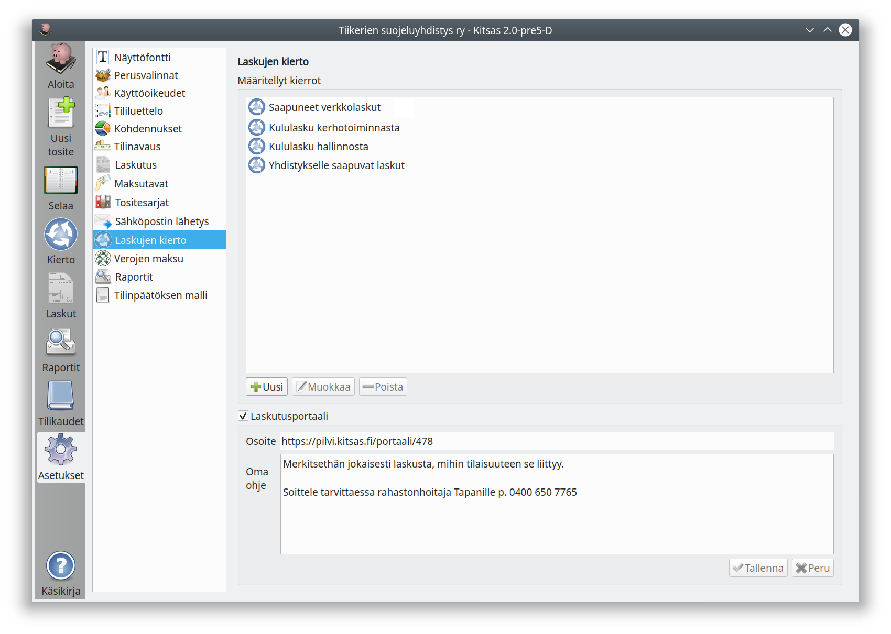
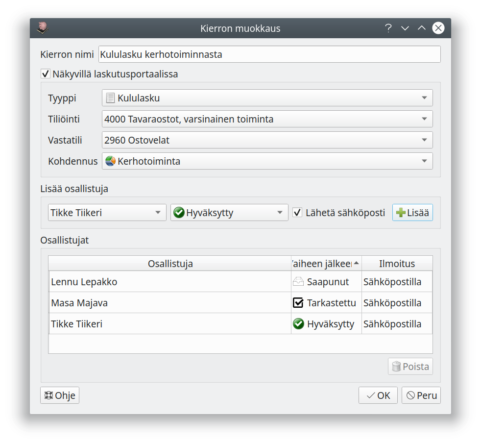

# Laskujen kierto

!!! note "Vain pilvessä"
    Laskujen kierto on käytettävissä vain, kun kirjanpito on tallennettu Kitsaan pilvipalveluun

**Laskujen kierto** mahdollistaa laskujen vastaanottamisen, tarkastamisen ja hyväksymisen sähköisesti Kitsaan kautta.

!!! note "Saapuneet verkkolaskut"
    Jos aktivoit pilveen tallennettuun kirjanpitoon verkkolaskujen noutamisen, noudetaan saapuneet verkkolaskut omaan kiertoonsa. Voit määritellä tälle kierrolle osallistujat tavalliseen tapaan, ja he myös saavat sähköposti-ilmoituksia tarkastettavista laskuista.

## Kiertojen määritteleminen

Luo uusi kierto **Uusi**-painikkeella tai **Muokkaa** olemassa olevaa kiertoa.

**Kierron nimi** näkyy luettelossa, josta kiertoon laitettaville laskuille valitaan kiertopolku.

Jos **näkyvillä laskutusportaalissa** on valittuna, voidaan tähän kiertoon lisätä laskuja laskutusportaalista. Tässä määritellään myös, mitkä ovat oletusvalinnat laskutusportaalin kautta lisättyihin laskuihin.

Kiertoon lisätään osallistuja valitsemalla nimi, kierron vaihe sekä se, lähtetäänkö käyttäjälle sähköpostilla ilmoitus laskun saapumisesta. Luettelossa näytetään vain ne käyttäjät, joilla on laskujen kiertoon sopivat oikeudet.

Vaihe  |   Merkitys
-------|----------------------
Saapunut | Käyttäjä näkee kiertoon lisätyt laskut. Oikeuksiensa puitteissa hän voi *tarkastaa* tai *hyväksyä* laskun tai *siirtää laskun kirjanpitoon*.
Tarkastettu | Käyttäjä näkee tarkastetut laskut. Oikeuksiensa puitteissa hän voi *tarkastaa* laskun tai *siirtää laskun kirjanpitoon*.
Hyväksytty | Käyttäjä näkee tarkastetut laskut, ja voi siirtää ne kirjanpitoon.

Kuvan esimerkkikierrossa *Lennu Lepakko* on kerhotoimintavastaava, joka tarkastaa ensin, että lähetetty kululasku kuuluu yhdistyksen kerhotoimintaan. *Masa Majava* on puheenjohtaja, joka tarkastaa laskut ja *Tikke Tiikeri* rahastonhoitaja, joka laittaa laskun maksuun ja tallentaa tositteen kirjanpitoon.

Kierto voidaan määritellä myös vähemmille henkilöille. Kiertoon voidaan merkitä samaan vaiheeseen myös useampi henkilö, joista kuka tahansa voi siirtää laskua eteenpäin kierrossa.

!!! note "Sähköposti-ilmoitukset kerran päivässä"
    Kitsaaan järjestelmä lähettää ilmoitukset kierrossa käsiteltävänä olevista laskuista kerran vuorokaudessa kaikille käyttäjille, joiden työlistalla on käsittelemättömiä laskuja ja joille on aktivoitu sähköposti-ilmoitukset.

## Laskutusportaali

!!! success "Kuuluu pilvitilaukseen"
    Mahdollisuus laskutusportaaliin kuuluu kaikkiin pilveen tallennetuihin kirjanpitoihin ilman lisämaksua.

Laskutusportaali antaa mahdollisuuden lähettää verkkoselaimen avulla laskuja ja kululaskuja suoraan Kitsaan kiertoon. Ominaisuuden avulla esimerkiksi yhdistyksen aktiivit voivat tallentaa yhdistykselle kuuluvia sähköisesti suoraan järjestelmään, eivätkä kuitit huku matkalla. Laskutusportaaliin ei tarvitse käyttäjätunnuksia, vaan käyttäjä tunnistetaan sähköpostiin lähetettävän linkin avulla.

Laskutusportaali otetaan käyttöön ruksittamalla **Laskutusportaali**-vaihtoehto ja syöttämällä käyttäjälle näytettävä ohjeteksti. Lisäksi on määriteltävä ne kierrot, jotka käyttäjä voi valita laskua lähettäessään.

Kun laskutusportaali on aktivoitu ja sille on määritelty vähintään yksi kierto, on se heti käyttövalmis **osoite**-kohdasta löytyvästä osoitteesta.

[Laskutusportaalin ohjeet](../../kierto/portaali/)
