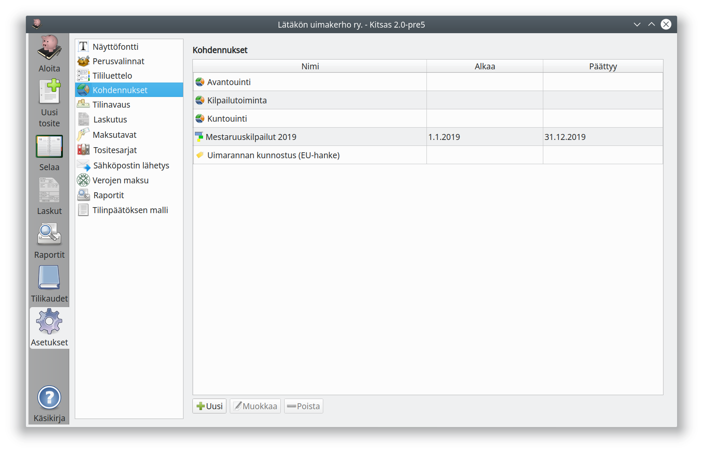

# Kohdennukset

Kohdennuksilla voidaan tuloja ja menoja kohdentaa yhdistyksen eri jaostoille tai toimintaryhmille, yrityksen eri osastoille tai projekteille jne. Koko kirjanpito voidaan toteuttaa myös ilman kohdennuksia.

**Kustannuspaikkojen** kustannuksia voidaan jakaa vielä tarkemmin niiden alaisille **projekteille**.

Kohdennukset ovat organisaation sisäistä laskentaa. Yhdistystoiminnassa kohdennuksia käytettäessä liitetään tilinpäätökseen yleensä eri toiminnanalojen erittelyt.

**Merkkaukset** ovat kirjauksiin liitettäviä merkkejä (tageja), joiden avulla kirjauksia voidaan poimia eri luetteloille, esimerkiksi pääkirjan ja päiväkirjan otteille. Toiminto on tarkoitettu erilaisten "korvamerkittyjen" rahojen, kuten avustusten seuraamiseen. Merkkauksen voi tehdä muun kohdennuksen (eli kustannuspaikan tai projektin) valitsemisen *lisäksi* ja samalle kirjaukselle voi tehdä useamman merkkauksen.

!!! note "Kohdennukset tasetileillä"
    Kitsas tukee kohdennuksia ainostaan tulo- ja menotileillä. Lisäksi poistettava omaisuus voidaan kohdentaa, jolloin kohdennukset huomioidaan poistolaskelmassa. Tasetilien menoihin voidaan kuitenkin liittää merkkauksia.
