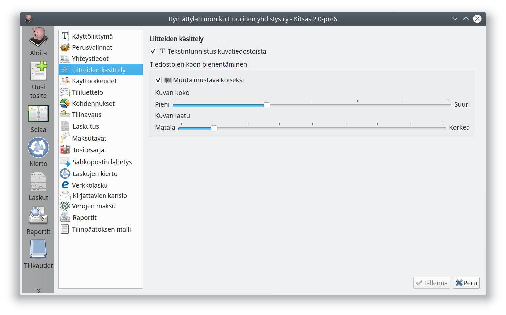

# Liitteiden käsittely

## Tekstintunnistus

Ottamalla teksintunnistuksen käyttöön Kitsas analysoi tositteiden liitteeksi tallennettavat kuvatiedostot ja pyrkii poimimaan niistä mm. laskun euromäärän, päivämäärän, eräpäivän ja toimittajan nimen.

Ominaisuus on käytössä vain maksullisissa tilauksissa.

Yhden kuvan käsittely palvelimella kestää tavallisesti noin 5 - 10 sekuntia.

## Tiedostojen koon pienentäminen

Liitteeksi tallennettavia kuvatiedostoja pienennetään valintojesi mukaan jo ohjelmassa. Näin säästät tallennustilaa ja pilveen tallennettaessa talentaminen on nopeampaa.

Lisätessäsi liitteet näen tiedoston siinä muodossa, millainen se on koon pienentämisen jälkeen.

Jos käytät tekstintunnistusta, et voi valita kovin tehokasta kuvan pienentämistä, jotta kuva on riittävän hyvälaatuinen koneellista tekstintunnistusta varten.
