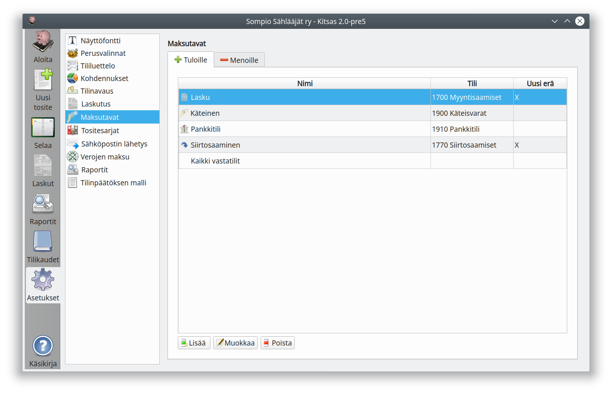

# Maksutavat

Maksutavat määrittelevät [Tulojen ja menojen kirjauksissa](../../kirjaus/menotulo/) käytettävät maksutavat. Maksutavat toimivat pikavalintoina useimmin käytetyille tileille.

Jos käytät säännöllisesti kahta maksuliikennetiliä, kannattaa molemmat lisätä Maksutavoiksi, niin voit tehdä tulo- ja menokirjauksia ilman että vastatili tarvitsee valita joka kerta erikseen.

Valinta **Uusi erä** tarkoittaa tase-eriteltävillä tileillä, ettei käyttäjälle näytetä tase-erien valintaluetteloa, vaan kirjaus tehdään aina uuteen tase-erään.
