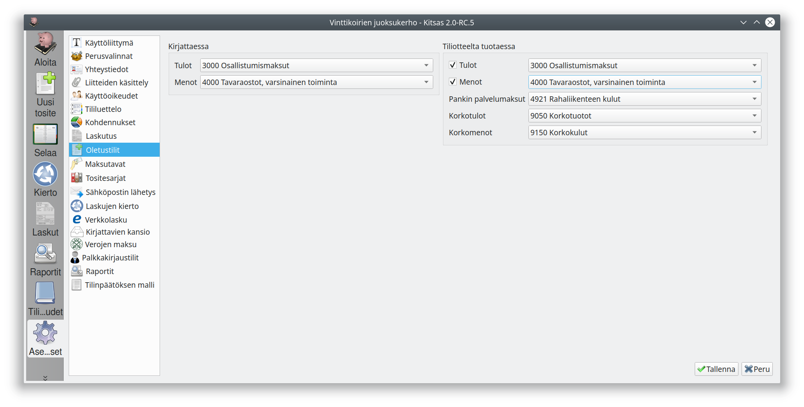

## Kirjattaessa
**Tulot** määrittelee oletustilin tulotositteille ja **menot** vastaavasti menotositteille

## Tiliotteelta tuotaessa
**Tulot** ja **menot** määrittelevät oletustiliöinnin tiliotteelta löydetyille tuloille ja menoille silloin, kun niille ei ole viitenumeron tai maksajan perusteella tunnistettu muuta tiliä (eli niitä ei ole voitu kohdentaa millekään laskulle). Jos näitä ei ole valittuina, ei tällaisille riveille tehdä oletustiliöintiä.

**Pankin palvelumaksut**, **korkotulot** ja **korkomenot** määrittelee tilit, joille kohdennetaan tiliotteiden rivejä tiliotteella olevan tapahtumatyypin perusteella.
