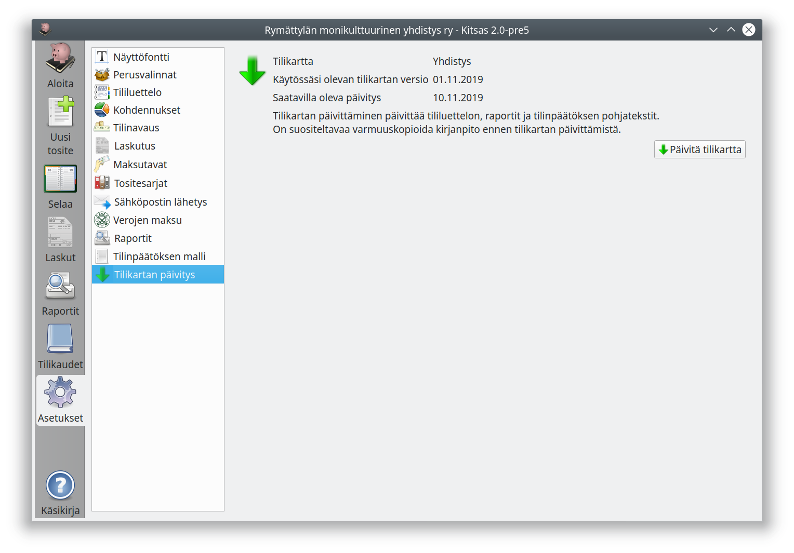

# Tilikartan päivittäminen

Kun tilikartasta on saatavilla uusi versio, saat siitä ilmoituksen aloitusnäyttöön. Klikkaamalla ilmoituksen otsikkoa pääset päivitysnäkymään, jossa voit tehdä päivityksen **Päivitä tilikartta**-painikkeella.

Ohjelman päivitysten yhteydessä myös tilikarttoja päivitetään. Tilikartan päivitys

* voi lisätä uusia tilejä, päivittää tilien nimiä ja ominaisuuksia
* voi lisätä ja päivittää käytössä olevia raportteja
* päivittää käytössä olevan tilinpäätöksen mallin
* lisää ohjelman uusiin omainaisuuksiin liittyviä tilikarttakohtaisia määrityksiä

Päivitettäessä sellaisten tilien ominaisuudet säilyvät, joita olet muokannut itse.

!!! warning "Varmuuskopioi kirjanpitosi ennen päivitystä"
    Päivitys muuttaa kirjanpitosi asetuksia, joten kirjanpidon varmuuskopiointi on erittäin suositeltavaa!
    
