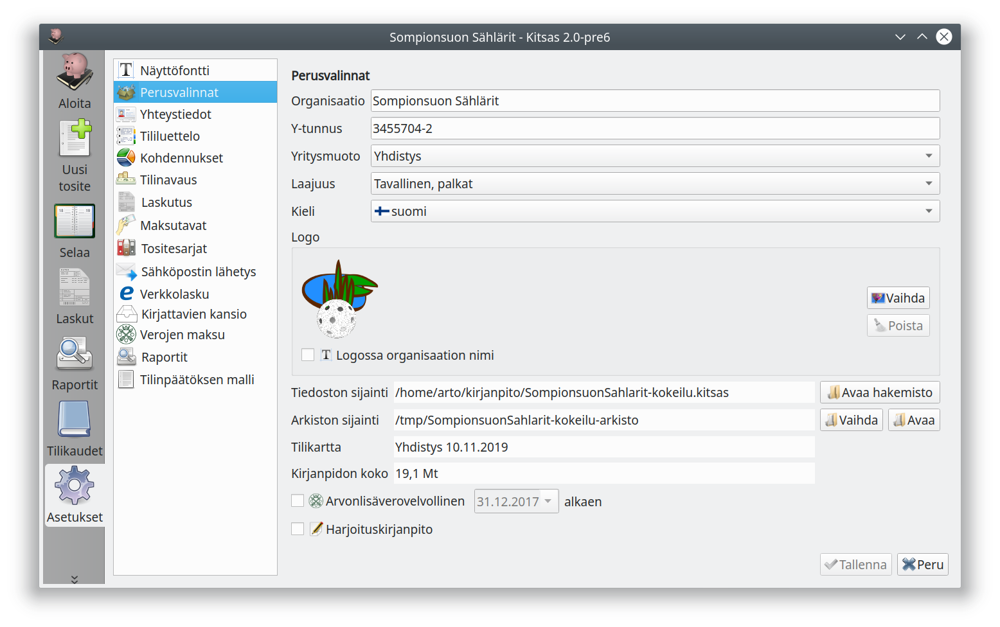

# Perusvalinnat

**Organisaation nimi**, **y-tunnus**, **osoite**, **kotipaikka**, **puhelin**, **sähköposti** ja **logo** näkyvät erilaisissa tulosteissa. Logoksi voi valita jpg- tai png-muotoisen kuvatiedoston. Jos logo sisältää organisaation nimen niin, ettei nimeä ole tarpeen toistaa logon vieressä, valitse **Logossa organisaation nimi**.

**Yritysmuto** vaikuttaa siihen, mitä tilejä on käytettävissä ja mm. tiettyihin tilinpäätöstoimintoihin.

Kitsaan tilikartat ovat laajoja, joten **Laajuus**-valinnalla voit valita osan tileistä piilotettaviksi. Voit myös valita käyttöön yksittäisen piilotetun tilin tai kirjatessa tiliä valitessasi ottaa kaikki tilit näkyviin.

**Tiedoston sijainti** näyttää kirjanpitotiedoston nimen ja sijainnin. **Tilikartta** kertoo käytettävän tilikartan nimen ja päiväyksen.

Valitse **Arvonlisäverovelvollinen** jos olet rekisteröitynyt arvonlisäverovelvolliseksi. Arvonlisäveroon liittyvät toiminnat näytetään vain, kun Arvonlisäverovelvollinen on valittu. Katso Käsikirjan lukua [Arvonlisävero](/alv).

**Harjoituskirjanpito**-valinnalla kaikkiin tulosteisiin tulee *HARJOITUS*-merkintä. Voit myös vaihtaa päivämäärää ruudun yläreunassa ja siten esimerkiksi päivätä laskuja valitsemillesi päiville, kun harjoittelet laskuttamista.
