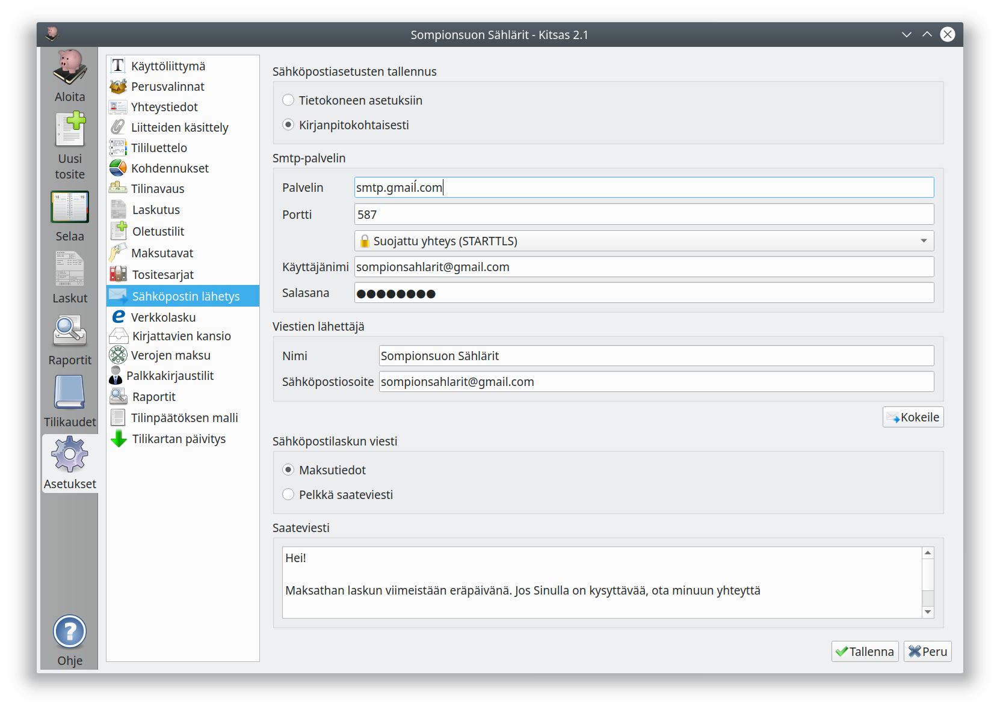
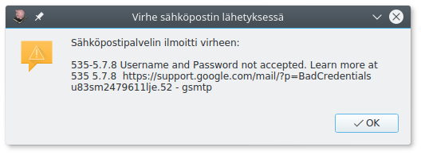

# Sähköpostin lähettäminen

Kitsaalla on mahdollista lähettää laskut suoraan sähköpostiin. Jos tätä toimintoa haluaa käyttää, on ohjelmassa määritettävä sähköpostin asetukset.

Jos valitset asetusten tallentamisen **tietokoneen asetuksiin**, sähköpostitilin asetukset ovat tietokonekohtaisia (samoja asetuksia käytetään kaikilla kirjanpidoilla). Jos valitset tallentamisen **kirjanpitokohtaisesti**, syötetään sähköpostiasetukset erikseen jokaiseen kirjanpitoon. Jos kirjanpidolla on useampi käyttäjä, käyttävät he samoja asetuksia.

* **Palvelin**: Lähtevän sähköpostin palvelimen osoite, löytyy sähköpostin tai internetyhteyden ohjeista.
* **Portti**: Lähtevän sähköpostin portti palvelimella
  * **Suojaamaton yhteys (TCP)**: Viestisi liikkuu täysin salaamattomana, sallittu yleensä vain oman yhtydentarjoajan palvelimelle. Portti 25.
  * **Salattu yhteys (SSL)**: Viestisi salataan. Portti yleensä 465.
  * **Suojattu yhteys (STARTTLS)**: Lähtevään sähköpostipalvelimeen muodostetaan suojattu yhteys. Portti yleensä 587. Suositellaan aina mikäli käytettävissä.
* **Käyttäjänimi**: Käyttäjänimi palvelimella palveluntarjoajan vaatimassa muodossa
* **Salasana**: Sähköpostin salasana. Jos Gmailissa käytetään kaksivaiheista varmennusta, tähän syötetään [sovellussalasana](https://myaccount.google.com/apppasswords).

* **Viestin lähettäjän nimi ja osoite**: Viesteissä näkyvät tiedot. Jotkut sähköpostipalvelut vaativat kyseisen palvelun sähköpostiosoitteen käyttämistä.

Kun olet syöttänyt asetukset, paina **Kokeile**-painiketta, joka yrittää lähettää sähköpostin omaan osoitteeseesi. Jos lähetys epäonnistuu, saat siitä ilmoituksen

Tässä tapauksessa käyttäjätunnus tai salasana on väärin.

**Sähköpostilaskun viesti** -kohdassa syötät saateviestin, jonka liitteeksi lasku lähetetään. Voit myös valita, lisätäänkö viestin loppuun **maksutiedot** eli laskun summa, viitenumero, tilinumero sekä virtuaaliviivakoodi.
