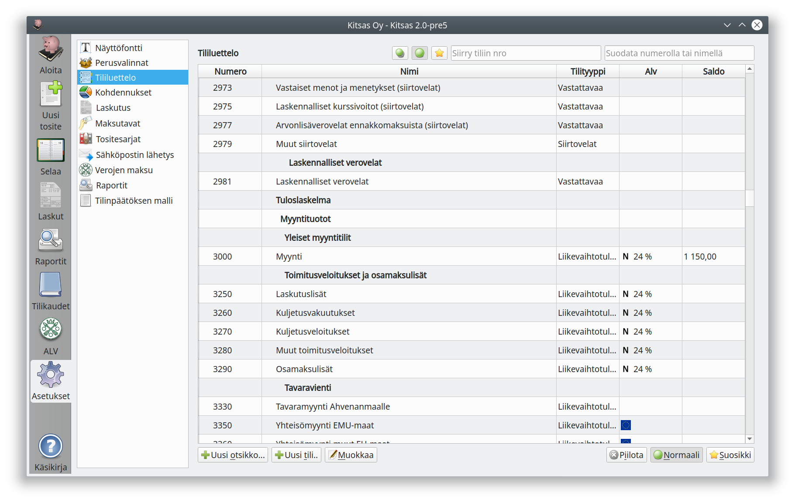
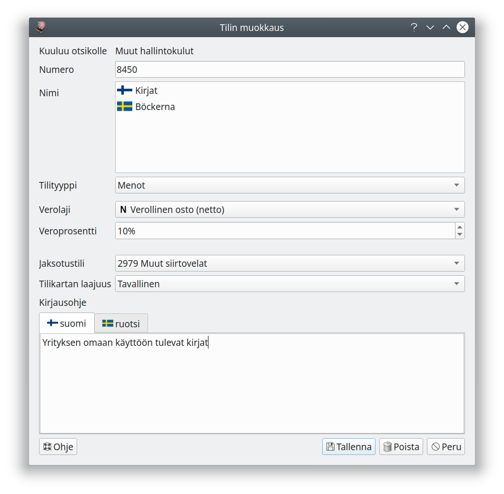
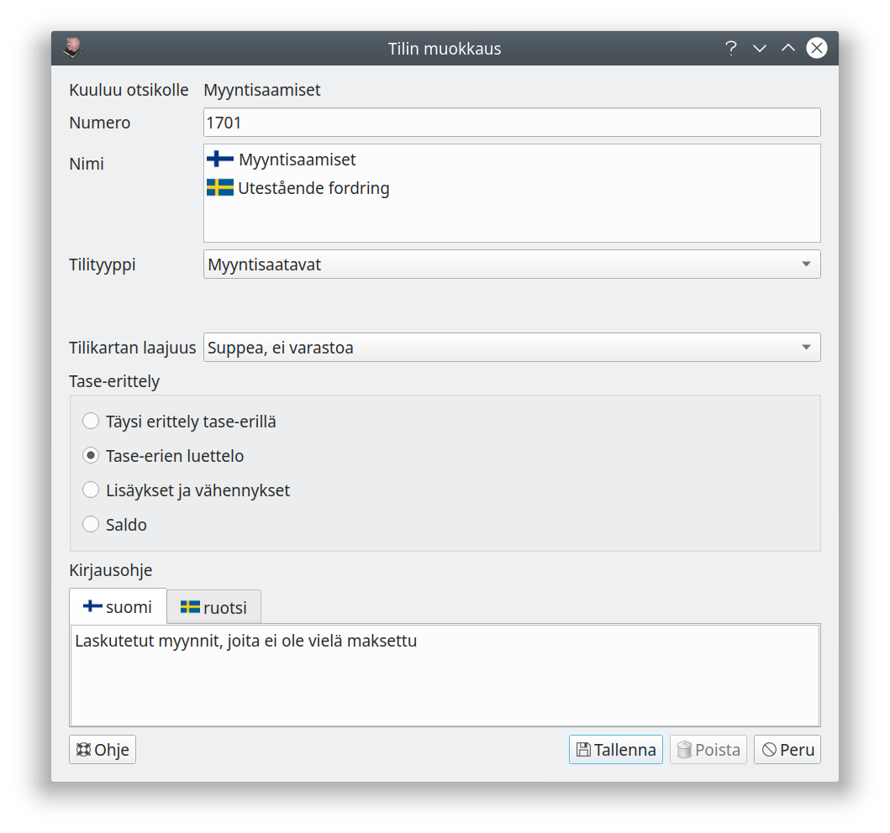
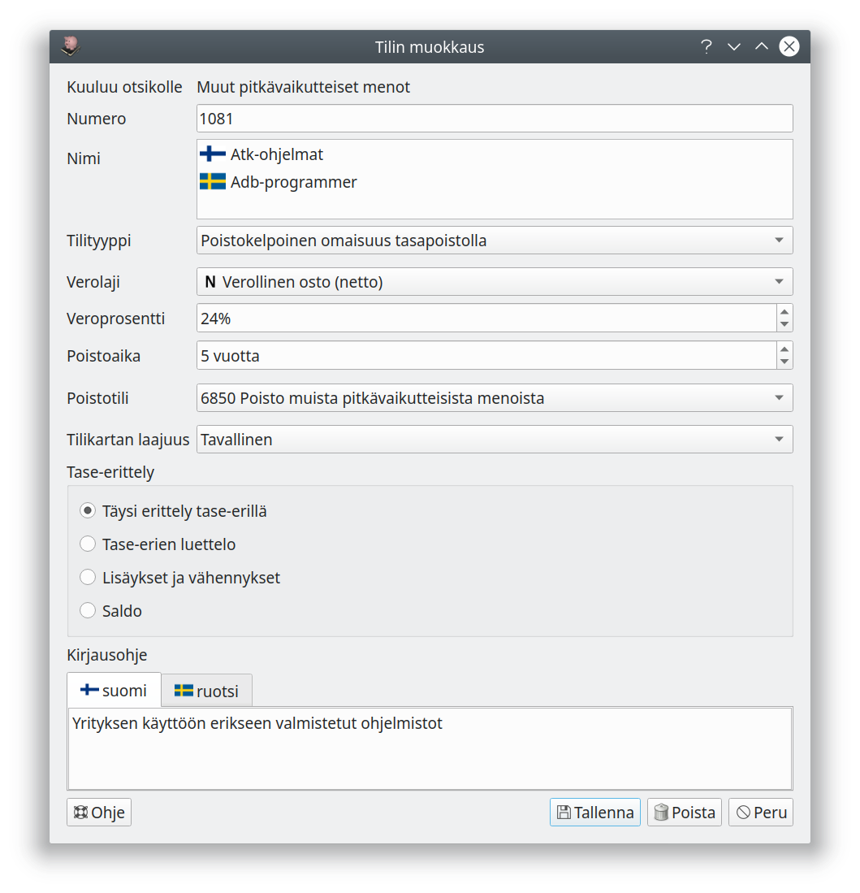

# Tililuettelo

## Tililuettelon muokkaaminen

!!! tip ""
    [ Kirjanpidon asetukset ja tilikartan muokkaaminen (Yhdistys)](https://youtu.be/R7vJiC3HjRQ)   

Tilikarttaan voi lisätä uusia tilejä sekä muokata ja poistaa vanhoja.

!!! success "Valmiit tilikartat"
    Lähes kaikki tarvitsemasi tilit löytyvät valmiista tilikartoista, joissa tilien määritykset ovat valmiiksi kohdallaan. Jos lisäät itse tilejä, ole huolellinen numeroinnin ja määritysten kanssa, jotta kirjaukset tulevat käsitellyiksi oikein!

!!! danger "Asetuksissa määriteltävät tilit"
    Ohjelman asetuksissa määritellään monelle tilille erityinen tilirooli, esimerkiksi pankkien palvelumaksujen tili tiliotteita automaattisesti kirjattaessa. Ohjelman tilinumerointia tulisi muuttaa mahdollisimman vähän, koska numeron muutos saattaa vaatia muutoksia myös monissa tilikartan asetuksissa.

Jos tilikartassa oleva tili on tarpeeton **piilota** se. Piilotettu tili ei näy luetteloissa tiliä valittaessa. Tilin voi myös kokonaan poistaa, mutta yleensä piilottaminen on parempi vaihtoehto.

Voit merkitä paljon käytetyt tilit **suosikkitileiksi**. Tiliä valittaessa voit näyttää pelkät suosikkitilit.

Ylärivin kuvakkeilla määritellään, näytetäänkö **kaikki tilit**, **käytettävissä olevat tilit** (tilit, joita ei ole piilotettu) tai ainoastaan **suosikkitilit**.

Sininen info-kuvake luettelossa merkitsee, että tilille on annettu kirjausohje.

Lisätäksesi uuden tilin valitse tili tai otsikko, jonka jälkeen uusi tili tulee, ja paina **Uusi tili**. Lisätäksesi otsikon valitse otsikko, jonka alle lisättävä otsikko tulee, ja valitse **Uusi otsikko**.

Tilit ja otsikot pitää **numeroida**. Taseen vastaavaa-tilit alkavat numerolla 1 ja vastattavaa-tilit numerolla 2. Numerosarjat 3..9 kuuluvat tuloslaskelmaan päätettäville tulo- ja menotileille. Tilinumeron pituus saa olla enintään enintään kahdeksan numeroa.

Tilejä lisättäessä on tärkeää, että tili tulee oikealle numeroalueelle, jotta se näkyy raporteissa oikealla tavalla. Tilinumero näytetään punaisella, jos numero on jo käytössä tai jos numero ei osu otsikkonsa numeroalueelle.

!!! note "Tilien sijoittuminen tilinpäätöksessä ja taseessa"
    Jos tilien numerointia muutetaan tai tilejä lisätään olemassa olevien otsikkoalueiden ulkopuolelle, pitää vastaavat muutokset tehdä myös [raporttien muokkauksessa](../raportit).

**Tilityyppi** määrittelee, miten tiliä käsitellään kirjanpidossa ja missä luetteloissa tili näytetään, katso alempaa [Tilityypit](#tilityypit).

**Verolaji** ja **veroprosentti** ovat tilin kirjauksen oletusvalintoja, verolajin ja -prosentin voi aina valita joka viennille erikseen, katso [arvonlisävero](/alv). Valinnat eivät ole näkyvissä, jos yritystä ei ole merkitty [perusvalinnoissa](../perusvalinnat) arvonlisävelvolliseksi.

**Jaksotustiliä** käytetään siirtovelkojen/siirtosaamisten kirjaamiseen silloin, kun tuloja jaksotetaan Kitsaan automaattitoiminnolla.

Pankkitileille syötetään lisäksi **IBAN-tilinumero**. Tilinumero tarvitaan maksujen kohdentamiseen maksuja
ja tiliotteita tuotaessa.

!!! note "Maksutavat"
    Jos haluat lisäämäsi pankkitilin meno- ja tulotositteiden maksutapavalintaan, on se tehtävä [maksutapojen asetuksista](../maksutavat).

**Tilikartan laajuus** määrittelee, millä tilikartan laajuuden valinnoilla tili on näkyvissä.

## Tase-erittely ja tase-erät

Tasetilien (vastaavaa ja vastattavaa) kohdalla valitaan, miten tili esitetään **tase-erittelyssä**.

* **Täysi erittely tase-erillä**: Tilin kirjaukset jaetaan eri tase-eriin, joiden kaikkia muutoksia seurataan. Käytetään esimerkiksi tasaeräpoistettavan omaisuuden kirjanpitoarvon seurantaan.
* **Tase-erien luettelo**: Kirjaukset jaetaan tase-eriksi, ja erittelyssä seurataan eri erien saldoja. Käytetään esimerkiksi myyntisaamisissa ja ostoveloissa, jolloin erittelyistä selviää, mitkä saatavat ovat vielä maksamatta.
* **Lisäykset ja vähennykset**: Kirjauksia ei eritellä, mutta tase-erittelyyn tulostuvat tilikauden aikaiset tapahtumat. Käytetään esimerkiksi menojäännöspoistettavissa tileissä.
* **Saldo**: Tase-erittelyyn tulostetaan vain tilien saldot.

## Poistettava omaisuus

Kitupiikki tukee suunnitelman mukaisten poistojen tekemistä tasaeräpoistoina tai menojäännöspoistoina.

**Tasaeräpoistoissa** jokaista tase-erää (hankintaa) seurataan erikseen, ja hankintahinta jaetaan poistoajalle (euromäärä kuukautta kohti). Tilin asetuksissa määritellän poistoajan oletus, mutta poistoaika on määriteltävissä erikseen jokaiselle erälle (hankinnalle).

**Menojäännöspoistossa** aina tilikauden lopussa poistetaan määritelty prosenttiosuus tilin senhetkisestä saldosta. Prosentti on tilikohtainen ja määritellään kohdassa **menojäännöspoisto**.

**Poistotili** määrittää, mille menotilille vuotuiset poistot kirjataan.

## Tilityypit

Koodi | Tilityyppi | Ryhmä | Huomautukset
------|------------|-------|----------
A     | Vastaavaa  | Vastaavaa | Vastaavaa-tili ilman tarkempaa erittelyä
APM   | Poistokelpoinen omaisuus, menojäännöspoisto | Vastaavaa |
APT   | Poistokelpoinen omaisuus, tasapoisto | Vastaavaa |
AS    | Saatavaa  | Vastaavaa | Saatavat ilman tarkempaa erittelyä
AO    | Myyntisaatava | Vastaavaa | Laskutettu myynti
AJ    | Siirtosaatava | Vastaavaa | Jaksotuksesta aiheutuvat saatavat
AL    | Arvonlisäverosaatava | Vastaavaa | Vain yksi tili. Tälle tilille kirjataan palautettavan arvonlisäveron osuus ennen alv-ilmoituksen antamista. Tilille saa tehdä vain sellaisia kirjauksia, joihin on määritelty oikeat alv-tunnistetiedot.
ALM   | Maksuperusteisen alv:n kohdentamaton saatava | Vastaavaa | Vain yksi tili. Tälle tilille kirjataan maksuperusteista arvonlisäveromenettelyä käytettäessä kohdentamaton arvonlisäverosaaminen. Kun maksu on suoritettu, siirretään erä arvonlisäverosaatavien tilille. Tilille saa tehdä vain kirjauksia oikeanlaisilla alv-ohjaustiedoilla.
ARK   | Käteisvarat | Vastaavaa |
ARP   | Pankkitili | Vastaavaa  |
AV    | Verosaatava | Vastaavaa | Vain yksi tili. Saatava verottajalta, jos palautettavia veroja on maksettavia enemmän.
B     | Vastattavaa | Vastattavaa | Vastattavaa-tili ilman tarkempaa erittelyä
BE    | Edellisten tilikausien voitto/tappio | Vastattavaa | Vain yksi tili. Edellisten tilikausien yli/alijäämä tulee näkyviin tälle tilille.
T     | Tämän tilikauden tulos | Vastattavaa | Vain yksi tili. Tämän tilikauden tulos tulee näkyviin tälle tilille. Tilille ei saa tehdä mitään kirjauksia.
BS    | Velat | Vastattavaa | Velat ilman tarkempaa erittelyä
BL    | Arvonlisäverovelka | Vastattavaa | Vain yksi tili. Tälle tilille kirjataan arvonlisäveron osuus ennen alv-ilmoituksen antamista. Tilille saa tehdä vain sellaisia kirjauksia, joihin on merkitty oikeat alv-ohjaustiedot.
BJ    | Siirtovelka  | Jaksotuksesta aiheutuva laskennallinen velka
BLM  | Maksuperusteisen alv:n kohdentamaton velka | Vastattavaa  | Vain yksi tili. Tälle tilille kirjataan maksuperusteista arvonlisäveromenettelyä käytettäessä kohdetamaton arvonlisäverovelka. Kun myynnistä on saatu maksu, siirretään erä arvonlisäverovelan tilille.
BO   | Ostovelka | Vastattavaa | Maksamattomat ostolaskut
BV   | Verovelka | Vastattavaa | Vain yksi tili. Oma-aloitteisesti maksettavat verot (esim. arvonlisävero ja ennakonpidätykset), jotka on ilmoitettu mutta ei vielä maksettu. Vastaa OmaVero-tilin velkasaldoa.
C    | Tulot    | Tulo   | Tulot, joita ei lasketa liikevaihtoon
CZ   | Verottomat tulot | Tulot | Tulot, joista ei makseta tuloveroa ja joita ei lasketa liikevaihtoon
CL   | Liikevaihtotulo | Tulo | Liikevaihtoon laskettava myynti
CLZ  | Veroton myynti | Tulo | Liikevaihtoon laskettava myynti, josta ei makseta tuloveroa
D    | Menot  | Meno |
DZ   | Vähennyskelvottomat menot | Meno | Meno, joka ei oikeuta vähennykseen tuloverossa
DH   | Puoliksi vähennyskelvottomat menot | Meno | Meno, joka oikeuttaa 50% vähennykseen tuloverossa
DP   | Poistot | Meno  | Poistojen menotili
DPZ  | Vähennyskelvottomat poistot | Meno | Poistot, jotka eivät oikeuta vähennykseen tuloverossa
DVE  | Ennakkoverot | Meno | Tuloverojen maksaminen
