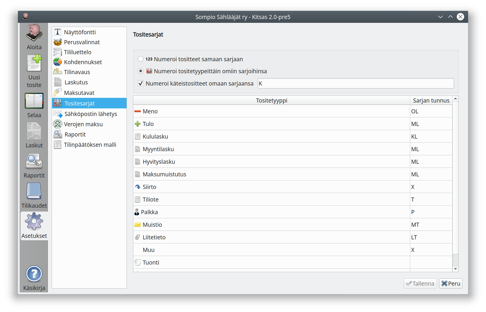

# Tositesarjat

Voit valita, haluatko numeroita kaikki tositteet yhteen juoksevaan tositesarjaan, vai haluatko käyttää useampaa tositesarjaa eri tyyppisille tositteille.

Laajassa kirjanpidossa, jossa tositteet säilytetään paperilla, on tavallista että eri mappeihin arkistoitavia erityyppisiä tositteita (esim. myyntilaskut, ostolaskut, palkkatositteet) varten on omat tositesarjansa.

Jos valitset usean tositesarjan käytön, voit vapaasti määritellä jokaiselle tositteelle siinä käytettävän tositesarjan (käytännössä kirjainlyhenne tositetunnisteen alussa). Lisäksi voit määritellä tässä valintaikkunassa eri tositetyyppien oletustunnisteet.

**Numeroi käteistositteet omaan sarjaansa** määrittelee tositesarjan, johon kaikki käteisvientejä sisältävät tulo-, meno- ja siirtotositteet kirjataan.
