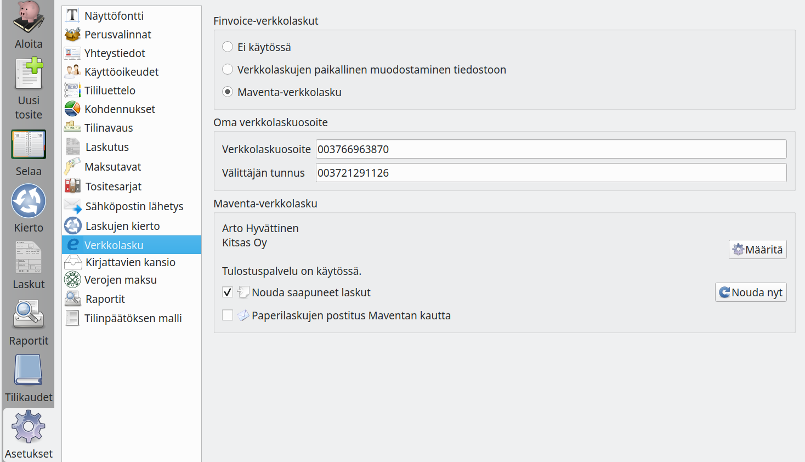
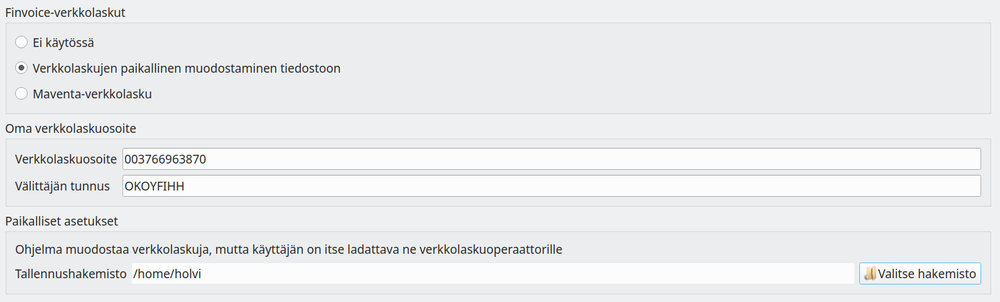
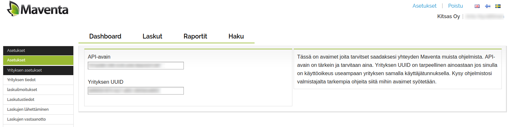

# Verkkolaskut

!!! note "Vain tilaajille"
    Verkkolaskutoiminto hyödyntää Kitsas Oy:n palvelinta, ja on käytettävissä vain maksullisten tilausten sekä kaikkien pilveen tallennettujen kirjanpitojen yhteydessä.

!!! note "Vain yritysten Finvoice-verkkolaskut"
    Kitsas ei toistaiseksi tue kuluttajien verkkolaskuja

## Verkkolaskujen paikallinen muodostaminen

!!! note "Kirjautuminen vaaditaan"
    Sekä laskujen lähettäminen että vastaanottaminen onnistuu vain, jos olet kirjautuneena Kitsaaseen käyttäjätunnuksillasi

Kun laskutuksessa lähetät verkkolaskun, muodostaa Kitsas verkkolaskusta xml-tiedoston ja tallentaa sen valitsemaasi hakemistoon. Sinun on itse huolehdittava tiedoston lataamisesta verkkolaskuoperaattorillesi.

Saapuneet verkkolaskut lisäät kirjanpitoon samoin kuin muutkin tositteet raahaamalla ne uuden tositteen näkymään.

## Maventan verkkolaskutus

Kitsaassa on integroitu yhteys [Maventan](https://maventa.com) verkkolaskutukseen. Kun Maventa-verkkolasku on otettu käyttöön, laskuttaa Maventa sekä lähetetyistä että vastaanotetuista verkkolaskuista hinnastonsa mukaisesti.

Luo ensin [Maventa-tili](https://secure.maventa.com/registrations).

Kitsaan verkkolaskuasetusten **Määritä**-painikkeella pääset syöttämään API-avaimen ja yrityksen UUID-tunnukset, jotka löydät Maventan asetuksista.

### Verkkolaskujen lähettäminen

!!! note "Kirjautuminen vaaditaan"
Sekä laskujen lähettäminen että vastaanottaminen onnistuu vain, jos olet kirjautuneena Kitsaaseen käyttäjätunnuksillasi

Kun laskutuksessa lähetät verkkolaskun, lähetetään se välittömästi Maventan kautta eteenpäin.

Kitsas ei ilmoita verkkolaskun toimittamisen epäonnistumisesta. Siksi Manventan asetusten kohdasta **laskuilmoitukset** on syytä ottaa käyttöön **Vastaanota ilmoituksia laskujen lähetysvirheistä**

### Verkkolaskujen vastaanottaminen

Verkkolaskujen noutaminen otetaan käyttöön **Nouda saapuneet laskut**-valinnalla.

Omalle koneelle tallennetuissa kirjanpidoissa saapuneet laskut haetaan ohjelman käynnistyessä. Voit hakea laskut myös verkkolaskuasetusten **Nouda nyt**-painikkeella. Laskut löytyvät **Selaa**-sivun **Saapuneet**-välilehdeltä. Noudetut laskut eivät näy kirjanpidossa ennen kuin ne tallennetaan **Valmis**-painikkeella

Pilveen tallennetuissa kirjanpidoissa saapuneet laskut noudetaan neljä kertaa vuorokaudessa **Saapuneet verkkolaskut**-kiertoon. Voit hakea laskut myös verkkolaskuasetusten **Nouda nyt**-painikkeella.

Kitsaassa ei toistaiseksi ole suoraa pankkiyhteyttä, vaan sinun on huolehdittava saapuneiden laskujen maksusta esimerkiksi verkkopankkia käyttäen.

### Laskujen postituspalvelu

Kun **Paperilaskujen postitus Maventan kautta** on valittuna, toimitetaan laskuja lähetettäessä ne laskut, joiden toimitustapana on **Postitus**, Maventan tulostuspalveluun. Maventa veloittaa laskujen tulostamisesta oman hinnastonsa mukaan.

Kitsaan toteutuksesta johtuen voit toistaiseksi lähettää postutuspalvelulla laskuja vain kotimaisiin osoitteisiin.
