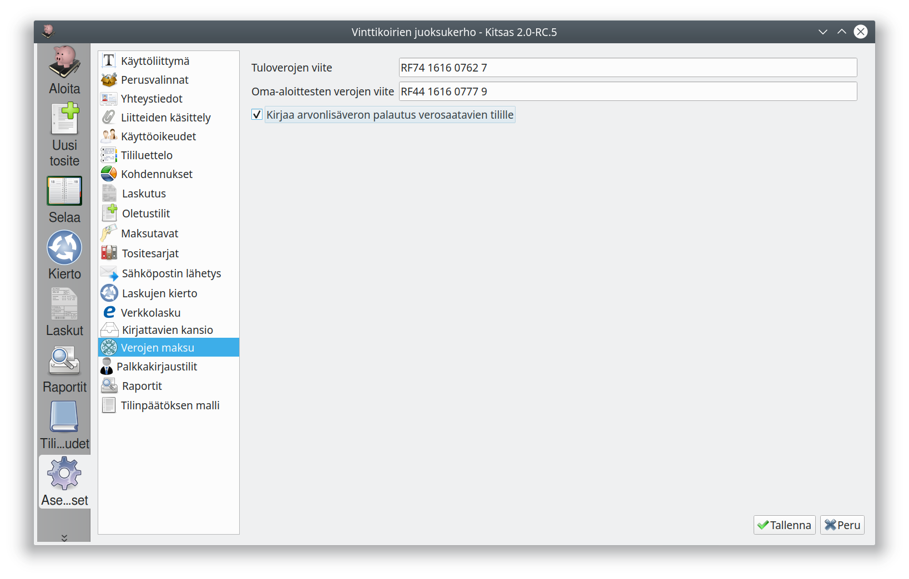

**Tuloverojen viite** on OmaVero-palvelusta näkyvä viitenumero, jolla yritys maksaa tuloverojaan (esim. ennakkoverot). Vastaavasti **Oma-aloittesten verojen viite** on viitenumero, jolla maksetaan esimerkiksi arvonlisäverot. Kitsas käyttää näitä viitenumeroita tiliotetietojen automaattiseen kohdistamiseen.

**Kirjaa arvonlisäverojen palautus verosaatavien tilille** -valinnalla arvonlisäveroilmoitusta laadittaessa mahdollinen palautus kirjataan verosaatavien tilille. Ilman tätä valintaa palautukset kirjataan negatiivisena arvonlisäverovelkana.
