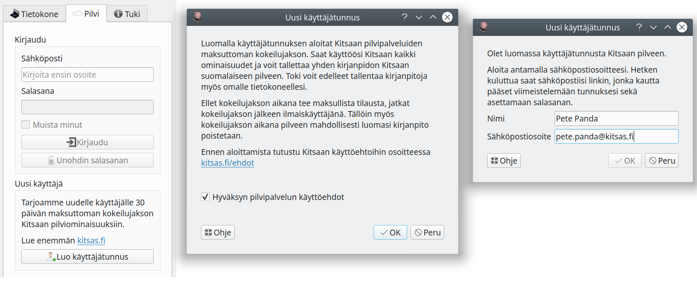
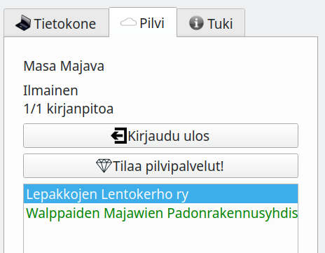
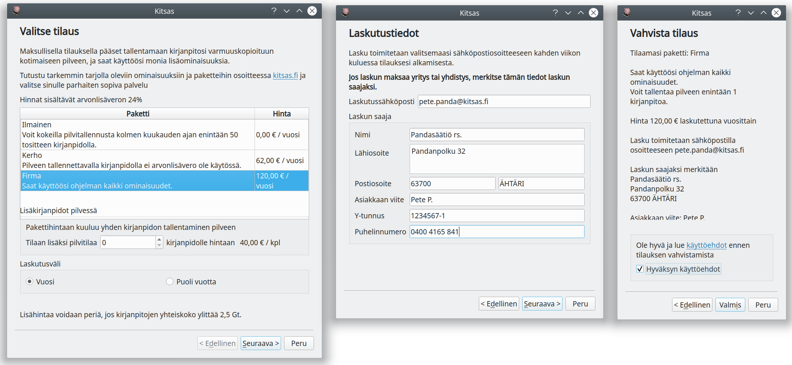

# Kitsaan pilvi

Kitsas Oy tarjoaa ohjelmaan liittyviä pilvipalveluita. Palveluista ja hinnotteluista löytyy tarkempaa tietoa sivulta [kitsas.fi](https://kitsas.fi).

Palvelussa voit tallentaa kirjanpitosi Kitsas Oy:n Suomessa sijaitsevalle, automaattisesti varmuuskopioitavalle palvelimelle. Pilvessä olevalla kirjanpidolla voi olla useita samanaikaisia käyttäjiä. Saat käyttöösi myös Finvoice-verkkolaskut, kuvatiedostojen tekstintunnistuksen ja tukipalvelut sekä [laskutusportaalin](/kierto/portaali) ja rajoitetun [Web-liittymän kirjanpitoosi](/webkitsas).

Rekisteröityessäsi Kitsaan pilveen aloitat 30 päivän maksuttoman kokeilujakson, jonka aikana saat käyttää kaikkia vain tilaajille rajoitettuja palveluita sekä tallentaa yhden kirjanpitosi Kitsaan pilveen.

!!! note "Kun kokeilujakso päättyy"
    Jos et tee maksullista tilausta, jatkat kokeilujakson jälkeen ilmaiskäyttäjänä ja mahdollinen pilveen tallentamasi kirjanpito poistetaan.

## Rekisteröityminen

Rekisteröityminen tehdään suodaan Kitsas-ohjelmasta.

Paina **Pilvi**-välilehdellä **Luo käyttäjätunnus**-painiketta.

Hyväksyttyäsi [käyttöehdot](https://kitsas.fi/ehdot) ja annettuasi tietosi saat hetken kuluttua sähköpostiisi linkin, jonka avulla pääset asettamaan salasanasi.

## Kirjautuminen

Kirjaudu **Pilvi**-välilehdellä syöttämällä sähköpostiosoitteesi ja salasanasi sekä painamalla **Kirjaudu**-nappia.

Kirjauduttuasi saat luettelon pilvessä olevista kirjanpidoista, joihin sinulla on käyttöoikeus.

## Kirjanpidon kopioiminen pilveen

Siirtääksesi omalla koneellasi olevan kirjanpidon pilvitallennukseen

1. Kirjaudu **Pilvi**-välilehdellä omalla tunnuksellasi
2. Avaa **Tietokone**-välilehdeltä tietokoneellasi oleva kirjanpito
3. Paina **Pilvi**-välilehdellä olevaa **Kopioi kirjanpito pilveen** -nappia

Kirjanpitosi kopioidaan pilveen. Kun käytät pilveen tallennettua kirjanpitoa, näet -kuvakkeen aloitussivulla tilikauden valinnan vasemmalla puolella.

!!! note "Paikallinen kirjanpitosi säilyy muuttumattomana"
    Jos jatkossa muokkaat omalla koneellasi olevaa kirjanpitotiedostoa, eivät sen muutokset vaikuta pilvessä olevaan kirjanpitoon (eivätkä pilvessä olevan kirjanpidon muutokset paikalliseen tiedostoon). Otettuasi käyttöön pilvikirjanpidon älä siis enää muokkaa omalle koneelle jäänyttä kirjanpitoasi.

    Pilvikirjanpitoa ei voi ladata omalle tietokoneelle muuten kuin kirjanpitoarkistona.

## Tilauksen tekeminen

Myös tilaukset tehdään suoraan Kitsas-ohjelman **Pilvi**-välilehdeltä.

**Tee tilaus**-painikkeella voit ottaa käyttöön maksullisen tilauksen, johon sisältyy pilvitallennustilaa sekä tukipalveluita.

Tilaukseesi liittyvät ominaisuudet ovat käytettävissä heti, kun olet tehnyt tilauksen.
Voit tilata suoraan ohjelmasta myös tarvitsemasi lisäkirjanpidot. Lisätietoja saat sähköpostilla myynti@kitsas.fi

## Kirjanpidon jakaminen

Voit [kirjanpidon asetuksissa](../maaritykset/kayttooikeudet/) antaa toisille käyttäjille oikeuden kirjanpitoon, jonka omistaja olet.

!!! tip "Maksuttomat lisäkäyttäjät"
    Kun sinulla olisi maksullinen tilaus, voit antaa käyttöoikeuksia myös ilmaiskäyttäjille. Myös ilmaiskäyttäjät saavat pilvessä olevan kirjanpidon osalta käyttää muuten maksullisia lisäpalveluita kuten verkkolaskujen muodostamista.
