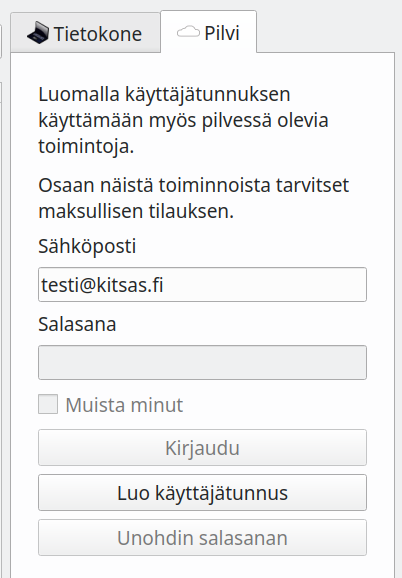

# Kitsaan pilvi

!!! note "Pilvi avautuu pian..."
    Kitsaan pilvi avautuu yleiseen käyttöön näillä näkymin maaliskuussa 2020

Kitsas Oy tarjoaa ohjelmaan liittyviä pilvipalveluita. Palveluista ja hinnotteluista löytyy tietoa sivulta [kitsas.fi](https://kitsas.fi). Rekisteröityiminen on maksutonta.

Ohjelmaa voi käyttää maksuttomasti omalla koneella myös ilman rekisteröitymistä.

## Rekisteröityminen

Kirjoita sähköpostiosoitteesi aloitussivun **Pilvi**-välilehdelle ja paina **Luo käyttäjätunnus**. Saat sähköpostiisi linkin, jonka avulla voit viimeistellä rekisteröitymisesi.

## Kirjautuminen

Kirjaudu **Pilvi**-välilehdellä syöttämällä sähköpostiosoitteesi ja salasanasi.

Kirjauduttuasi saat luettelon pilvessä olevista kirjanpidoista, joihin sinulla on käyttöoikeus. Pilvessä olevia kirjanpitoja voi useampi käyttäjä käsitellä samanaikaisesti.

**Tilaukseni**-painikkeellä voit ottaa käyttöön maksullisen tilauksen, johon sisältyy pilvitallennustilaa sekä tukipalveluita.

## Kirjanpidon jakaminen

Voit antaa toisille käyttäjille oikeuden kirjanpitoon, jonka omistaja olet.
