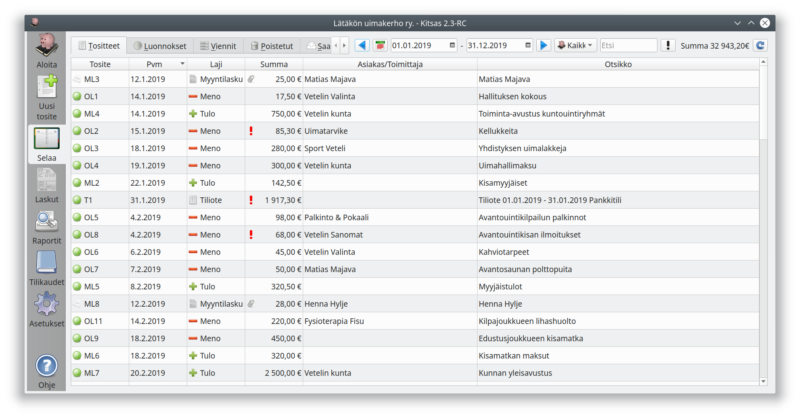
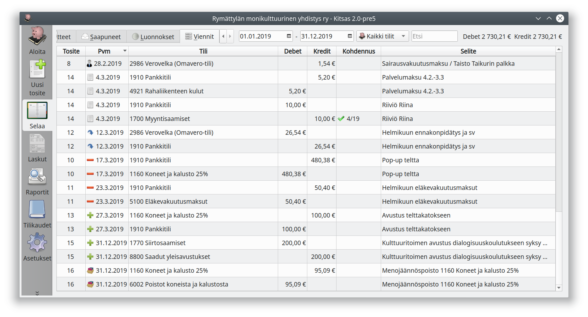

# Selaaminen ja etsiminen

**Selaa**-välilehdellä pääset selaamaan ja hakemaan jo tehtyjä kirjauksia.

## Tositteiden selaaminen

- **Tositteet** -välilehdellä näet kirjanpitoon tallennetut tositteet
- **Luonnokset** -välilehdellä ovat luonnoksina tallennetut tositteet
- **Viennit** -välilehdellä voit selata kirjanpidon vientejä
- **Saapuneet** -välilehdellä ovat paikalliseen kirjanpitoon noudetut verkkolaskut

Rajaa selattavien tositteiden aikaväli ja halutessasi tositetyyppi.

**Etsi**-valinta suodattaa näytöllä olevista tositteista ne, joiden otsikossa on etsittävä teksti.

Napsauttamalla riviä pääset katsomaan tai muokkaamaan valittua tositetta.

## Vientien selaaminen

**Viennit**-välilehdellä näet vientien eli tositteella olevien rivien selaamisen.
Rajaa selattavien vientien aikaväli. Voit selata yksittäisen tilin tapahtumia
valitsemalla **Kaikki tilit**-valinnan tilalle haluamasi tilin.

**Etsi**-valinta suodattaa näytöllä olevista vienneistä ne, joiden selitteessä on
etsittävä teksti.

Napsauttamalla riviä pääset katsomaan tai muokkaamaan tositetta, johon vienti on
kirjattu.

-kuvake kohdennussarakkeessa tarkoittaa, että kyseinen tase-erä on "tasan" eli myynti- tai ostolasku maksettu kokonaan tai poistettava hankinta poistettu kokonaisuudessaan.

## Porautuminen aloitusnäytöltä

Aloitusruudun saldoluettelon tilinnumerot ovat linkkejä, joita napsauttamalla näet luettelon kyseiselle tilille kirjatuista vienneistä.

## Porautuminen arkistossa

[Sähköisen arkiston](/tilikaudet/arkisto) raporteista pääset seuraamaan kirjausketjua taseesta ja tilinpäätöksestä aina yksittäisiin tositteisiin saakka.
