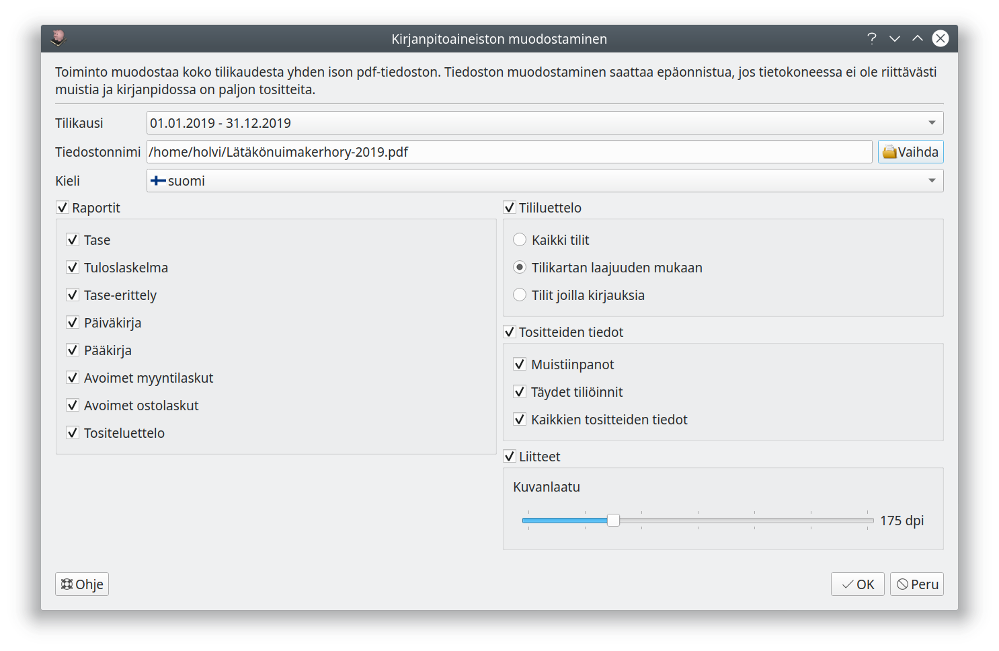

# Kirjanpitoaineisto

Kirjanpitoaineisto-toiminnolla voit koota raportteja ja tositteita yhteen pdf-tiedostoon. Näin esimerkiksi yhdistys voi helposti koota ja toimittaa toiminnantarkastajalle hänen tilinpäätöksen lisäksi tarvitsemansa kirjanpitoaineiston.

Yhteensopivuuden takia tositteet ovat aineistossa kuvamuodossa, joten aineistosta voi muodostua helposti kymmenien tai jopa satojen megatavujen suuruinen. Aineiston muodostaminen ei välttämättä onnistu tietokoneelta, jossa ei ole riittävästi keskusmuistia.

Suosittelemme kirjanpidon välittömään säilyttämiseen mieluummin [sähköistä arkistoa](/tilikaudet/arkisto), joka vie vähemmän tilaa ja jossa kirjausketju on paremmin seurattavissa.
