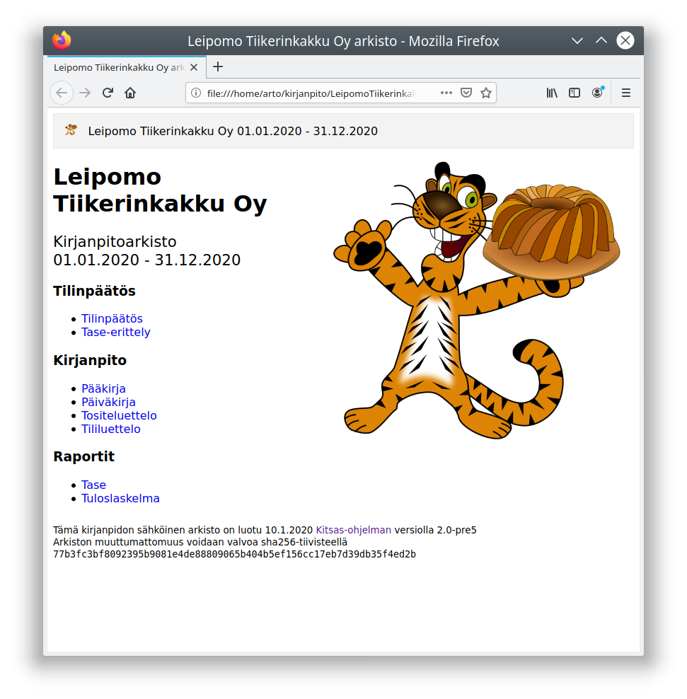
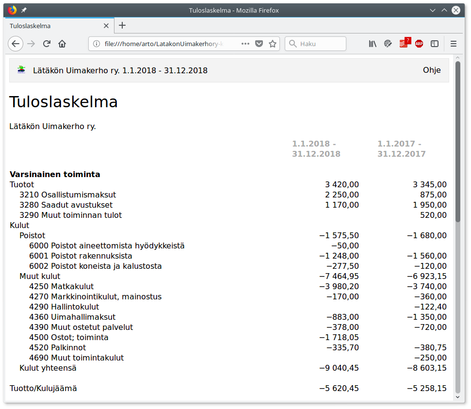
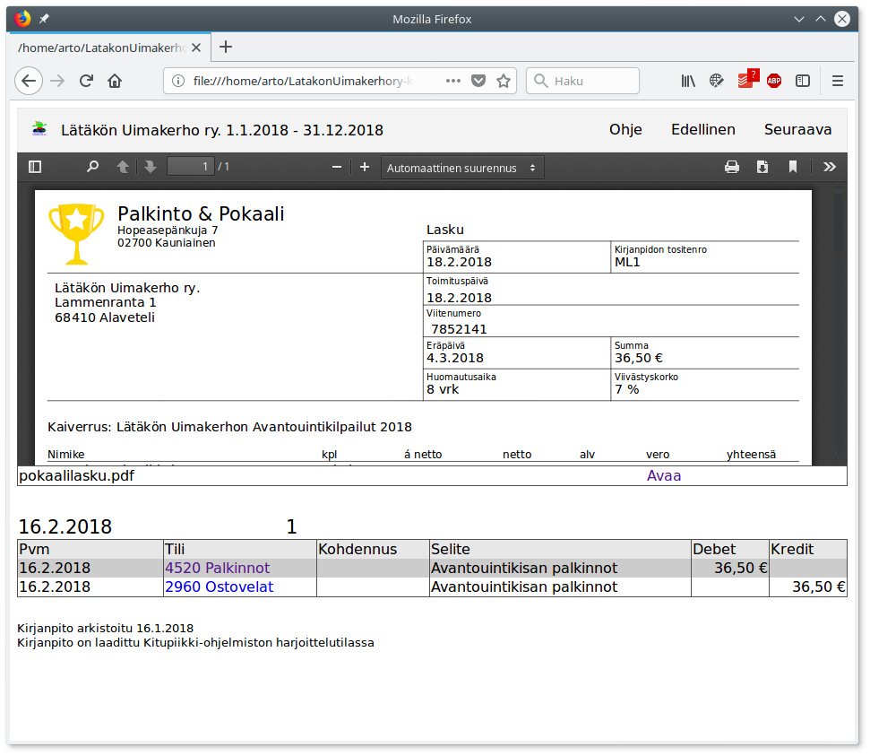
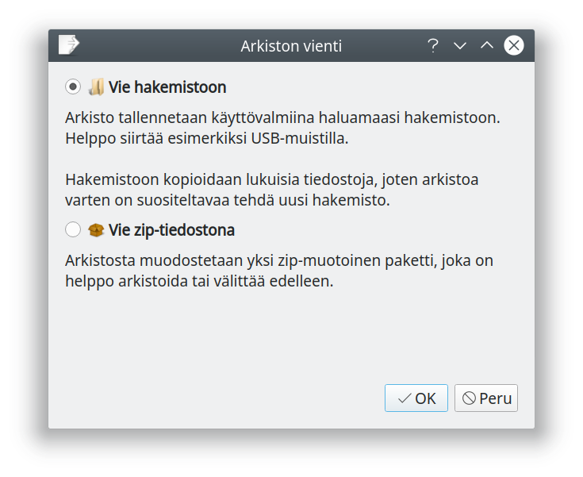

# Sähköinen arkisto

Kitsas muodostaa kirjanpidosta html-muotoisen sähköisen arkiston. Arkisto muodostetaan ja siihen pääsee Kitupiikistä **Tilikaudet**-välilehden **Arkisto**-painikkeella.

Arkisto on hakemisto, johon kirjanpitoaineisto on tallennettu html-muodossa. Arkistoa voi lukea millä tahansa selaimella avaamalla hakemistosta **index.html**-tiedoston. Arkisto on suunniteltu niin, että kirjanpidon aineisto on tarkasteltavissa kirjausketju säilyttäen sellaisessa muodossa, joka oletetaan olevan yleisesti käytettävillä ohjelmilla avattavissa vielä vuosikymmenten kuluttua, myös ilman Kitsas-ohjelmaa.

!!! note "Huolehdi säilyttämisestä"
    Huolehdi siitä, että kirjanpitoarkistosi on varmistettu tallentamalle se useammalle fyysiselle medialle, jotka säilyvät käyttökelpoisina koko 10 vuoden säilytysajan.

Sähköistä arkistoa voit käyttää myös kirjanpitoaineiston siirtämiseen esimerkiksi tilintarkastajille.



Arkisto sisältää kirjanpidon ([pääkirja](/tulosteet#paakirja), [päiväkirja](/tulosteet#paivakirja), [tositeluettelo](/tulosteet#tositeluettelo) sekä [tililuettelo](/tulosteet#tililuettelo) tositteineen), [taseen](/tulosteet#tase) ja [tuloslaskelman](/tulosteet#tuloslaskelma), [tase-erittelyn](/tulosteet#tase-erittely) sekä mahdollisesti myös muita tilikarttakohtaisia raportteja.



Tilinumerot ovat linkkejä, joista pääsee tilin pääkirjanäkymään. Tositteiden numerot ovat puolestaan linkkejä tositteisiin.



## Arkiston vieminen

Tilikausittaiset arkistot voit viedä *Tilikaudet*-välilehden **Vie arkisto**-painikkeella.



**Vie hakemistoon** kopioi koko arkiston valitsemaasi hakemistoon. Arkistoon pääset avaamalla hakemistoon kopioidun **index.html**-tiedoston selaimellasi. Huomaa, että arkistohakemistossa voi olla todella paljon tiedostoja, joten sitä varten kannattaa ehkä luoda uusi hakemistonsa.

Tällä toiminnolla voit siirtää yhden vuoden arkiston esim. suoraan USB-muistitikulle.

**Vie zip-tiedostona** tallentaa koko arkiston yhdeksi pakatuksi tiedostoksi. [ZIP-arkiston](https://fi.wikipedia.org/wiki/ZIP) saa avattua suoraan nykyisillä Windows-, Linux- ja macOS-tietokoneilla.

Kirjanpitoaineiston voi tallentaa pdf-muotoon **Aineisto**-painikkeella.

## Arkiston muuttumattomuuden varmistaminen

Voit varmistaa Kitsaan luomalla [sha256-tiivisteellä](https://fi.wikipedia.org/wiki/SHA), ettei arkistossa olevia tiedostoja (esimerkiksi tositteita) ole muokattu arkiston muodostamisen jälkeen. Tämä edellyttää kuitenkin, että valvonnassa käytetty tiiviste (näkyvissä arkiston etusivulla) on säilytetty turvassa muutoksilta.

Tässä kuvattua muuttumattomuuden varmistamista tarvittaneen lähinnä vain, mikäli on syytä epäillä, että kirjanpitoa on muutettu jälkikäteen. Kirjanpitolaki kieltää kirjanpitoaineiston muuttamisen tilinpäätöksen laatimisen jälkeen (2. luku 7 §). Väärien tai harhaanjohtavien tietojen merkitsemisestä kirjanpitoon rangaistaan sakolla tai vankeudella (Rikoslaki 30. luku 9 § ja 9a §).

Muuttumattomuuden voi tarkistaa **sha256sum**-ohjelmalla (löytyy sekä Windowsille että Linuxille). Arkistossa olevan valvontatiedoston tiiviste tulostetaan komennolla **sha256sum arkisto.sha256**.

```
~/LatakonUimakerho/arkisto/2018 $ sha256sum arkisto.sha256
b3fb35a6e113b98e4eb68a133b575463b05d6a39a9c78fb584ade9e9ef6a7b78  arkisto.sha256
```
Ohjelma tulostaa valvontatiedoston tiivisteen, jota pitää verrata tiedossa olevaan tiivisteeseen.

Valvontatiedosto sisältää kaikkien arkistoon kuuluvien tositteiden ja raporttien - ei kuitenkaan tilinpäätöksen - tiivisteet. Tiivisteet pitää vielä tarkastaa komennolla **sha256sum -c arkisto.sha256**.

```
arto@pantteri ~/LatakonUimakerho/arkisto/2018 $ sha256sum -c arkisto.sha256
00000097-01.pdf: OK
00000097.html: OK
00000018-01.pdf: OK
00000018.html: OK
00000020.html: OK
00000022.html: OK
00000042.html: OK
...
```

Jos jotain tiedostoa olisi muutettu, antaisi sha256sum seuraavan kaltaisen ilmoituksen

```
...
00000011.html: OK
00000012-01.pdf: EI TÄSMÄÄ
00000012.html: OK
...
sha256sum: WARNING: 1 computed checksum did NOT match
```
