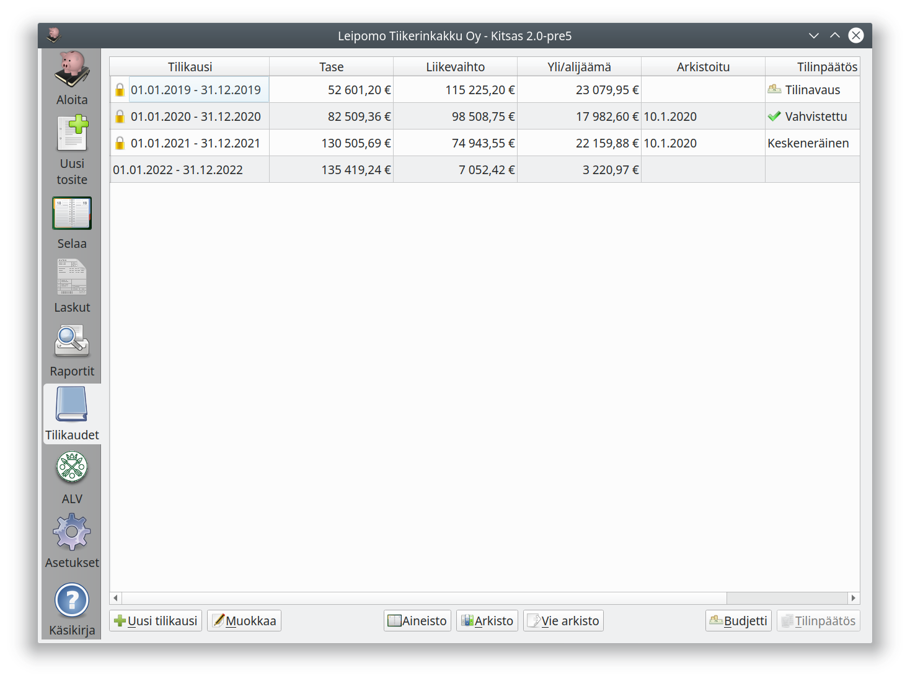
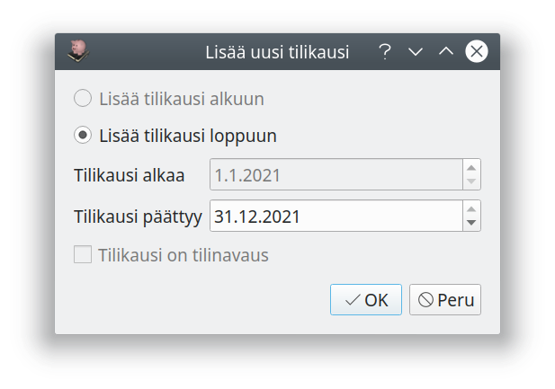
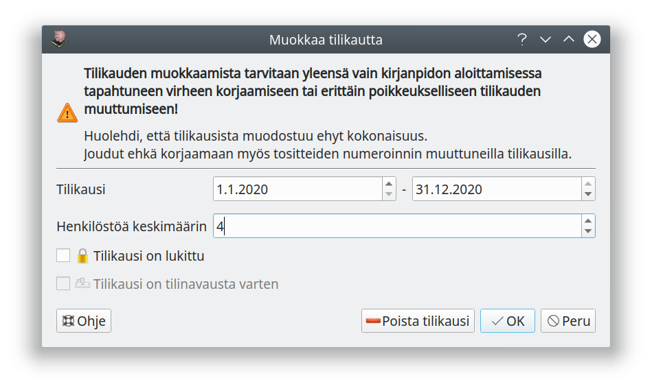

# Tilikaudet

Kitsas tallentaa samaan kirjanpitoon eri tilikausien tapahtumat. Voit aloittaa uuden tilikauden kirjausten tekemisen jo ennen kuin edellisen tilikauden kirjanpito on valmistunut. Tilien saldot ja tase eivät ole kuitenkaan oikein, ennen kuin kaikki edellisen tilikauden kirjaukset on tehty.

## Tilikauden aloittaminen

Kitsas ilmoittaa aloitusnäytössä, kun tilikausi alkaa olla lopussa. Voidaksesi tehdä kirjauksia seuraavalle tilikaudelle, aloita **Uusi tilikausi**.

Tilikauden pituus on yleensä 12 kuukautta - poikkeuksellinen, enintään 18 kuukauden tilikausi on mahdollinen toimintaa aloitettaessa, lopetettaessa tai tilikautta muutettaessa.

## Tilikauden muokkaaminen

**Muokkaa**-painikkeella voit muuttaa _viimeisen_ tilikauden päättymispäivää tai poistaa viimeisen tilikauden, jos sillä ei ole yhtään kirjausta. Tilikauden päättymistä ei saa muuttaa aikaisemmaksi kuin tilikauden viimeinen kirjaus.

Voit tarvittaessa myös **perua tilikauden lukitsemisen**. Toiminto on tarkoitettu käytettäväksi vain, jos tilinpäätöstä laadittaessa on vielä tarpeen palata tekemään kirjauksia.

!!! quote "Kirjanpitolaki 2. luku 7 § 2. mom."
    Tositteen, kirjanpidon tai muun kirjanpitoaineiston sisältöä ei saa muuttaa tai poistaa tilinpäätöksen laatimisen jälkeen. Sisältöä ei saa muuttaa eikä poistaa myöskään sen jälkeen, kun 6 §:ssä tarkoitettu (kirjanpidosta viranomaiselle verotusta tai muuta tarkoitusta varten määräajoin tehtävä) ilmoitus on tehty tai kirjanpitovelvollinen on julkistanut tai antanut ulkopuolisen käyttöön aineistosta laatimansa välitilinpäätöksen tai muun vastaavan asiakirjan.

## Kirjanpitoaineisto

**Aineisto**-painikkeella muodostat kirjanpidostasi pdf-tiedoston, joka sisältää koko tilikauden koko kirjanpidon ja kaikki sähköisessä muodossa olevat tositteet (mutta ei tilinpäätöstä).

!!! warning "Aineistoa ei voi muodostaa suuresta kirjanpidosta"
    Kirjanpidosta, jossa on kovin isokokoisia sähköisiä tositteita tai kovin suuri määrä tositteita, ei välttämättä voi muodostaa aineistoa. Voit kuitenkin muodostaa kirjanpidosta [sähköisen arkiston](arkisto/)
