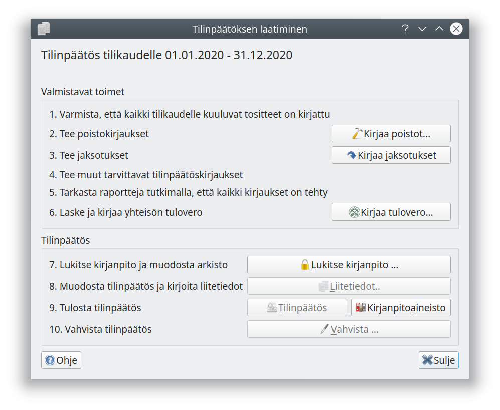

# Tilinpäätöksen aloittaminen

!!! tip ""
    [ Katso video yhdistyksen tilinpäätöksen laatimisesta](https://youtu.be/YFeb9-CZF2g)   

Tilinpäätös on laadittava neljän kuukauden kuluessa tilikauden päättymisestä. Kitsas muistuttaa tästä aloitusnäytössä. Kun kaikki tilikaudelle kuuluvat tositteet on kirjattu, aloitetaan tilinpäätöksen laatiminen **Tilikaudet**-välilehden **Tilinpäätös**-painikkeesta.

!!! info "Ammatin- ja liikkeenharjoittajan vapautus tilinpäätöksen laatimisesta"
    Ammatin- ja liikkeenharjoittaja on velvollinen laatimaan tilinpäätöksen vain, mikäli sekä päättyneellä että edellisellä tilikaudella on täyttynyt kaksi seuraavista ehdoista:

    * Taseen loppusumma ylittää 100 000 euroa.
    * Liikevaihto ylittää 200 000 euroa.
    * Palveluksessa on keskimäärin yli kolme henkilöä.

## Tilinpäätöksen laatiminen

Valitse **Tilikaudet** -välilehdeltä tilikausi ja käynnistä tilinpäätöstyökalu painamalla **Tilinpäätös**.

Varmista ensimmäisenä, että kaikki tilikaudelle kuuluvat tositteet on kirjattu. Vertaa tilien tiliotteita **Pääkirja**-raporttiin ja täsmäytä kirjanpito ja tilit.
